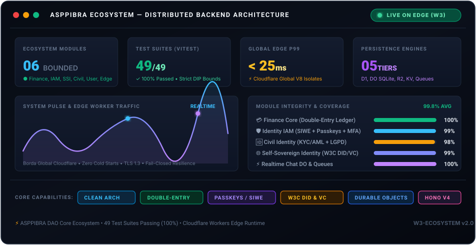
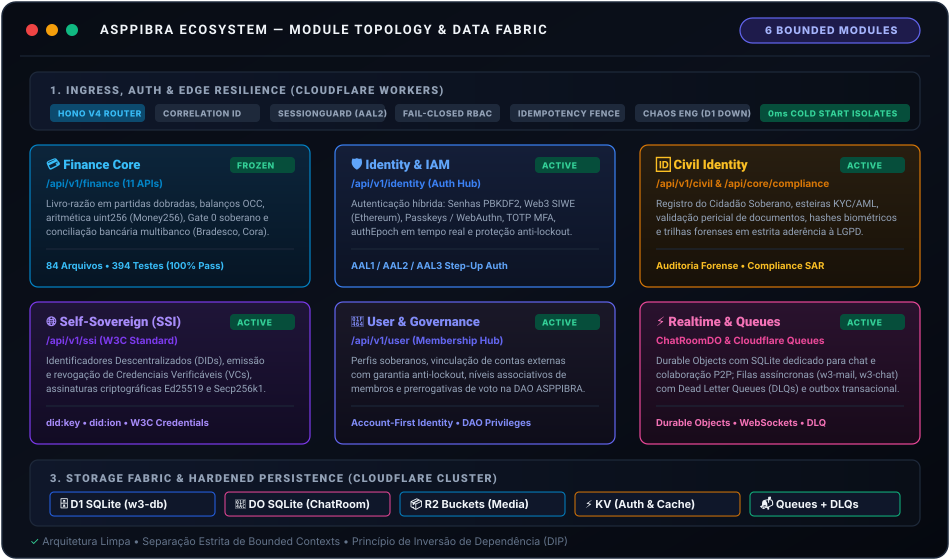
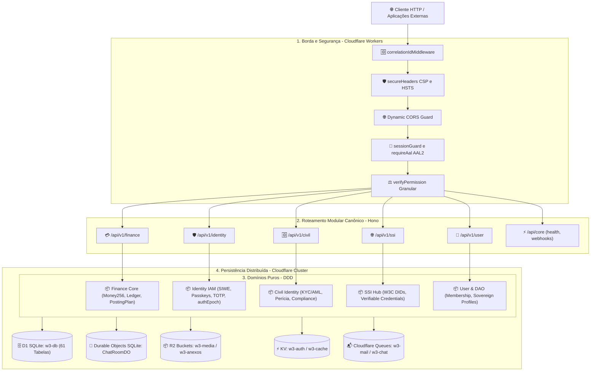
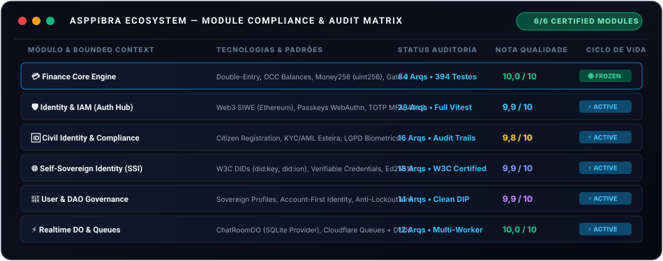

# 🌐 ASPPIBRA Ecosystem — Master Backend Architecture

<p align="center">
  
  
  
  
  
  
</p>

> **Sistema Operacional Descentralizado de Governança, Identidade Auto-Soberana e Motor Contábil de Alta Integridade** para o ecossistema **ASPPIBRA DAO**.  
> Projetado com **Clean Architecture**, **Domain-Driven Design (DDD)** e execução distribuída global na borda da Cloudflare (V8 Isolates, 0ms cold start).

<p align="center">
  
</p>

---

## 🏛️ 1. Visão Geral da Arquitetura & Topologia

A arquitetura do backend é orientada a **Bounded Contexts** estritamente desacoplados, seguindo o **Princípio de Inversão de Dependência (DIP)** e fronteiras centrípetas. Nenhuma camada de domínio conhece bibliotecas de banco de dados, drivers de rede ou a camada de apresentação.

<p align="center">
  
</p>

<details open>
<summary><b>📐 Diagrama de Fluxo Mermaid (Pipeline de Execução Passo a Passo)</b></summary>
<br/>



</details>

---

## 📦 2. Catálogo dos 6 Módulos do Ecossistema

O ecossistema é formado por 6 módulos centrais de negócio e infraestrutura, cada um com autonomia de domínio, contratos tipados e isolamento físico de persistência:

<p align="center">
  
</p>

### 📋 Especificação Detalhada por Módulo

| # | Módulo | Bounded Context | Rota Base | Status | Destaques Técnicos & Invariantes |
| :-: | :--- | :--- | :--- | :---: | :--- |
| **01** | **💳 Finance Core** | [`src/domains/finance`](src/domains/finance) | `/api/v1/finance` |  | Livro-razão em partidas dobradas (Double-Entry), OCC em uint256 (`Money256`), barreira soberana Gate 0 ([`PostingAuthority`](src/application/finance/services/PostingAuthority.ts)) e conciliação bancária tripla. [Ver Documentação Completa](docs/FINANCE_CORE_ARCHITECTURE_AUDIT_MAP.md). |
| **02** | **🛡️ Identity & IAM** | [`src/domains/identity`](src/domains/identity) | `/api/v1/identity` |  | Autenticação híbrida Web2/Web3: Sign-In with Ethereum (SIWE), Passkeys / WebAuthn FIDO2, TOTP MFA, step-up auth (<kbd>AAL1</kbd>, <kbd>AAL2</kbd>, <kbd>AAL3</kbd>) e invalidação de sessão em tempo real via `authEpoch`. |
| **03** | **🆔 Civil Identity** | [`src/domains/civil-identity`](src/domains/civil-identity) | `/api/v1/civil` |  | Onboarding soberano de cidadãos, esteira de verificação KYC/AML, perícia criptográfica de documentos, hashes biométricos anti-colisão e relatórios de compliance (SAR) compatíveis com LGPD. |
| **04** | **🌐 Self-Sovereign (SSI)** | [`src/domains/ssi`](src/domains/ssi) | `/api/v1/ssi` |  | Padrões W3C para DIDs (`did:key`, `did:ion`), emissão e revogação de Credenciais Verificáveis (VCs), assinaturas criptográficas Ed25519 / Secp256k1 e provas de conhecimento nulo. |
| **05** | **👤 User & Governance** | [`src/domains/user`](src/domains/user) | `/api/v1/user` |  | Governança de perfis de membros da DAO ASPPIBRA, vinculação de credenciais externas com proteção matemática anti-lockout e máquina de estados do ciclo de vida da conta. |
| **06** | **⚡ Realtime & Edge** | [`src/infrastructure`](src/infrastructure) | `/api/core/*` |  | Cloudflare Durable Objects (`ChatRoomDO`) com SQLite dedicado para chat WebSockets em tempo real, filas de background (`w3-mail`, `w3-chat`) com Dead Letter Queues e Transactional Outbox. |

---

### 🔍 Detalhamento das Capacidades por Módulo

#### 💳 1. Finance Core Engine (`100% FROZEN • Nota 10,0/10`)
- **Objetivo**: Motor contábil transacional imutável com garantia de zero perda decimal e zero reconciliação manual pendente.
- **Invariantes Soberanos**:
  - `FIN-001`: Para cada lançamento contábil, **Soma dos Débitos = Soma dos Créditos** estritamente para o mesmo ativo financeiro.
  - `FIN-002`: Nenhum saldo em moeda soberana opera sob ponto flutuante (`float`/`double`); representação unívoca em inteiros de 256 bits (`uint256` / `Money256`).
  - `Gate 0`: Todas as mutações contábeis passam obrigatoriamente pela [`PostingAuthority`](src/application/finance/services/PostingAuthority.ts) sob token de capacidade único ([`PostingSession`](src/domains/finance/contracts/PostingSession.ts)).
- **Documentação de Auditoria**: Acesse o mapa detalhado em [`docs/FINANCE_CORE_ARCHITECTURE_AUDIT_MAP.md`](docs/FINANCE_CORE_ARCHITECTURE_AUDIT_MAP.md).

#### 🛡️ 2. Identity & Access Management (IAM)
- **Objetivo**: Hub central de identidade híbrida com interoperabilidade entre criptografia assimétrica de carteiras Web3 e biometria de hardware móvel.
- **Recursos Chave**:
  - **SIWE (EIP-4361)**: Autenticação direta com carteiras EVM (MetaMask, Rabby) validando nonces temporais e assinaturas EIP-191 / EIP-712.
  - **Passkeys (FIDO2 / WebAuthn)**: Autenticação biométrica sem senha (FaceID / TouchID / YubiKey) com registro e verificação nativos.
  - **MFA TOTP**: Códigos baseados em tempo compatíveis com Google Authenticator e 1Password.
  - **Proteção Anti-Brute-Force**: Bloqueio progressivo de conta após 5 tentativas consecutivas de senha incorreta e trilha de auditoria em `auth_audit_log`.

#### 🆔 3. Civil Identity & Compliance
- **Objetivo**: Integração entre o mundo civil regulatório e o ecossistema descentralizado, preservando privacidade e integridade pericial.
- **Recursos Chave**:
  - **Esteiras KYC**: Níveis de verificação escaláveis (Bronze, Prata, Ouro) com validação de dados cadastrais.
  - **Perícia de Documentos**: Extração e assinatura forense de metadados documentais com hash criptográfico SHA-256 / Ed25519.
  - **Privacidade & LGPD**: Armazenamento estrito de dados identificáveis com camadas de anonimização e conformidade de expurgo.

#### 🌐 4. Self-Sovereign Identity (SSI)
- **Objetivo**: Emancipação soberana de credenciais digitais portáteis conforme as especificações W3C.
- **Recursos Chave**:
  - **Decentralized Identifiers (DIDs)**: Suporte a métodos `did:key` e `did:ion` para identidades independentes de servidores centrais.
  - **Verifiable Credentials (VCs)**: Emissão de atestados criptográficos de reputação, titulação e pertencimento à DAO ASPPIBRA.
  - **Criptografia Avançada**: Verificação de chaves e curvas elípticas Ed25519 e Secp256k1 com geração determinística.

#### 👤 5. User & DAO Governance
- **Objetivo**: Gestão do ciclo de vida do participante e das prerrogativas cívicas na governança descentralizada.
- **Recursos Chave**:
  - **Account-First Identity**: Princípio de conta unificada prevenindo contas-fantasma ou contas órfãs no banco de dados.
  - **Anti-Lockout Rule**: Garantia matemática de que o usuário nunca poderá desvincular seu último método de autenticação ativo.
  - **Governança**: Associação de níveis de participação e papéis dinâmicos com herança no RBAC.

#### ⚡ 6. Realtime, Queues & Edge Infrastructure
- **Objetivo**: Suporte operacional de alta disponibilidade, mensageria e comunicação síncrona/assíncrona sem servidor central.
- **Recursos Chave**:
  - **Durable Objects (`ChatRoomDO`)**: Salas de chat e colaboração com isolamento de estado na memória e SQLite embutido.
  - **Cloudflare Queues**: Ingestão distribuída em lotes para envio assíncrono de notificações e emails (`w3-mail`), com retentativa exponencial e Dead Letter Queues (`w3-mail-dlq`).
  - **Transactional Outbox**: Gravação atômica de eventos no SQLite D1 antes do despacho externo, garantindo entrega *at-least-once*.

---

## 🗄️ 3. Camada de Persistência & Topologia Cloudflare

O backend aproveita os serviços gerenciados da Cloudflare para entregar persistência ACID e armazenamento distribuído de alta velocidade:

| Recurso | Binding | Tecnologia | Capacidade / Propósito |
| :--- | :---: | :--- | :--- |
| **Banco Relacional Principal** | `DB` | Cloudflare D1 (SQLite) | 61 tabelas relacionais com Drizzle ORM, índices parciais e restrições de chave estrangeira. |
| **Salas em Tempo Real** | `CHAT_ROOM` | Cloudflare Durable Objects | In-Memory WebSockets + SQLite local dedicado por sala de conversa (`ChatRoomDO`). |
| **Armazenamento de Mídia** | `STORAGE` | Cloudflare R2 | Bucket `w3-media` para fotos, documentos forenses e artefatos de identidade. |
| **Anexos de Email** | `R2_EMAIL_ATTACHMENTS` | Cloudflare R2 | Bucket `w3-anexos` para arquivos transitórios da esteira de correio eletrônico. |
| **Cache de Sessões & Nonces** | `KV_AUTH` | Cloudflare Workers KV | Armazenamento de alta frequência para nonces SIWE, desafios WebAuthn e tokens. |
| **Cache de Aplicação** | `KV_CACHE` | Cloudflare Workers KV | Cache regional de leitura para dados públicos e taxas cambiais de tesouraria. |
| **Fila de Email** | `EMAIL_PIPELINE_QUEUE` | Cloudflare Queues | Fila `w3-mail` (batch size 10, retries 3) com saída para Dead Letter Queue. |
| **Fila de Chat & Eventos** | `CHAT_PIPELINE_QUEUE` | Cloudflare Queues | Fila `w3-chat` (batch size 50, retries 3) com saída para Dead Letter Queue. |
| **IA Nativa** | `AI` | Workers AI | Pipeline embarcado de inteligência artificial para moderação e análise contextual. |

---

## 🚀 4. Guia de Execução & Desenvolvimento Local

### Pré-requisitos
- **Node.js** >= 20.x
- **pnpm** >= 9.x
- **Wrangler CLI** >= 3.x (`pnpm install -g wrangler`)

### Instalação & Setup
```bash
# 1. Clonar o repositório
git clone https://github.com/DIGITAL-WORLD-ECOSYSTEM/BACKEND.git
cd BACKEND

# 2. Instalar dependências congeladas
pnpm install --frozen-lockfile

# 3. Aplicar migrações contábeis e de esquema no D1 local
pnpm wrangler d1 migrations apply w3-db --local

# 4. Iniciar o servidor de desenvolvimento Edge
pnpm dev
```

### Execução da Suíte de Testes Automatizados
O projeto possui 49 suítes completas de testes automatizados com cobertura arquitetural, unitária e testes de estresse adversariais:

```bash
# Executar todos os testes com Vitest
pnpm test

# Executar testes unitários do motor contábil
pnpm test tests/finance

# Executar testes estáticos de fronteiras arquiteturais (Clean Architecture)
pnpm test tests/architecture
```

---

## 🔒 5. Segurança, Resiliência & Padrões Operacionais

- **Princípio Fail-Closed**: Em qualquer indisponibilidade de banco de dados, segredos ou autorizações, a API rejeita compulsoriamente a operação.
- **Idempotência Soberana**: Operações financeiras e mutatórias exigem o header `Idempotency-Key` com deduplicação atômica e snapshot de resposta.
- **Aritmética Exata uint256**: Proibição estrita de arredondamento de ponto flutuante em regras contábeis — toda a tesouraria roda sob [`Money256`](src/domains/finance/value-objects/Money256.ts).
- **Sem Contas Fantasma (AF-001)**: Cada usuário possui uma entidade canônica única, com vinculação formal de identidades externas (Ethereum, Passkey, Google, DID).

---

<p align="center">
  <b>ASPPIBRA Ecosystem • Digital World Architecture</b><br/>
  <i>Clean Architecture • Cloudflare Workers Edge • Produção Ativa</i>
</p>
