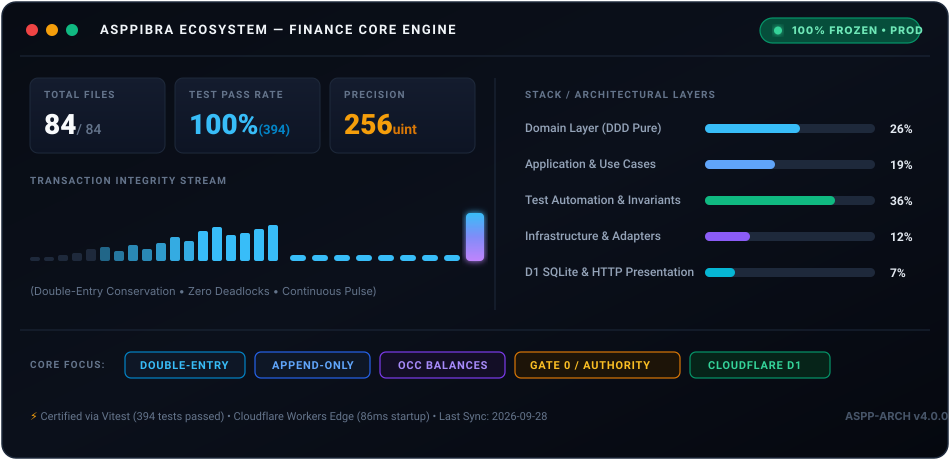
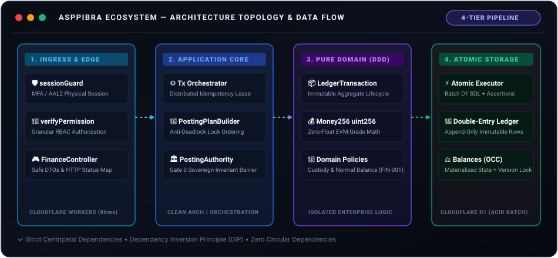
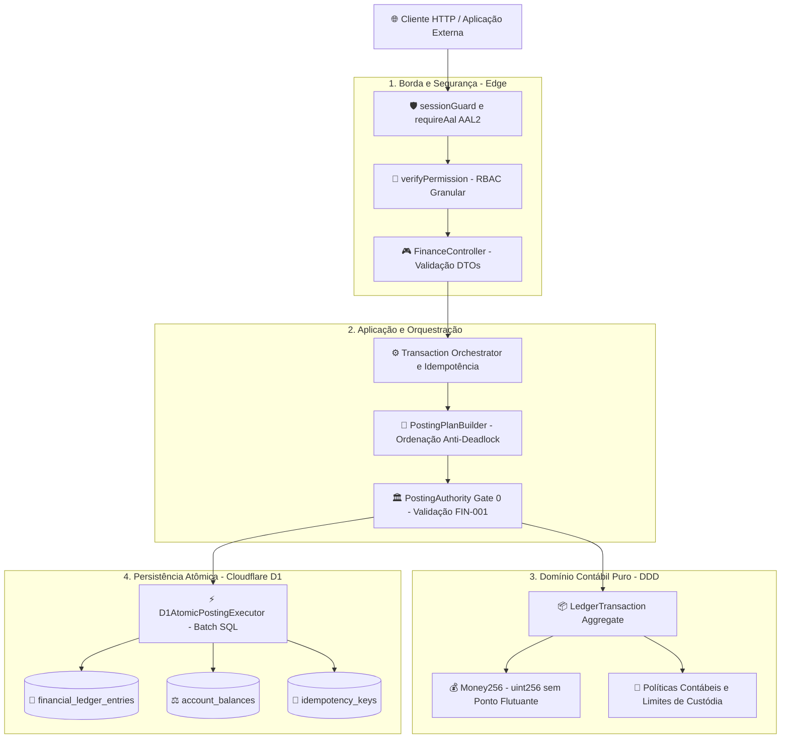
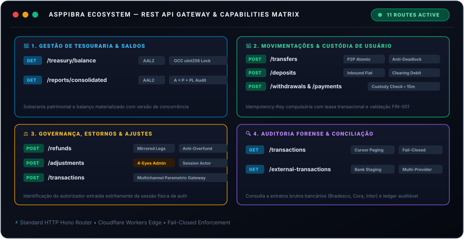
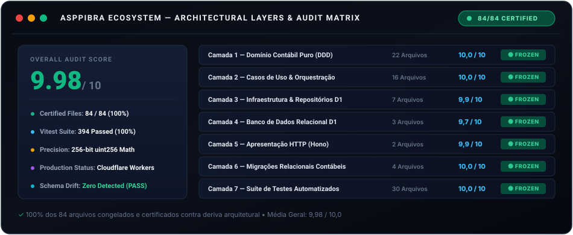

# 💳 Finance Core — Motor Contábil de Alta Integridade

  
  
  
  
  

> **Motor financeiro transacional de missão crítica** projetado segundo **Clean Architecture** e **Domain-Driven Design (DDD)**.  
> Implementa **livro-razão em partidas dobradas (Double-Entry Ledger)**, balanços materializados com **OCC (Optimistic Concurrency Control)**, aritmética de precisão exata de **256 bits (`Money256`)** e barreira soberana de autorização contábil (**PostingAuthority / Gate 0**).

  

---

## 🏛️ 1. Diagrama de Arquitetura do Módulo

O diagrama visual abaixo sintetiza a jornada de uma transação financeira pelas camadas do sistema — desde a borda até a persistência atômica no SQLite D1:

  

<b>📐 Diagrama de Fluxo Mermaid (Pipeline de Execução Passo a Passo)</b>

 

---

## 🚀 2. Catálogo Visual de APIs do Módulo

Todas as rotas operam sob a base `https://w3-api.asppibra.workers.dev/api/v1/finance` com proteção **Fail-Closed**, validação física de sessão e autorização granular baseada em papéis (RBAC).

  

> [!IMPORTANT]
> **Idempotência & Fencing Distribuído:** Todas as operações mutatórias (`POST`) exigem o header `Idempotency-Key`. Tentativas de repetição legítimas recebem o resultado original em cache com o header `Idempotency-Replayed: true`, prevenindo double-spend sem reprocessar saldo ou razão.

### 📋 Especificação Unificada dos 11 Endpoints

| # | Domínio | Método | Endpoint | Controlador & Caso de Uso | Segurança & RBAC | Regra Contábil & Invariante |
| :-: | :--- | :---: | :--- | :--- | :--- | :--- |
| 01 | Tesouraria |  | `/treasury/balance` | [`FinanceController.getBalance`](../src/interfaces/http/controllers/finance/FinanceController.ts#L21) [`GetTreasuryBalanceUseCase`](../src/application/finance/use-cases/GetTreasuryBalanceUseCase.ts) | <kbd>AAL2</kbd> `finance.treasury.read` | Consulta saldo consolidado da conta mestre com versão de concorrência (OCC) em uint256 |
| 02 | Tesouraria |  | `/reports/consolidated` | [`FinanceController.getConsolidatedReport`](../src/interfaces/http/controllers/finance/FinanceController.ts#L381) [`GetConsolidatedFinancialReportUseCase`](../src/application/finance/use-cases/GetConsolidatedFinancialReportUseCase.ts) | <kbd>AAL2</kbd> `finance.treasury.read` | Balancete patrimonial consolidado: prova matemática onde **Ativo = Passivo + Patrimônio Líquido** |
| 03 | Movimentação |  | `/deposits` | [`FinanceController.recordDeposit`](../src/interfaces/http/controllers/finance/FinanceController.ts#L193) [`RecordDepositUseCase`](../src/application/finance/use-cases/RecordDepositUseCase.ts) | <kbd>AAL2 (15m)</kbd> • **Idempotente** `finance.deposit.create` | Entrada de fundos (`INBOUND`): credita conta de custódia do usuário e debita clearing da tesouraria (FIN-001) |
| 04 | Movimentação |  | `/withdrawals` | [`FinanceController.recordWithdrawal`](../src/interfaces/http/controllers/finance/FinanceController.ts#L197) [`RecordTreasuryTransactionUseCase`](../src/application/finance/use-cases/RecordTreasuryTransactionUseCase.ts) | <kbd>AAL2 (15m)</kbd> • **Idempotente** `finance.withdrawal.create` | Saída (`OUTBOUND`): debita saldo disponível após validação via [`AccountStatusPolicy`](../src/domains/finance/policies/AccountStatusPolicy.ts) |
| 05 | Movimentação |  | `/transfers` | [`FinanceController.recordTransfer`](../src/interfaces/http/controllers/finance/FinanceController.ts#L209) [`RecordTransferUseCase`](../src/application/finance/use-cases/RecordTransferUseCase.ts) | <kbd>AAL2 (15m)</kbd> • **Idempotente** `finance.transfer.create` | Transferência P2P atômica entre dois usuários sob plano fechado com ordenação lexicográfica anti-deadlock |
| 06 | Movimentação |  | `/payments` | [`FinanceController.recordPayment`](../src/interfaces/http/controllers/finance/FinanceController.ts#L201) [`RecordTreasuryTransactionUseCase`](../src/application/finance/use-cases/RecordTreasuryTransactionUseCase.ts) | <kbd>AAL2 (15m)</kbd> • **Idempotente** `finance.payment.create` | Pagamento de serviços: debita a conta do usuário e credita a receita operacional da plataforma sem intermediários |
| 07 | Governança |  | `/refunds` | [`FinanceController.recordRefund`](../src/interfaces/http/controllers/finance/FinanceController.ts#L205) [`ReverseTransactionUseCase`](../src/application/finance/use-cases/ReverseTransactionUseCase.ts) | <kbd>AAL2 (15m)</kbd> • **Idempotente** `finance.refund.create` | Estorno contábil auditado: inverte pernas contábeis da transação original com bloqueio de estorno duplicado |
| 08 | Governança |  | `/adjustments` | [`FinanceController.recordAdjustment`](../src/interfaces/http/controllers/finance/FinanceController.ts#L292) [`RecordTreasuryTransactionUseCase`](../src/application/finance/use-cases/RecordTreasuryTransactionUseCase.ts) | <kbd>AAL2 (Admin)</kbd> • **Idempotente** `finance.adjustment.create` | Ajuste administrativo auditado (4-Eyes): autorizador (`authorizedByUserId`) injetado compulsoriamente pela sessão |
| 09 | Governança |  | `/transactions` | [`FinanceController.recordTransaction`](../src/interfaces/http/controllers/finance/FinanceController.ts#L189) [`RecordLedgerTransactionUseCase`](../src/application/finance/use-cases/RecordLedgerTransactionUseCase.ts) | <kbd>AAL2 (15m)</kbd> • **Idempotente** `finance.transaction.create` | Gateway multicanal genérico com validação tipada e sanitização textual anti-DoS ([`FinancialTextPolicy`](../src/domains/finance/policies/FinancialTextPolicy.ts)) |
| 10 | Auditoria |  | `/transactions` | [`FinanceController.listTransactions`](../src/interfaces/http/controllers/finance/FinanceController.ts#L296) [`IFinanceRepository.listTransactions`](../src/application/ports/output/IFinanceRepository.ts) | <kbd>AAL2</kbd> Próprio / `finance.treasury.read` | Extrato cronológico do razão contábil com paginação defensiva por cursor (`limit <= 100`) e proteção Fail-Closed |
| 11 | Auditoria |  | `/external-transactions` | [`FinanceController.getExternalTransactions`](../src/interfaces/http/controllers/finance/FinanceController.ts#L331) [`GetExternalTransactionsUseCase`](../src/application/finance/use-cases/GetExternalTransactionsUseCase.ts) | <kbd>AAL2</kbd> `finance.treasury.read` | Staging de extratos bancários externos para conciliação automatizada multibanco (Bradesco, Cora, Inter) |

---

## 📁 3. Tabela de Arquivos do Módulo (84 Arquivos Físicos)

Todos os **84 arquivos** do módulo Finance Core foram auditados, certificados e congelados (**100% `FROZEN`**, média geral **9,98 / 10,0**).

  

### 📋 Inventário Completo dos 84 Arquivos

| # | Camada | Arquivo | Responsabilidade Central | Atualizado | Nota |
| :-: | :--- | :--- | :--- | :-: | :-: |
| 01 | Domínio | [`src/domains/finance/constants/FinancialLimits.ts`](../src/domains/finance/constants/FinancialLimits.ts) | Limites financeiros de transação e tetos operacionais | 2026-09-28 | **10,0** |
| 02 | Domínio | [`src/domains/finance/contracts/AuthorizationContext.ts`](../src/domains/finance/contracts/AuthorizationContext.ts) | Contexto imutável de autorização do ator | 2026-09-28 | **10,0** |
| 03 | Domínio | [`src/domains/finance/contracts/DeterministicIdGenerator.ts`](../src/domains/finance/contracts/DeterministicIdGenerator.ts) | Gerador determinístico de 53 bits (Lazy Cloudflare) | 2026-09-28 | **10,0** |
| 04 | Domínio | [`src/domains/finance/contracts/FinancialLedgerEntryRecord.ts`](../src/domains/finance/contracts/FinancialLedgerEntryRecord.ts) | Contrato de perna contábil em partidas dobradas | 2026-09-28 | **10,0** |
| 05 | Domínio | [`src/domains/finance/contracts/IdempotencyScope.ts`](../src/domains/finance/contracts/IdempotencyScope.ts) | Escopo tripartite de chave de idempotência | 2026-09-28 | **10,0** |
| 06 | Domínio | [`src/domains/finance/contracts/PostingPlan.ts`](../src/domains/finance/contracts/PostingPlan.ts) | Plano selado de escrita contábil (FIN-001) | 2026-09-28 | **10,0** |
| 07 | Domínio | [`src/domains/finance/contracts/PostingSession.ts`](../src/domains/finance/contracts/PostingSession.ts) | Token OCap de uso único contra replay e deadlocks | 2026-09-28 | **10,0** |
| 08 | Domínio | [`src/domains/finance/entities/LedgerTransaction.ts`](../src/domains/finance/entities/LedgerTransaction.ts) | Agregado de transação e pernas no livro-razão | 2026-09-28 | **10,0** |
| 09 | Domínio | [`src/domains/finance/errors/FinancialError.ts`](../src/domains/finance/errors/FinancialError.ts) | Catálogo de erros tipados de domínio | 2026-09-28 | **10,0** |
| 10 | Domínio | [`src/domains/finance/errors/LedgerImbalanceError.ts`](../src/domains/finance/errors/LedgerImbalanceError.ts) | Erro crítico de desbalanceamento contábil | 2026-09-28 | **10,0** |
| 11 | Domínio | [`src/domains/finance/policies/AccountClassPolicy.ts`](../src/domains/finance/policies/AccountClassPolicy.ts) | Classificação contábil e naturezas de contas | 2026-09-28 | **10,0** |
| 12 | Domínio | [`src/domains/finance/policies/AccountingEntryPolicy.ts`](../src/domains/finance/policies/AccountingEntryPolicy.ts) | Políticas contábeis de pernas e saldos iniciais | 2026-09-28 | **10,0** |
| 13 | Domínio | [`src/domains/finance/policies/AccountStatusPolicy.ts`](../src/domains/finance/policies/AccountStatusPolicy.ts) | Políticas de transacionabilidade e bloqueio de contas | 2026-09-28 | **10,0** |
| 14 | Domínio | [`src/domains/finance/policies/AssetStatusPolicy.ts`](../src/domains/finance/policies/AssetStatusPolicy.ts) | Políticas de transacionabilidade de ativos | 2026-09-28 | **10,0** |
| 15 | Domínio | [`src/domains/finance/policies/FinancialTextPolicy.ts`](../src/domains/finance/policies/FinancialTextPolicy.ts) | Sanitização anti-DoS e normalização textual | 2026-09-28 | **10,0** |
| 16 | Domínio | [`src/domains/finance/services/FinancialTransactionStateMachine.ts`](../src/domains/finance/services/FinancialTransactionStateMachine.ts) | Máquina de estados finitos transacional | 2026-09-28 | **10,0** |
| 17 | Domínio | [`src/domains/finance/services/PostingPlanBuilder.ts`](../src/domains/finance/services/PostingPlanBuilder.ts) | Compilador de planos contábeis e ordenação de locks | 2026-09-28 | **10,0** |
| 18 | Domínio | [`src/domains/finance/value-objects/BaseUnits.ts`](../src/domains/finance/value-objects/BaseUnits.ts) | Conversão de representação sem perda decimal | 2026-09-28 | **10,0** |
| 19 | Domínio | [`src/domains/finance/value-objects/FinancialIdentifier.ts`](../src/domains/finance/value-objects/FinancialIdentifier.ts) | Identificadores numéricos e UUIDs canônicos | 2026-09-28 | **10,0** |
| 20 | Domínio | [`src/domains/finance/value-objects/FinancialTransactionStatus.ts`](../src/domains/finance/value-objects/FinancialTransactionStatus.ts) | Enumeração e tipos de ciclo de vida da transação | 2026-09-28 | **10,0** |
| 21 | Domínio | [`src/domains/finance/value-objects/LedgerEntryDirection.ts`](../src/domains/finance/value-objects/LedgerEntryDirection.ts) | Value Object de direção contábil (DEBIT/CREDIT) | 2026-09-28 | **10,0** |
| 22 | Domínio | [`src/domains/finance/value-objects/Money256.ts`](../src/domains/finance/value-objects/Money256.ts) | Aritmética de precisão arbitrária uint256 | 2026-09-28 | **10,0** |
| 23 | Aplicação | [`src/application/finance/errors/FinancialErrorMapper.ts`](../src/application/finance/errors/FinancialErrorMapper.ts) | Mapeamento de erros de domínio para status HTTP | 2026-09-28 | **10,0** |
| 24 | Aplicação | [`src/application/finance/services/CanonicalRequestHashService.ts`](../src/application/finance/services/CanonicalRequestHashService.ts) | Hashing SHA-256 canônico de requisições | 2026-09-28 | **10,0** |
| 25 | Aplicação | [`src/application/finance/services/ConsolidatedReportConfig.ts`](../src/application/finance/services/ConsolidatedReportConfig.ts) | Configuração e regras de consolidação patrimonial | 2026-09-28 | **10,0** |
| 26 | Aplicação | [`src/application/finance/services/FinancialTransactionOrchestrator.ts`](../src/application/finance/services/FinancialTransactionOrchestrator.ts) | Orquestrador de concorrência e escrita contábil | 2026-09-28 | **10,0** |
| 27 | Aplicação | [`src/application/finance/services/PostingAuthority.ts`](../src/application/finance/services/PostingAuthority.ts) | Barreira Gate 0 autorizando commits contábeis | 2026-09-28 | **10,0** |
| 28 | Aplicação | [`src/application/finance/use-cases/GetConsolidatedFinancialReportUseCase.ts`](../src/application/finance/use-cases/GetConsolidatedFinancialReportUseCase.ts) | Emissão de balancete patrimonial consolidado | 2026-09-28 | **10,0** |
| 29 | Aplicação | [`src/application/finance/use-cases/GetExternalTransactionsUseCase.ts`](../src/application/finance/use-cases/GetExternalTransactionsUseCase.ts) | Leitura de extratos bancários externos em staging | 2026-09-28 | **10,0** |
| 30 | Aplicação | [`src/application/finance/use-cases/GetTreasuryBalanceUseCase.ts`](../src/application/finance/use-cases/GetTreasuryBalanceUseCase.ts) | Consulta do saldo mestre da tesouraria | 2026-09-28 | **10,0** |
| 31 | Aplicação | [`src/application/finance/use-cases/RecordDepositUseCase.ts`](../src/application/finance/use-cases/RecordDepositUseCase.ts) | Registro de depósito de usuário | 2026-09-28 | **10,0** |
| 32 | Aplicação | [`src/application/finance/use-cases/RecordLedgerTransactionUseCase.ts`](../src/application/finance/use-cases/RecordLedgerTransactionUseCase.ts) | Escrita direta no razão contábil | 2026-09-28 | **10,0** |
| 33 | Aplicação | [`src/application/finance/use-cases/RecordTransferUseCase.ts`](../src/application/finance/use-cases/RecordTransferUseCase.ts) | Transferência peer-to-peer (P2P) entre usuários | 2026-09-28 | **10,0** |
| 34 | Aplicação | [`src/application/finance/use-cases/RecordTreasuryTransactionUseCase.ts`](../src/application/finance/use-cases/RecordTreasuryTransactionUseCase.ts) | Mutações contábeis de tesouraria | 2026-09-28 | **10,0** |
| 35 | Aplicação | [`src/application/finance/use-cases/RepairFinanceUseCase.ts`](../src/application/finance/use-cases/RepairFinanceUseCase.ts) | Saneamento e reparo contábil emergencial (4-Eyes) | 2026-09-28 | **10,0** |
| 36 | Aplicação | [`src/application/finance/use-cases/ReverseTransactionUseCase.ts`](../src/application/finance/use-cases/ReverseTransactionUseCase.ts) | Estorno de transações prévias aprovadas | 2026-09-28 | **10,0** |
| 37 | Aplicação | [`src/application/ports/output/IFinanceRepository.ts`](../src/application/ports/output/IFinanceRepository.ts) | Porta de persistência de contas e idempotência | 2026-09-28 | **10,0** |
| 38 | Aplicação | [`src/application/ports/output/IPostingExecutor.ts`](../src/application/ports/output/IPostingExecutor.ts) | Porta de execução física atômica do plano | 2026-09-28 | **10,0** |
| 39 | Infraestrutura | [`src/infrastructure/repositories/DrizzleFinanceRepository.ts`](../src/infrastructure/repositories/DrizzleFinanceRepository.ts) | Repositório financeiro sobre Drizzle / SQLite D1 | 2026-09-28 | **9,9** |
| 40 | Infraestrutura | [`src/infrastructure/repositories/DrizzleOutboxRepository.ts`](../src/infrastructure/repositories/DrizzleOutboxRepository.ts) | Repositório transactional outbox para mensageria | 2026-09-28 | **10,0** |
| 41 | Infraestrutura | [`src/infrastructure/repositories/DrizzleUnitOfWork.ts`](../src/infrastructure/repositories/DrizzleUnitOfWork.ts) | Unit of Work gerenciando transações atômicas D1 | 2026-09-28 | **10,0** |
| 42 | Infraestrutura | [`src/infrastructure/services/D1AtomicPostingExecutor.ts`](../src/infrastructure/services/D1AtomicPostingExecutor.ts) | Executor físico atômico de batches D1 com OCC | 2026-09-28 | **10,0** |
| 43 | Infraestrutura | [`src/infrastructure/services/EventInboxService.ts`](../src/infrastructure/services/EventInboxService.ts) | Ingestão e deduplicação de eventos assíncronos | 2026-09-28 | **10,0** |
| 44 | Infraestrutura | [`src/infrastructure/services/FinanceBootstrapService.ts`](../src/infrastructure/services/FinanceBootstrapService.ts) | Inicialização gênesis idempotente do plano de contas | 2026-09-28 | **10,0** |
| 45 | Infraestrutura | [`src/infrastructure/services/FinancialHistoricalImportService.ts`](../src/infrastructure/services/FinancialHistoricalImportService.ts) | Pipeline de importação de extratos bancários | 2026-09-28 | **9,5** |
| 46 | Banco D1 | [`src/db/finance/tables.ts`](../src/db/finance/tables.ts) | Schema canônico de 17 tabelas D1 com uint256 | 2026-09-28 | **9,9** |
| 47 | Banco D1 | [`src/db/finance/relations.ts`](../src/db/finance/relations.ts) | Mapeamento de relações ORM de navegação estrita | 2026-09-28 | **10,0** |
| 48 | Banco D1 | [`src/db/seed_treasury_report.sql`](../src/db/seed_treasury_report.sql) | Fixture SQL de auditoria da tesouraria ASPPIBRA | 2026-09-28 | **9,2** |
| 49 | HTTP | [`src/interfaces/http/controllers/finance/FinanceController.ts`](../src/interfaces/http/controllers/finance/FinanceController.ts) | Controlador HTTP Hono com sanitização e DTOs | 2026-09-28 | **9,9** |
| 50 | HTTP | [`src/interfaces/http/routes/finance/finance.routes.ts`](../src/interfaces/http/routes/finance/finance.routes.ts) | Roteador REST Hono com sessionGuard, AAL2 e RBAC | 2026-09-28 | **10,0** |
| 51 | Migrações | [`migrations/0009_finance_schema_alignment.sql`](../migrations/0009_finance_schema_alignment.sql) | Alinhamento de schema, índices parciais e staging fiat | 2026-09-28 | **10,0** |
| 52 | Migrações | [`migrations/0010_finance_fixes_and_rates_alignment.sql`](../migrations/0010_finance_fixes_and_rates_alignment.sql) | Câmbio racional exato em TEXT e erradicação de floats | 2026-09-28 | **10,0** |
| 53 | Migrações | [`migrations/0011_treasury_singleton_and_forensic_audit.sql`](../migrations/0011_treasury_singleton_and_forensic_audit.sql) | Singleton físico de tesouraria e trilhas forenses | 2026-09-28 | **10,0** |
| 54 | Migrações | [`migrations/0012_finance_p0_hardening.sql`](../migrations/0012_finance_p0_hardening.sql) | Triggers SQLite append-only, ordinais e _sql_assertions | 2026-09-28 | **10,0** |
| 55 | Testes | [`tests/architecture/architecture-boundaries.test.ts`](../tests/architecture/architecture-boundaries.test.ts) | Limites arquiteturais Clean Architecture e DIP estrito | 2026-09-28 | **10,0** |
| 56 | Testes | [`tests/architecture/dependency_rules.test.ts`](../tests/architecture/dependency_rules.test.ts) | Regras centrípetas de dependência de pacotes | 2026-09-28 | **10,0** |
| 57 | Testes | [`tests/architecture/finance_posting_authority.test.ts`](../tests/architecture/finance_posting_authority.test.ts) | Proibição de bypass fora da PostingAuthority | 2026-09-28 | **10,0** |
| 58 | Testes | [`tests/architecture/static_architecture.test.ts`](../tests/architecture/static_architecture.test.ts) | Análise estática contra imports circulares | 2026-09-28 | **10,0** |
| 59 | Testes | [`tests/finance/invariants/balance_projection.test.ts`](../tests/finance/invariants/balance_projection.test.ts) | Projeção causal de saldo a partir do razão | 2026-09-28 | **10,0** |
| 60 | Testes | [`tests/finance/invariants/commit_failure.test.ts`](../tests/finance/invariants/commit_failure.test.ts) | Rollback atômico em falha simulada de commit | 2026-09-28 | **10,0** |
| 61 | Testes | [`tests/finance/invariants/seeds_normal_balance.test.ts`](../tests/finance/invariants/seeds_normal_balance.test.ts) | Validação contábil de normal balance dos seeds | 2026-09-28 | **10,0** |
| 62 | Testes | [`tests/finance/invariants/transaction_failure_matrix.test.ts`](../tests/finance/invariants/transaction_failure_matrix.test.ts) | Matriz de contorno de falhas em mutações contábeis | 2026-09-28 | **10,0** |
| 63 | Testes | [`tests/finance/DrizzleFinanceRepository.test.ts`](../tests/finance/DrizzleFinanceRepository.test.ts) | Persistência D1 local e integridade de foreign keys | 2026-09-28 | **10,0** |
| 64 | Testes | [`tests/finance/FinancialTransaction.test.ts`](../tests/finance/FinancialTransaction.test.ts) | Agregado de domínio e máquinas de estado de transações | 2026-09-28 | **10,0** |
| 65 | Testes | [`tests/finance/adversarial_certification.test.ts`](../tests/finance/adversarial_certification.test.ts) | Ataques de double-spend, replay e desbalanceamento | 2026-09-28 | **10,0** |
| 66 | Testes | [`tests/finance/audit_gaps_hardening.test.ts`](../tests/finance/audit_gaps_hardening.test.ts) | Regressão de brechas de auditoria de ciclos prévios | 2026-09-28 | **10,0** |
| 67 | Testes | [`tests/finance/bootstrap_atomicity.test.ts`](../tests/finance/bootstrap_atomicity.test.ts) | Atomicidade integral do bootstrap contábil do sistema | 2026-09-28 | **10,0** |
| 68 | Testes | [`tests/finance/bootstrap_service.test.ts`](../tests/finance/bootstrap_service.test.ts) | Idempotência na re-execução do provisionamento | 2026-09-28 | **10,0** |
| 69 | Testes | [`tests/finance/concurrency_idempotency_same_key.test.ts`](../tests/finance/concurrency_idempotency_same_key.test.ts) | Disputa com mesma chave de idempotência concorrente | 2026-09-28 | **10,0** |
| 70 | Testes | [`tests/finance/concurrency_stress.test.ts`](../tests/finance/concurrency_stress.test.ts) | Estresse de alta frequência e ordenação anti-deadlock | 2026-09-28 | **10,0** |
| 71 | Testes | [`tests/finance/domain_freeze_hardening.test.ts`](../tests/finance/domain_freeze_hardening.test.ts) | Congelamento profundo de contratos e entidades | 2026-09-28 | **10,0** |
| 72 | Testes | [`tests/finance/domain_policies.test.ts`](../tests/finance/domain_policies.test.ts) | Validação unitária de todas as policies (FIN-001/025) | 2026-09-28 | **10,0** |
| 73 | Testes | [`tests/finance/event_inbox.test.ts`](../tests/finance/event_inbox.test.ts) | Deduplicação de eventos assíncronos e renovação CAS | 2026-09-28 | **10,0** |
| 74 | Testes | [`tests/finance/evm_precision.test.ts`](../tests/finance/evm_precision.test.ts) | Compatibilidade aritmética EVM uint256 (18 casas) | 2026-09-28 | **10,0** |
| 75 | Testes | [`tests/finance/failure_injection.test.ts`](../tests/finance/failure_injection.test.ts) | Injeção de falha de disco mantendo consistência ACID | 2026-09-28 | **10,0** |
| 76 | Testes | [`tests/finance/finance_controller_e2e.test.ts`](../tests/finance/finance_controller_e2e.test.ts) | E2E HTTP Hono (201, 200 Replay, 400, 403, 409, 500) | 2026-09-28 | **10,0** |
| 77 | Testes | [`tests/finance/finance_real_db_e2e.test.ts`](../tests/finance/finance_real_db_e2e.test.ts) | E2E ponta a ponta com banco D1 local real | 2026-09-28 | **10,0** |
| 78 | Testes | [`tests/finance/money256.test.ts`](../tests/finance/money256.test.ts) | Provas matemáticas de precisão de 256 bits | 2026-09-28 | **10,0** |
| 79 | Testes | [`tests/finance/phase4_hardening.test.ts`](../tests/finance/phase4_hardening.test.ts) | Paginação defensiva e trilhas forenses de estorno | 2026-09-28 | **10,0** |
| 80 | Testes | [`tests/finance/posting_authority_hardening.test.ts`](../tests/finance/posting_authority_hardening.test.ts) | Isolamento da barreira PostingAuthority | 2026-09-28 | **10,0** |
| 81 | Testes | [`tests/finance/reconciliation_3way.test.ts`](../tests/finance/reconciliation_3way.test.ts) | Reconciliação bancária tripla (extrato vs razão) | 2026-09-28 | **10,0** |
| 82 | Testes | [`tests/finance/reverse_transaction.test.ts`](../tests/finance/reverse_transaction.test.ts) | Estorno contábil com partidas espelhadas perfeitas | 2026-09-28 | **10,0** |
| 83 | Testes | [`tests/finance/schema_drift.test.ts`](../tests/finance/schema_drift.test.ts) | Detecção e prevenção de deriva estrutural de esquema | 2026-09-28 | **10,0** |
| 84 | Testes | [`tests/finance/schema_invariants_audit.test.ts`](../tests/finance/schema_invariants_audit.test.ts) | Auditoria de índices, constraints uint256 e triggers | 2026-09-28 | **10,0** |

---

  <b>ASPPIBRA Ecosystem • Finance Core Engine</b> 
  <i>100% dos 84 arquivos homologados • 394 testes automatizados aprovados • Produção Ativa</i>

