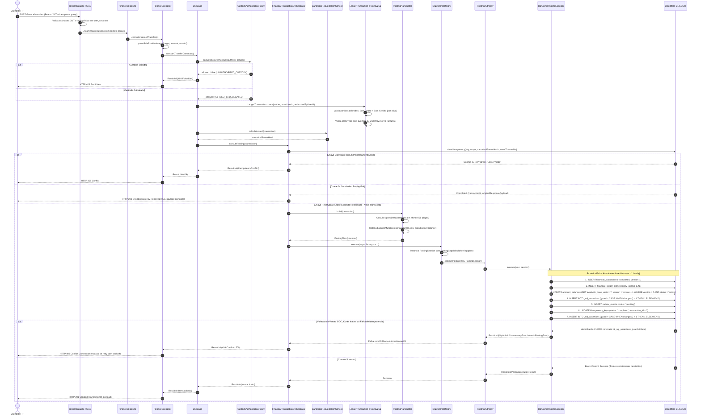
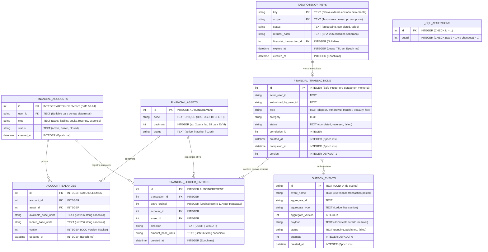

# Finance Core — Mapeamento Arquitetural, Diagramas & Checklist Unificado de Auditoria

> **Documento Oficial de Engenharia & Auditoria de Fronteira (Gate 0 / P0 Hardened)**  
> **Versão:** 2.6.0 (P0 Hardened Post-Audit)  
> **Ambiente de Execução:** Cloudflare Workers (D1 SQLite) + Drizzle ORM + Hono Framework  
> **Padrão Arquitetural:** Clean Architecture + Domain-Driven Design (DDD) + Append-Only Double-Entry Ledger com Balanços Materializados Síncronos (State-Based OCC) + Transactional Outbox Pattern  
> **Aritmética & Armazenamento:** Precisão Arbitrária de 256 bits (`Money256` / `BigInt` em Memória V8) + Persistência em Texto Canônico (`TEXT`) no Cloudflare D1 SQLite

---

## 1. Diagrama Arquitetural Completo (Clean Architecture & Posting Boundary)

O diagrama a seguir descreve a topologia integral de entrada, orquestração, regras de negócio puras, contratos de custódia, isolamento de autoridade contábil e persistência atômica no banco de dados Cloudflare D1.

```mermaid
flowchart TD
    %% ==========================================
    %% CAMADA DE ENTRADA HTTP (INGRESS & GUARDS)
    %% ==========================================
    subgraph INGRESS [Camada 4 - Apresentacao HTTP e Ingress]
        REQ["Cliente HTTP / Frontend"] --> SG["sessionGuard<br/>(Validacao fisica no D1 user_sessions)"]
        SG --> AAL["requireAal(2, 15)<br/>(Autenticacao Recente e Forte)"]
        AAL --> RBAC["verifyPermission<br/>(RBAC DB-Backed e Injecao de Contexto)"]
        RBAC --> ROUTES["finance.routes.ts<br/>(Roteamento Semantico Tipado)"]
        ROUTES --> CTRL["FinanceController.ts<br/>(Parse Safe Integer, DTOs, Error Mapping)"]
    end

    %% ==========================================
    %% CAMADA DE APLICAÇÃO (USE CASES & ORQUESTRAÇÃO)
    %% ==========================================
    subgraph APPLICATION [Camada 2 - Aplicacao, Casos de Uso e Portas]
        CTRL -->|Mutacoes| UC_TX["RecordTreasuryTransactionUseCase"]
        CTRL -->|Transferencia P2P| UC_TR["RecordTransferUseCase"]
        CTRL -->|Deposito| UC_DEP["RecordDepositUseCase"]
        CTRL -->|Estorno Auditado| UC_REV["ReverseTransactionUseCase"]
        CTRL -->|Consultas| UC_REP["GetConsolidatedFinancialReportUseCase"]
        CTRL -->|Extratos Externos| UC_EXT["GetExternalTransactionsUseCase"]
        CTRL -->|Saldo Tesouraria| UC_BAL["GetTreasuryBalanceUseCase"]

        HASH_SRV["CanonicalRequestHashService<br/>(Hash Canonico SHA-256 Soberano)"]
        UC_TX -->|Verificacao de Hash| HASH_SRV
        UC_TR -->|Verificacao de Hash| HASH_SRV

        ORCH["FinancialTransactionOrchestrator<br/>(Controle OCC, Idempotencia e State Machine)"]
        UC_TX --> ORCH
        UC_TR --> ORCH
        UC_DEP --> ORCH
        UC_REV --> ORCH

        POST_AUTH["PostingAuthority<br/>(Porta Estrita de Commit Contabil)"]
        ORCH -->|Despacha PostingPlan + Session| POST_AUTH

        subgraph PORTS [Portas de Saida - Abstracoes]
            IFIN_REPO["IFinanceRepository<br/>(Porta de Leitura Contabil e Idempotencia)"]
            IPOST_EXEC["IPostingExecutor<br/>(Porta de Execucao Fisica do Plano)"]
            IUOW["IUnitOfWork<br/>(Fronteira Transacional e Emissao de Sessao)"]
        end

        ORCH -->|Executa no escopo transacional| IUOW
        ORCH -->|Queries e Lease de Idempotencia| IFIN_REPO
        POST_AUTH -->|PostingPlan + PostingSession| IPOST_EXEC
    end

    %% ==========================================
    %% CAMADA DE DOMÍNIO (REGRAS CONTÁBEIS PURAS)
    %% ==========================================
    subgraph DOMAIN [Camada 1 - Dominio e Regras Contabeis Puras]
        AUTH_POL["CustodyAuthorizationPolicy<br/>(Verificacao Soberana de Custodia sobre Debito)"]
        UC_TR -->|Verifica Custodia| AUTH_POL

        PLAN_BLD["PostingPlanBuilder<br/>(Compilador de Mutacoes: Ordenacao Deterministica accountId ASC)"]
        ORCH -->|Compila Plano| PLAN_BLD

        AGG_TX["LedgerTransaction - Aggregate Root<br/>(Partidas Dobradas: Sum Debitos = Sum Creditos)"]
        M256["Money256 - Value Object<br/>(Aritmetica BigInt 256 bits sem float no V8)"]
        ENT_POL["AccountingEntryPolicy<br/>(Matriz Contabil e Regras de Lancamento)"]
        ACC_POL["AccountClassPolicy e AccountStatusPolicy<br/>(Natureza Contabil: Ativo, Passivo, PL)"]

        PLAN_BLD --> AGG_TX
        AGG_TX --> M256
        AGG_TX --> ENT_POL
        ENT_POL --> ACC_POL

        PLAN["PostingPlan - Imutavel<br/>(Transacao + Ledger Entries + Balance Deltas + Outbox)"]
        PLAN_BLD --> PLAN

        TOKEN["PostingCapabilityToken - Unique Symbol<br/>(Nao-forjavel pela aplicacao)"]
        SESS["PostingSession<br/>(Autoridade Fisica de Escrita)"]
        TOKEN --> SESS
    end

    %% ==========================================
    %% CAMADA DE INFRAESTRUTURA & PERSISTÊNCIA
    %% ==========================================
    subgraph INFRA [Camada 3 - Infraestrutura Concreta, Adaptadores e Repositorios]
        DRIZZLE_UOW["DrizzleUnitOfWork.ts<br/>(Portador Exclusivo do Token e Emissor da Session)"]
        D1_EXEC["D1AtomicPostingExecutor.ts<br/>(Execucao d1.batch com Guardas SQL changes() = 1)"]
        DRIZZLE_REPO["DrizzleFinanceRepository.ts<br/>(Adaptador Concreto D1 SQLite)"]
        BOOTSTRAP["FinanceBootstrapService.ts<br/>(Inicializacao Idempotente do Plano de Contas)"]
        OUTBOX_RELAY["Outbox Relay / Worker / EventInboxService<br/>(Despacho Assincrono At-Least-Once)"]
    end

    IUOW --> DRIZZLE_UOW
    IPOST_EXEC --> D1_EXEC
    IFIN_REPO --> DRIZZLE_REPO
    DRIZZLE_UOW -->|Fornece Token e Fabrica| SESS

    %% ==========================================
    %% BANCO DE DADOS (CLOUDFLARE D1 / SQLITE)
    %% ==========================================
    subgraph DATABASE [Camada 5 - Banco de Dados Relacional SQLite D1]
        T_TX["financial_transactions<br/>(Registro da Transacao e Metadados Forenses)"]
        T_ENT["financial_ledger_entries<br/>(Lancamentos Imutaveis com Ordinal Estrito)"]
        T_BAL["account_balances<br/>(Saldos Materializados em TEXT uint256 com Versao OCC)"]
        T_ACC["financial_accounts<br/>(Plano de Contas do Sistema e Usuarios)"]
        T_ASS["financial_assets<br/>(Ativos e Moedas Cadastradas)"]
        T_IDEM["idempotency_keys<br/>(Travamento Concorrente com TTL e Replay)"]
        T_OUT["outbox_events<br/>(Eventos Contabeis Transacionais)"]
        T_SQL_ASSERT["_sql_assertions<br/>(Tabela de Guarda Fisica de Mutacao changes() = 1)"]
    end

    D1_EXEC -->|1. INSERT Transacao| T_TX
    D1_EXEC -->|2. INSERT Pernas Contabeis| T_ENT
    D1_EXEC -->|3. UPDATE Saldo OCC em TEXT| T_BAL
    D1_EXEC -->|4. INSERT Evento Outbox| T_OUT
    D1_EXEC -->|5. UPDATE Idempotencia completed| T_IDEM
    D1_EXEC -->|6. Guarda Fisica changes() = 1| T_SQL_ASSERT

    DRIZZLE_REPO --> T_ACC
    DRIZZLE_REPO --> T_ASS
    DRIZZLE_REPO --> T_IDEM
    T_OUT --> OUTBOX_RELAY
```

---

## 2. Diagrama de Sequência Forense: Ciclo de Commit Contábil

O fluxo a seguir ilustra a orquestração segura contra condições de corrida, contenção OCC, lease timeout de idempotência e validação atômica via `_sql_assertions`.



---

## 3. Diagrama Entidade-Relacionamento Físico (ERD — Livro-Razão Contábil)

O diagrama a seguir exibe as entidades centrais do razão contábil, suas chaves primárias, relacionamentos de integridade referencial e os tipos de dados físicos persistidos no SQLite D1.



> **Contrato Físico de Aritmética no SQLite:**  
> O SQLite nativo opera com inteiros de 64 bits com sinal. Para suportar unidades de 256 bits com precisão completa de contratos inteligentes EVM ($2^{256}-1$), os campos monetários `amount_base_units`, `available_base_units` e `locked_base_units` são armazenados como **`TEXT`**. A aritmética de atualização e validação contábil ocorre **exclusivamente em memória no runtime V8 via [`Money256`](file:///home/sandro/Área de trabalho/BackEnd/src/domains/finance/value-objects/Money256.ts)**, impedindo qualquer arredondamento ou overflow no banco.

---

## 4. Topologia e Árvore Completa de Diretórios do Módulo Financeiro

A árvore a seguir consolida toda a topologia de diretórios e a localização física dos 76 arquivos do subsistema financeiro, cobrindo o núcleo de domínio, contratos, portas, orquestração, infraestrutura de persistência, rotas de apresentação, migrações D1 e a suíte de testes contábeis e de fronteira arquitetural:

```text
BackEnd/
├── migrations/
│   ├── 0009_finance_schema_alignment.sql
│   ├── 0010_finance_fixes_and_rates_alignment.sql
│   ├── 0011_treasury_singleton_and_forensic_audit.sql
│   └── 0012_finance_p0_hardening.sql
├── src/
│   ├── application/
│   │   ├── finance/
│   │   │   ├── errors/
│   │   │   │   └── FinancialErrorMapper.ts
│   │   │   ├── services/
│   │   │   │   ├── CanonicalRequestHashService.ts
│   │   │   │   ├── FinancialTransactionOrchestrator.ts
│   │   │   │   └── PostingAuthority.ts
│   │   │   └── use-cases/
│   │   │       ├── GetConsolidatedFinancialReportUseCase.ts
│   │   │       ├── GetExternalTransactionsUseCase.ts
│   │   │       ├── GetTreasuryBalanceUseCase.ts
│   │   │       ├── RecordDepositUseCase.ts
│   │   │       ├── RecordLedgerTransactionUseCase.ts
│   │   │       ├── RecordTransferUseCase.ts
│   │   │       ├── RecordTreasuryTransactionUseCase.ts
│   │   │       ├── RepairFinanceUseCase.ts
│   │   │       └── ReverseTransactionUseCase.ts
│   │   └── ports/
│   │       └── output/
│   │           ├── IFinanceRepository.ts
│   │           ├── IPostingExecutor.ts
│   │           └── IUnitOfWork.ts
│   ├── db/
│   │   ├── finance/
│   │   │   ├── relations.ts
│   │   │   └── tables.ts
│   │   └── seed_treasury_report.sql
│   ├── domains/
│   │   └── finance/
│   │       ├── constants/
│   │       │   └── FinancialLimits.ts
│   │       ├── contracts/
│   │       │   ├── AuthorizationContext.ts
│   │       │   ├── DeterministicIdGenerator.ts
│   │       │   ├── FinancialLedgerEntryRecord.ts
│   │       │   ├── IdempotencyScope.ts
│   │       │   ├── PostingPlan.ts
│   │       │   └── PostingSession.ts
│   │       ├── entities/
│   │       │   └── LedgerTransaction.ts
│   │       ├── errors/
│   │       │   ├── FinancialError.ts
│   │       │   └── LedgerImbalanceError.ts
│   │       ├── policies/
│   │       │   ├── AccountClassPolicy.ts
│   │       │   ├── AccountStatusPolicy.ts
│   │       │   ├── AccountingEntryPolicy.ts
│   │       │   ├── AssetStatusPolicy.ts
│   │       │   └── FinancialTextPolicy.ts
│   │       ├── services/
│   │       │   ├── FinancialTransactionStateMachine.ts
│   │       │   └── PostingPlanBuilder.ts
│   │       └── value-objects/
│   │           ├── BaseUnits.ts
│   │           ├── FinancialIdentifier.ts
│   │           ├── FinancialTransactionStatus.ts
│   │           ├── LedgerEntryDirection.ts
│   │           └── Money256.ts
│   ├── infrastructure/
│   │   ├── repositories/
│   │   │   ├── DrizzleFinanceRepository.ts
│   │   │   ├── DrizzleOutboxRepository.ts
│   │   │   └── DrizzleUnitOfWork.ts
│   │   └── services/
│   │       ├── D1AtomicPostingExecutor.ts
│   │       ├── EventInboxService.ts
│   │       ├── FinanceBootstrapService.ts
│   │       └── FinancialHistoricalImportService.ts
│   └── interfaces/
│       └── http/
│           ├── controllers/
│           │   └── finance/
│           │       └── FinanceController.ts
│           └── routes/
│               └── finance/
│                   └── finance.routes.ts
└── tests/
    ├── architecture/
    │   ├── architecture-boundaries.test.ts
    │   ├── dependency_rules.test.ts
    │   ├── finance_posting_authority.test.ts
    │   └── static_architecture.test.ts
    └── finance/
        ├── invariants/
        │   ├── balance_projection.test.ts
        │   ├── commit_failure.test.ts
        │   ├── seeds_normal_balance.test.ts
        │   └── transaction_failure_matrix.test.ts
        ├── DrizzleFinanceRepository.test.ts
        ├── FinancialTransaction.test.ts
        ├── adversarial_certification.test.ts
        ├── audit_gaps_hardening.test.ts
        ├── bootstrap_atomicity.test.ts
        ├── bootstrap_service.test.ts
        ├── concurrency_idempotency_same_key.test.ts
        ├── concurrency_stress.test.ts
        ├── domain_freeze_hardening.test.ts
        ├── domain_policies.test.ts
        ├── event_inbox.test.ts
        ├── evm_precision.test.ts
        ├── failure_injection.test.ts
        ├── finance_controller_e2e.test.ts
        ├── finance_real_db_e2e.test.ts
        ├── money256.test.ts
        ├── phase4_hardening.test.ts
        ├── posting_authority_hardening.test.ts
        ├── reconciliation_3way.test.ts
        ├── reverse_transaction.test.ts
        ├── schema_drift.test.ts
        └── schema_invariants_audit.test.ts
```

---

## 5. Inventário Descritivo de Todos os 76 Arquivos do Módulo Financeiro

### Camada 1: Domínio Contábil Puro (`src/domains/finance/`) — 22 Arquivos

| # | Arquivo | Responsabilidade Arquitetural | Invariante / Garantia de Segurança |
| **01** | [`constants/FinancialLimits.ts`](file:///home/sandro/Área de trabalho/BackEnd/src/domains/finance/constants/FinancialLimits.ts)<br/>`[████████████████████] 100%`<br/>**`✅ FROZEN (10,0 / 10,0)`** | Catálogo canônico de limites fundamentais, invariantes matemáticas (uint256), cardinalidades e metadados executáveis. | Imutável, sem dependências de I/O, bijeção estrita no manifesto, anti-DoS ceiling e proteção contra overflow acumulado. |
| **02** | [`contracts/AuthorizationContext.ts`](file:///home/sandro/Área de trabalho/BackEnd/src/domains/finance/contracts/AuthorizationContext.ts) | Contratos formais de custódia e `CustodyAuthorizationPolicy`. | Impede débito em conta sem autoridade soberana (`SELF` ou `DELEGATED`). |
| **03** | [`contracts/DeterministicIdGenerator.ts`](file:///home/sandro/Área de trabalho/BackEnd/src/domains/finance/contracts/DeterministicIdGenerator.ts) | Gerador determinístico de identificadores de 53 bits (Safe Integer). | IDs conhecidos em memória antes da compilação do lote SQL físico. |
| **04** | [`contracts/FinancialLedgerEntryRecord.ts`](file:///home/sandro/Área de trabalho/BackEnd/src/domains/finance/contracts/FinancialLedgerEntryRecord.ts) | Contrato de dados imutável de transporte das pernas contábeis. | Estrutura de dados canônica para gravação de partidas dobradas. |
| **05** | [`contracts/IdempotencyScope.ts`](file:///home/sandro/Área de trabalho/BackEnd/src/domains/finance/contracts/IdempotencyScope.ts) | Taxonomia canônica de escopos compostos e resultados de claim. | Evita colisão de chaves entre usuários, provedores e operações. |
| **06** | [`contracts/PostingPlan.ts`](file:///home/sandro/Área de trabalho/BackEnd/src/domains/finance/contracts/PostingPlan.ts) | DTO imutável contendo todas as mutações físicas de uma transação. | Fonte Única da Verdade para deltas de saldo (`signedDeltaBaseUnits`). |
| **07** | [`contracts/PostingSession.ts`](file:///home/sandro/Área de trabalho/BackEnd/src/domains/finance/contracts/PostingSession.ts) | *Capability Token* não-forjável protegido por `unique symbol`. | Impede que a aplicação forje sessões contábeis sem a Unit of Work. |
| **08** | [`entities/LedgerTransaction.ts`](file:///home/sandro/Área de trabalho/BackEnd/src/domains/finance/entities/LedgerTransaction.ts) | Raiz de Agregação Contábil (Aggregate Root). | Impõe a Equação Fundamental: $\sum Débito = \sum Crédito$ por ativo. |
| **09** | [`errors/FinancialError.ts`](file:///home/sandro/Área de trabalho/BackEnd/src/domains/finance/errors/FinancialError.ts) | Hierarquia completa de exceções e erros tipados de domínio. | Erros sem acoplamento HTTP com códigos canônicos determinísticos. |
| **10** | [`errors/LedgerImbalanceError.ts`](file:///home/sandro/Área de trabalho/BackEnd/src/domains/finance/errors/LedgerImbalanceError.ts) | Erro específico de desbalanceamento contábil. | Disparado imediatamente se uma perna contábil for desbalanceada. |
| **11** | [`policies/AccountClassPolicy.ts`](file:///home/sandro/Área de trabalho/BackEnd/src/domains/finance/policies/AccountClassPolicy.ts) | Regras das 5 naturezas contábeis (Ativo, Passivo, PL, Receita, Despesa). | Garante regras de saldo normal (devedor vs credor) para cada conta. |
| **12** | [`policies/AccountStatusPolicy.ts`](file:///home/sandro/Área de trabalho/BackEnd/src/domains/finance/policies/AccountStatusPolicy.ts) | Regras de ciclo de vida e permissões operacionais de contas. | Bloqueia lançamentos em contas inativas, suspensas ou encerradas. |
| **13** | [`policies/AccountingEntryPolicy.ts`](file:///home/sandro/Área de trabalho/BackEnd/src/domains/finance/policies/AccountingEntryPolicy.ts) | Políticas de geração de pernas contábeis para depósitos, saques, etc. | Gera pernas espelhadas de contrapartida para partidas dobradas. |
| **14** | [`policies/AssetStatusPolicy.ts`](file:///home/sandro/Área de trabalho/BackEnd/src/domains/finance/policies/AssetStatusPolicy.ts) | Regras de validação e estados de ativos transacionáveis. | Impede operações em moedas e tokens congelados ou não homologados. |
| **15** | [`policies/FinancialTextPolicy.ts`](file:///home/sandro/Área de trabalho/BackEnd/src/domains/finance/policies/FinancialTextPolicy.ts) | Sanitização e validação de textos, descrições e motivos de negócio. | Previne injeção de caracteres de controle e descrições vazias. |
| **16** | [`services/FinancialTransactionStateMachine.ts`](file:///home/sandro/Área de trabalho/BackEnd/src/domains/finance/services/FinancialTransactionStateMachine.ts) | Máquina de estados determinística para o ciclo da transação. | Impede transições ilegais (ex: de `failed` direto para `completed`). |
| **17** | [`services/PostingPlanBuilder.ts`](file:///home/sandro/Área de trabalho/BackEnd/src/domains/finance/services/PostingPlanBuilder.ts) | Compilador que converte intenções de domínio em um `PostingPlan`. | Prepara a ordem determinística de atualização de contas (`accountId ASC`). |
| **18** | [`value-objects/BaseUnits.ts`](file:///home/sandro/Área de trabalho/BackEnd/src/domains/finance/value-objects/BaseUnits.ts)<br/>`[████████████████████] 100%`<br/>**`✅ FROZEN (10,0 / 10,0)`** | Conversão de representação decimal humana para unidades base canônicas e formatação determinística. | Pre-parsing trim, validação estrita de precisão (0-18), limite lexical uint256 e validação forte de `AssetPrecisionContext`. |
| **19** | [`value-objects/FinancialTransactionStatus.ts`](file:///home/sandro/Área de trabalho/BackEnd/src/domains/finance/value-objects/FinancialTransactionStatus.ts)<br/>`[████████████████████] 100%`<br/>**`✅ FROZEN (10,0 / 10,0)`** | Catálogo canônico dos estados do ciclo de vida transacional. | `Object.freeze` em dicionário e tupla, sanitização de JSDoc sem vazamento de infraestrutura, type guard seguro. |
| **20** | [`value-objects/Money256.ts`](file:///home/sandro/Área de trabalho/BackEnd/src/domains/finance/value-objects/Money256.ts)<br/>`[████████████████████] 100%`<br/>**`✅ FROZEN (10,0 / 10,0)`** | Value Object imutável de precisão arbitrária de 256 bits (`BigInt`). | Imune a estouros de ponto flutuante, delega validação de IDs para `FinancialIdentifier.ts`, aritmética pura em `BigInt`. |
| **21** | [`value-objects/LedgerEntryDirection.ts`](file:///home/sandro/Área de trabalho/BackEnd/src/domains/finance/value-objects/LedgerEntryDirection.ts)<br/>`[████████████████████] 100%`<br/>**`✅ FROZEN (10,0 / 10,0)`** | Catálogo canônico da direção contábil de pernas do razão (`debit` / `credit`). | Domínio puro isolado, imutabilidade com `Object.freeze`, type guard `isLedgerEntryDirection` estrito. |
| **22** | [`value-objects/FinancialIdentifier.ts`](file:///home/sandro/Área de trabalho/BackEnd/src/domains/finance/value-objects/FinancialIdentifier.ts)<br/>`[████████████████████] 100%`<br/>**`✅ FROZEN (10,0 / 10,0)`** | Value Object e validador canônico de identificadores físicos inteiros positivos (53 bits). | Teto lexical de 16 dígitos (`MAX_JS_SAFE_INTEGER_DECIMAL_DIGITS`), validação de `Number.isSafeInteger() > 0`, imutabilidade com `Object.freeze`. |

---

### Camada 2: Aplicação, Portas e Casos de Uso (`src/application/finance/` e portas) — 15 Arquivos

| # | Arquivo | Responsabilidade Arquitetural | Invariante / Garantia de Segurança |
| :---: | :--- | :--- | :--- |
| **21** | [`ports/output/IFinanceRepository.ts`](file:///home/sandro/Área de trabalho/BackEnd/src/application/ports/output/IFinanceRepository.ts) | Porta de persistência de leitura contábil e idempotência. | Contrato desacoplado da tecnologia de banco de dados física. |
| **22** | [`ports/output/IPostingExecutor.ts`](file:///home/sandro/Área de trabalho/BackEnd/src/application/ports/output/IPostingExecutor.ts) | Porta que define a execução física do `PostingPlan`. | Exige compulsoriamente a entrega de uma `PostingSession` válida. |
| **23** | [`ports/output/IUnitOfWork.ts`](file:///home/sandro/Área de trabalho/BackEnd/src/application/ports/output/IUnitOfWork.ts) | Porta de fronteira transacional e fábrica de repositórios. | Emite a sessão autorizada para execução do lote contábil. |
| **24** | [`finance/errors/FinancialErrorMapper.ts`](file:///home/sandro/Área de trabalho/BackEnd/src/application/finance/errors/FinancialErrorMapper.ts) | Tradutor de erros de domínio em códigos HTTP. | Isola o domínio do protocolo web (400, 403, 404, 409, 422). |
| **25** | [`finance/services/CanonicalRequestHashService.ts`](file:///home/sandro/Área de trabalho/BackEnd/src/application/finance/services/CanonicalRequestHashService.ts) | Cálculo canônico determinístico de hash SHA-256. | Impede ataques de adulteração e falsificação de idempotência. |
| **26** | [`finance/services/FinancialTransactionOrchestrator.ts`](file:///home/sandro/Área de trabalho/BackEnd/src/application/finance/services/FinancialTransactionOrchestrator.ts) | Orquestrador de concorrência, pré-validação e lock contábil. | Ordena contas deterministicamente e impõe OCC atômico. |
| **27** | [`finance/services/PostingAuthority.ts`](file:///home/sandro/Área de trabalho/BackEnd/src/application/finance/services/PostingAuthority.ts) | Ponto único e soberano de despacho contábil. | Não permite mutação contábil fora do par `(PostingPlan, PostingSession)`. |
| **28** | [`finance/use-cases/GetConsolidatedFinancialReportUseCase.ts`](file:///home/sandro/Área de trabalho/BackEnd/src/application/finance/use-cases/GetConsolidatedFinancialReportUseCase.ts) | Emissão de balancete patrimonial consolidado. | Projeta e audita saldos totais de todas as classes contábeis. |
| **29** | [`finance/use-cases/GetExternalTransactionsUseCase.ts`](file:///home/sandro/Área de trabalho/BackEnd/src/application/finance/use-cases/GetExternalTransactionsUseCase.ts) | Consulta paginada de lançamentos bancários importados. | Suporta filtragem por reconciliação e proteção de payload bruto. |
| **30** | [`finance/use-cases/GetTreasuryBalanceUseCase.ts`](file:///home/sandro/Área de trabalho/BackEnd/src/application/finance/use-cases/GetTreasuryBalanceUseCase.ts) | Consulta do saldo da conta-mestre de tesouraria do sistema. | Consulta atômica do saldo disponível sem locks desnecessários. |
| **31** | [`finance/use-cases/RecordDepositUseCase.ts`](file:///home/sandro/Área de trabalho/BackEnd/src/application/finance/use-cases/RecordDepositUseCase.ts) | Registro de depósitos e integralização de saldos de usuários. | Credita usuário debitando a conta de clearing/bancária correspondente. |
| **32** | [`finance/use-cases/RecordLedgerTransactionUseCase.ts`](file:///home/sandro/Área de trabalho/BackEnd/src/application/finance/use-cases/RecordLedgerTransactionUseCase.ts) | Registro genérico de transações multi-pernas no razão. | Validação estrita de matriz contábil antes da submissão. |
| **33** | [`finance/use-cases/RecordTransferUseCase.ts`](file:///home/sandro/Área de trabalho/BackEnd/src/application/finance/use-cases/RecordTransferUseCase.ts) | Transferência entre contas de usuários. | Exige aprovação de custódia (`CustodyAuthorizationPolicy`). |
| **34** | [`finance/use-cases/RecordTreasuryTransactionUseCase.ts`](file:///home/sandro/Área de trabalho/BackEnd/src/application/finance/use-cases/RecordTreasuryTransactionUseCase.ts) | Mutações diretas na tesouraria (aportes, despesas, taxas). | Validação do hash canônico e controle contra *overdraft*. |
| **35** | [`finance/use-cases/ReverseTransactionUseCase.ts`](file:///home/sandro/Área de trabalho/BackEnd/src/application/finance/use-cases/ReverseTransactionUseCase.ts) | Estorno de transações prévias aprovadas. | Gera pernas contábeis inversas com rastreabilidade forense (`reversed_at`). |

---

### Camada 3: Infraestrutura Concreta, Adaptadores e Repositórios (`src/infrastructure/`) — 5 Arquivos

| # | Arquivo | Responsabilidade Arquitetural | Invariante / Garantia de Segurança |
| :---: | :--- | :--- | :--- |
| **36** | [`repositories/DrizzleUnitOfWork.ts`](file:///home/sandro/Área de trabalho/BackEnd/src/infrastructure/repositories/DrizzleUnitOfWork.ts) | Fábrica transacional Drizzle, emissor da `PostingSession` e portador único do token. | Detém exclusivamente o `PostingCapabilityToken`; impede forja de sessões contábeis. |
| **37** | [`repositories/DrizzleFinanceRepository.ts`](file:///home/sandro/Área de trabalho/BackEnd/src/infrastructure/repositories/DrizzleFinanceRepository.ts) | Adaptador concreto do repositório financeiro sobre Drizzle ORM. | Executa queries seguras no D1 e gerencia leases de idempotência com TTL. |
| **38** | [`services/D1AtomicPostingExecutor.ts`](file:///home/sandro/Área de trabalho/BackEnd/src/infrastructure/services/D1AtomicPostingExecutor.ts) | Executor físico atômico do `PostingPlan` via `db.batch()`. | Agrupa INSERTs e UPDATEs com guardas SQL `_sql_assertions` (`changes() = 1`). |
| **39** | [`services/FinanceBootstrapService.ts`](file:///home/sandro/Área de trabalho/BackEnd/src/infrastructure/services/FinanceBootstrapService.ts) | Inicializador idempotente do plano de contas e tesouraria. | Garante existência singleton da conta de tesouraria e ativos semente. |
| **40** | [`services/FinancialHistoricalImportService.ts`](file:///home/sandro/Área de trabalho/BackEnd/src/infrastructure/services/FinancialHistoricalImportService.ts) | Pipeline de importação de extratos (Bradesco, Cora, Caixa, Inter). | Gera fingerprint SHA-256 por linha importada para evitar duplicatas. |

> *Nota de Serviços Complementares de Mensageria e Reparo:*  
> Além dos 5 arquivos centrais da Camada 3, o subsistema integra [`services/EventInboxService.ts`](file:///home/sandro/Área de trabalho/BackEnd/src/infrastructure/services/EventInboxService.ts) (deduplicação de eventos at-least-once), [`repositories/DrizzleOutboxRepository.ts`](file:///home/sandro/Área de trabalho/BackEnd/src/infrastructure/repositories/DrizzleOutboxRepository.ts) (despacho assíncrono de outbox) e o caso de uso de manutenção preventiva [`use-cases/RepairFinanceUseCase.ts`](file:///home/sandro/Área de trabalho/BackEnd/src/application/finance/use-cases/RepairFinanceUseCase.ts).

---

### Camada 4: Banco de Dados Relacional (`src/db/finance/` e seed) — 3 Arquivos

| # | Arquivo | Responsabilidade Arquitetural | Invariante / Garantia de Segurança |
| :---: | :--- | :--- | :--- |
| **41** | [`finance/tables.ts`](file:///home/sandro/Área de trabalho/BackEnd/src/db/finance/tables.ts) | Definição das tabelas físicas do razão contábil e asserções. | Valores em `TEXT`, constraints de check, foreign keys e índices determinísticos. |
| **42** | [`finance/relations.ts`](file:///home/sandro/Área de trabalho/BackEnd/src/db/finance/relations.ts) | Definição dos relacionamentos estruturais do Drizzle. | Integridade referencial entre contas, lançamentos, transações e saldos. |
| **43** | [`seed_treasury_report.sql`](file:///home/sandro/Área de trabalho/BackEnd/src/db/finance/seed_treasury_report.sql) | Script de seed para relatórios e calibração contábil. | Carga de homologação com balanceamento rigoroso pré-validado. |

---

### Camada 5: Apresentação HTTP (`src/interfaces/http/`) — 2 Arquivos

| # | Arquivo | Responsabilidade Arquitetural | Invariante / Garantia de Segurança |
| :---: | :--- | :--- | :--- |
| **44** | [`controllers/finance/FinanceController.ts`](file:///home/sandro/Área de trabalho/BackEnd/src/interfaces/http/controllers/finance/FinanceController.ts) | Controlador HTTP do módulo financeiro. | Parse estrito de Safe Integer, extração do ator da sessão e mapa de erros. |
| **45** | [`routes/finance/finance.routes.ts`](file:///home/sandro/Área de trabalho/BackEnd/src/interfaces/http/routes/finance/finance.routes.ts) | Roteador REST (Hono) do subsistema. | sessionGuard obrigatório, requireAal(2, 15) e permissões granulares por rota. |

---

### Camada 6: Migrações Relacionais Contábeis (`migrations/`) — 4 Arquivos

| # | Arquivo | Responsabilidade Arquitetural | Invariante / Garantia de Segurança |
| :---: | :--- | :--- | :--- |
| **46** | [`0009_finance_schema_alignment.sql`](file:///home/sandro/Área de trabalho/BackEnd/migrations/0009_finance_schema_alignment.sql) | Alinhamento estrutural inicial das tabelas contábeis. | Criação das tabelas do livro-razão e saldos materializados. |
| **47** | [`0010_finance_fixes_and_rates_alignment.sql`](file:///home/sandro/Área de trabalho/BackEnd/migrations/0010_finance_fixes_and_rates_alignment.sql) | Ajuste fino de tipos, índices e precisão de taxas financeiras. | Índices compostos de concorrência e busca rápida de transações. |
| **48** | [`0011_treasury_singleton_and_forensic_audit.sql`](file:///home/sandro/Área de trabalho/BackEnd/migrations/0011_treasury_singleton_and_forensic_audit.sql) | Garantia de singleton de tesouraria e triggers forenses. | Impede criação de uma segunda conta de tesouraria no sistema. |
| **49** | [`0012_finance_p0_hardening.sql`](file:///home/sandro/Área de trabalho/BackEnd/migrations/0012_finance_p0_hardening.sql) | Endurecimento P0: ordinais contíguos e tabela `_sql_assertions`. | Unique constraint em `(transaction_id, entry_ordinal)` e tabela de guarda `_sql_assertions`. |

---

### Camada 7: Suíte de Testes Automatizados e Invariantes (`tests/finance/` e arquitetura) — 27 Arquivos

| # | Arquivo | Responsabilidade Arquitetural | Invariante / Garantia de Segurança |
| :---: | :--- | :--- | :--- |
| **50** | [`tests/architecture/finance_posting_authority.test.ts`](file:///home/sandro/Área de trabalho/BackEnd/tests/architecture/finance_posting_authority.test.ts) | Teste arquitetural de barreira de postagem. | Garante que nenhuma classe fora de `PostingAuthority` comita no ledger. |
| **51** | [`tests/finance/adversarial_certification.test.ts`](file:///home/sandro/Área de trabalho/BackEnd/tests/finance/adversarial_certification.test.ts) | Teste de certificação contra ataques adversariais. | Ataques de re-entrância, falsificação de tokens e colisão concorrente. |
| **52** | [`tests/finance/audit_gaps_hardening.test.ts`](file:///home/sandro/Área de trabalho/BackEnd/tests/finance/audit_gaps_hardening.test.ts) | Hardening de auditoria e trilhas forenses. | Verificação de integridade entre eventos outbox e registros físicos. |
| **53** | [`tests/finance/bootstrap_atomicity.test.ts`](file:///home/sandro/Área de trabalho/BackEnd/tests/finance/bootstrap_atomicity.test.ts) | Teste de atomicidade do bootstrap contábil. | Rollback integral caso qualquer conta sistêmica falhe na inicialização. |
| **54** | [`tests/finance/bootstrap_service.test.ts`](file:///home/sandro/Área de trabalho/BackEnd/tests/finance/bootstrap_service.test.ts) | Testes unitários do serviço de inicialização. | Confere idempotência na execução repetida de seeds de contas. |
| **55** | [`tests/finance/concurrency_idempotency_same_key.test.ts`](file:///home/sandro/Área de trabalho/BackEnd/tests/finance/concurrency_idempotency_same_key.test.ts) | Teste de colisão com mesma chave de idempotência. | Exatamente 1 request é processado; concorrentes recebem 409 ou replay 200. |
| **56** | [`tests/finance/concurrency_stress.test.ts`](file:///home/sandro/Área de trabalho/BackEnd/tests/finance/concurrency_stress.test.ts) | Teste de estresse com transações simultâneas de alta frequência. | Verifica que nenhum saldo fica corrompido sob corrida concorrente. |
| **57** | [`tests/finance/domain_freeze_hardening.test.ts`](file:///home/sandro/Área de trabalho/BackEnd/tests/finance/domain_freeze_hardening.test.ts) | Teste de congelamento e imutabilidade de regras. | Impede regressões acidentais em políticas contábeis inegociáveis. |
| **58** | [`tests/finance/domain_policies.test.ts`](file:///home/sandro/Área de trabalho/BackEnd/tests/finance/domain_policies.test.ts) | Validação unitária de todas as policies contábeis. | Testa validações de texto, classes de conta e status operacionais. |
| **59** | [`tests/finance/DrizzleFinanceRepository.test.ts`](file:///home/sandro/Área de trabalho/BackEnd/tests/finance/DrizzleFinanceRepository.test.ts) | Testes de integração do repositório Drizzle sobre SQLite. | Confere comportamento das queries e mapeamento de campos físicos. |
| **60** | [`tests/finance/event_inbox.test.ts`](file:///home/sandro/Área de trabalho/BackEnd/tests/finance/event_inbox.test.ts) | Teste do inbox de eventos financeiros assíncronos. | Garante entrega *at-least-once* com deduplicação rigorosa de eventos. |
| **61** | [`tests/finance/evm_precision.test.ts`](file:///home/sandro/Área de trabalho/BackEnd/tests/finance/evm_precision.test.ts) | Compatibilidade matemática com EVM (uint256). | Garante precisão decimal idêntica à de contratos inteligentes Solidity (18 casas). |
| **62** | [`tests/finance/failure_injection.test.ts`](file:///home/sandro/Área de trabalho/BackEnd/tests/finance/failure_injection.test.ts) | Injeção de falhas deliberadas e simulação de pane de disco. | Verifica se o sistema mantém consistência ACID mesmo com falha no commit. |
| **63** | [`tests/finance/finance_controller_e2e.test.ts`](file:///home/sandro/Área de trabalho/BackEnd/tests/finance/finance_controller_e2e.test.ts) | Testes ponta a ponta da camada de apresentação HTTP. | Testa contratos de resposta (201, 200 replay, 400, 403, 409, 500). |
| **64** | [`tests/finance/finance_real_db_e2e.test.ts`](file:///home/sandro/Área de trabalho/BackEnd/tests/finance/finance_real_db_e2e.test.ts) | Teste E2E contra banco D1 real local. | Executa o ciclo de vida completo de depósitos, saques e transferências. |
| **65** | [`tests/finance/FinancialTransaction.test.ts`](file:///home/sandro/Área de trabalho/BackEnd/tests/finance/FinancialTransaction.test.ts) | Testes unitários do Aggregate Root LedgerTransaction. | Testa invariantes de balanceamento e transições da State Machine. |
| **66** | [`tests/finance/money256.test.ts`](file:///home/sandro/Área de trabalho/BackEnd/tests/finance/money256.test.ts) | Testes matemáticos exaustivos do Money256. | Testes de adição, subtração, overflow em $2^{256}-1$ e underflow negativo. |
| **67** | [`tests/finance/phase4_hardening.test.ts`](file:///home/sandro/Área de trabalho/BackEnd/tests/finance/phase4_hardening.test.ts) | Endurecimento da fase 4 de auditoria. | Validação das trilhas forenses de estorno e auditoria de reconciliação. |
| **68** | [`tests/finance/posting_authority_hardening.test.ts`](file:///home/sandro/Área de trabalho/BackEnd/tests/finance/posting_authority_hardening.test.ts) | Teste estrito da barreira de capacidade PostingAuthority. | Garante que requisições sem PostingSession sejam bloqueadas no ato. |
| **69** | [`tests/finance/reconciliation_3way.test.ts`](file:///home/sandro/Área de trabalho/BackEnd/tests/finance/reconciliation_3way.test.ts) | Reconciliação tripla (banco, provedor e livro-razão). | Confere detecção de discrepâncias entre extratos reais e saldos do razão. |
| **70** | [`tests/finance/reverse_transaction.test.ts`](file:///home/sandro/Área de trabalho/BackEnd/tests/finance/reverse_transaction.test.ts) | Testes de estorno e cancelamento de transações. | Valida se a reversão gera débitos/créditos espelhados perfeitos. |
| **71** | [`tests/finance/schema_drift.test.ts`](file:///home/sandro/Área de trabalho/BackEnd/tests/finance/schema_drift.test.ts) | Prevenção e detecção de deriva estrutural de esquema. | Compara o schema Drizzle TypeScript com as tabelas físicas do banco. |
| **72** | [`tests/finance/schema_invariants_audit.test.ts`](file:///home/sandro/Área de trabalho/BackEnd/tests/finance/schema_invariants_audit.test.ts) | Auditoria de integridade do schema relacional. | Verifica índices únicos obrigatórios e integridade referencial física. |
| **73** | [`tests/finance/invariants/balance_projection.test.ts`](file:///home/sandro/Área de trabalho/BackEnd/tests/finance/invariants/balance_projection.test.ts) | Invariante contábil: Projeção de saldo histórico. | Garante que: $\text{Saldo Acumulado} \equiv \sum \text{Lançamentos Históricos}$. |
| **74** | [`tests/finance/invariants/commit_failure.test.ts`](file:///home/sandro/Área de trabalho/BackEnd/tests/finance/invariants/commit_failure.test.ts) | Invariante: Rollback atômico em caso de falha de commit. | Assegura que nenhum saldo ou perna parcial seja persistido em erro. |
| **75** | [`tests/finance/invariants/seeds_normal_balance.test.ts`](file:///home/sandro/Área de trabalho/BackEnd/tests/finance/invariants/seeds_normal_balance.test.ts) | Invariante: Natureza e saldo normal das contas-semente. | Confere conformidade com as normas contábeis internacionais (IFRS). |
| **76** | [`tests/finance/invariants/transaction_failure_matrix.test.ts`](file:///home/sandro/Área de trabalho/BackEnd/tests/finance/invariants/transaction_failure_matrix.test.ts) | Matriz abrangente de cenários de falha. | Simula todas as permutações de falhas de saldo, autorização e formato. |

> *Nota de Governança Arquitetural Executável:*  
> A pureza estrita das fronteiras do domínio e isolamento de dependências é auditada continuamente por [`tests/architecture/architecture-boundaries.test.ts`](file:///home/sandro/Área de trabalho/BackEnd/tests/architecture/architecture-boundaries.test.ts), [`tests/architecture/dependency_rules.test.ts`](file:///home/sandro/Área de trabalho/BackEnd/tests/architecture/dependency_rules.test.ts) e [`tests/architecture/static_architecture.test.ts`](file:///home/sandro/Área de trabalho/BackEnd/tests/architecture/static_architecture.test.ts).

---

## 6. Checklist Padrão Unificado para Auditoria Contínua (Matriz Expandida v2.6.0)

Ao analisar, refatorar ou auditar qualquer arquivo ou fluxo do subsistema financeiro, verifique obrigatoriamente os seguintes 10 pontos de controle:

```markdown
### MATRIZ DE AUDITORIA FORMAL DO SUBSISTEMA FINANCEIRO (EXPANDIDA v2.6.0)

[ ] CRITÉRIO 1: Pureza & Clean Architecture
    - O Domínio (src/domains/finance) depende APENAS de si mesmo e de tipos primitivos (sem imports de HTTP, Hono, Drizzle ou D1).
    - Erros de negócio herdam de FinancialError e não contêm status codes HTTP.
    - Casos de uso utilizam portas abstratas (IFinanceRepository, IPostingExecutor, IUnitOfWork).

[ ] CRITÉRIO 2: Integridade Numérica & Aritmética no SQLite
    - Nenhum valor financeiro ou saldo utiliza number ou ponto flutuante (float / double).
    - Toda aritmética contábil utiliza Money256 (BigInt em memória no V8 com precisão exata de 256 bits).
    - Valores no banco de dados são persistidos como TEXT (strings numéricas decimais canônicas).
    - Identificadores numéricos passam por Number.isSafeInteger(id) && id > 0 (proteção de 53 bits).

[ ] CRITÉRIO 3: Custódia & Soberania de Autoridade
    - Nenhuma operação de débito é despachada sem validação pela CustodyAuthorizationPolicy.
    - O autor da ação é estritamente derivado da sessão autenticada física (c.get('userId')).
    - Todas as mutações contábeis passam obrigatoriamente pela PostingAuthority usando PostingSession válida.
    - É proibido qualquer bypass direto para repositórios mutáveis ou UPDATEs manuais de saldo.

[ ] CRITÉRIO 4: Idempotência Canônica & Gestão de Leases Órfãos
    - Toda rota de mutação exige header Idempotency-Key.
    - O hash de integridade (requestHash) é soberanamente calculado pelo servidor via CanonicalRequestHashService.
    - Chaves reutilizadas com o mesmo payload retornam replay determinístico (HTTP 200, isReplayed: true, payload salvo).
    - Chaves reutilizadas com payload divergente são rejeitadas imediatamente (HTTP 409 Conflict).
    - Leases de idempotência possuem TTL (expires_at) para evitar bloqueio definitivo em caso de falha transitória do worker.

[ ] CRITÉRIO 5: Filosofia Fail-Closed & Asserções Físicas D1
    - Ausência de credencial, expiração de sessão ou erro de permissão bloqueia imediatamente (401 / 403).
    - Execuções de lote físico ocorrem dentro de d1.batch() com guardas na tabela _sql_assertions.
    - O mecanismo changes() = 1 aborta o batch se a versão OCC do saldo divergir ou se a conta estiver inativa.
    - Em caso de falha de qualquer perna contábil, nenhuma mutação de saldo ou lançamento é persistido (Rollback Total).

[ ] CRITÉRIO 6: Imutabilidade do Livro-Razão & Padrão Append-Only
    - A tabela financial_ledger_entries é estritamente append-only (proibido UPDATE ou DELETE).
    - Toda transação possui ordinais contíguos de pernas (entry_ordinal 1, 2, ...) protegidos por unique constraint (transaction_id, entry_ordinal).
    - Estornos geram novas pernas contábeis de contrapartida em transação separada vinculada (reversed_at), sem sobrescrever dados históricos.

[ ] CRITÉRIO 7: Ordenação Determinística e Prevenção de Deadlocks
    - Todas as mutações de saldo no PostingPlanBuilder são ordenadas deterministicamente por accountId ASC.
    - Impede contenção cruzada e impasses de trava entre transações concorrentes simultâneas.

[ ] CRITÉRIO 8: Transactional Outbox Pattern & Entrega de Eventos
    - Cada transação contábil grava simultaneamente um registro em outbox_events no mesmo d1.batch().
    - O processador assíncrono opera com garantia de entrega at-least-once e deduplicação via EventInboxService.

[ ] CRITÉRIO 9: Proteção contra Contas Quentes (Hot Accounts) & Thundering Herd
    - Operações de alta concorrência sobre contas centralizadoras (ex: tesouraria) tratam OptimisticConcurrencyError com backoff exponencial e jitter determinístico.
    - Rate limiting em nível de rota e de usuário antes da camada de orquestração.

[ ] CRITÉRIO 10: Reconciliação Contínua & Auditoria Forense
    - Invariante formal auditável: account_balances.available_base_units == sum(financial_ledger_entries.amount_base_units).
    - Existência de rotina de verificação para detecção periódica de deriva de integridade contábil.
```

---

## 7. Histórico e Status de Auditoria dos Gates & Rubrica de Avaliação

A tabela a seguir consolida o histórico de auditoria por lotes, os itens críticos avaliados e os critérios objetivos necessários para a certificação do Gate 0.

| Gate / Lote | Foco da Auditoria | Nota | Status | Itens Críticos Avaliados | Requisitos para Aprovação Definitiva (DoD) |
| :--- | :--- | :---: | :---: | :--- | :--- |
| **G0 — Auditoria Inicial** | Fronteira HTTP, autenticação, injeção e isolamento | 6,1 / 10 | 🔴 Não Aprovado | Falha no isolamento de rotas, dependência de tipos primitivos sem safe integer, falta de barreira de postagem. | Superado com a introdução do `sessionGuard`, `requireAal(2, 15)` e DTOs tipados. |
| **G0 — Reauditoria Lote 1 (v2.5.0)** | Endurecimento de rota, safe integer, context RBAC | 7,4 / 10 | 🟠 Condicional | Validação de identificadores de 53 bits, injeção de `userId` pelo contexto físico de sessão, isolamento de repositórios. | Pendente de resolução: contenção OCC sob concorrência e guarda de asserção de lote. |
| **G0 — Lote 1B (Concluído)** | Value Objects & Limites (`FinancialLimits`, `Money256`, `BaseUnits`, `FinancialIdentifier`, `LedgerEntryDirection`, `FinancialTransactionStatus`) | **10,0 / 10** | 🟢 **Aprovado / 100% Frozen** | Imutabilidade profunda (`Object.freeze`), proscrição total de IEEE-754, precisão arbitrária uint256 pura, isolamento de IDs (53 bits), regexes em escopo de módulo, serialização `toJSON` segura. | 45 suítes de testes, 356 testes aprovados (100% de sucesso absoluto), zero regressões. |
| **G0 — Lote 2 (Em Andamento)** | Contratos, portas, custódia, `PostingAuthority` e `_sql_assertions` | *Em Análise* | ⏳ Em Análise | Imutabilidade do `PostingPlan`, não-forjabilidade do `PostingCapabilityToken`, prova física de falha em `_sql_assertions`. | 100% dos testes de `adversarial_certification.test.ts` e `posting_authority_hardening.test.ts` aprovados. |
| **G0 — Lote 3 (A Seguir)** | Casos de uso (`RecordTreasury`, `RecordTransfer`, Orchestrator) | *Pendente* | ⏳ Na Fila | Orquestração com deadlock avoidance (`accountId ASC`), replay de idempotência com payload completo e estorno forense. | Validação E2E com banco D1 real local (`finance_real_db_e2e.test.ts`) sem drift contábil. |

### Critérios de Pontuação e Definition of Done (DoD) do Gate 0:
* **Nota 9,0+ (Aprovação Definitiva P0 Hardened):**
  1. Todos os 76 arquivos conformes com a Matriz de 10 Critérios de Auditoria.
  2. Zero violações nos testes de fronteira estática (`architecture-boundaries.test.ts`).
  3. Prova executável de rollback integral do lote `d1.batch()` perante falha forçada de OCC em `_sql_assertions`.
  4. Nenhuma mutação de saldo realizada fora do par `(PostingPlan, PostingSession)`.

---

## 8. Painel Oficial de Progresso & Registro de Certificação Individual por Arquivo (Matrix P0 Hardened)

Este painel consolida o registro formal e auditável de cada um dos **76 arquivos do Finance Core**, comprovando a aplicação cirúrgica de melhorias, fechamento de invariantes e validação por testes automatizados, segundo a **Matriz de Arquitetura Matrix (Padrão Militar P0 Hardened)**.

### 8.1. Progresso Geral da Certificação do Módulo Financeiro (78 Arquivos)

```text
STATUS GERAL: [██▒▒▒▒▒▒▒▒▒▒▒▒▒▒▒▒▒▒] 6 / 78 Arquivos Auditados e Certificados (7,7%)
```

| Camada Arquitetural | Total de Arquivos | Arquivos Certificados | Percentual | Status de Homologação |
| :--- | :---: | :---: | :---: | :---: |
| **Camada 1 — Domínio Contábil Puro** | 22 | 6 | 27,3% | 🟡 Em Andamento (27,3% Frozen) |
| **Camada 2 — Aplicação, Portas e Casos de Uso** | 15 | 0 | 0,0% | ⚪ Na Fila |
| **Camada 3 — Infraestrutura Concreta, Adaptadores e Repositórios** | 5 | 0 | 0,0% | ⚪ Na Fila |
| **Camada 4 — Banco de Dados Relacional** | 3 | 0 | 0,0% | ⚪ Na Fila |
| **Camada 5 — Apresentação HTTP** | 2 | 0 | 0,0% | ⚪ Na Fila |
| **Camada 6 — Migrações Relacionais Contábeis** | 4 | 0 | 0,0% | ⚪ Na Fila |
| **Camada 7 — Suíte de Testes Automatizados e Invariantes** | 27 | 0 | 0,0% | ⚪ Na Fila |
| **TOTAL CONSOLIDADO** | **78** | **6** | **7,7%** | 🟡 **Certificação P0 em Execução** |

---

### 8.2. Estrutura Canônica do Checklist Padronizado (Padrão Oficial Único para Todos os Arquivos)

A partir da certificação pioneira do arquivo `#01`, **todos os 76 arquivos do Finance Core devem adotar compulsoriamente a seguinte estrutura uniforme de verificação e auditoria**, garantindo padrão corporativo unificado e auditabilidade forense:

```markdown
#### [CAMADA-X / ARQUIVO-##] `caminho/do/arquivo.ext`
- **Responsabilidade Central:** <propósito arquitetural estrito>
- **Nota Matrix Oficial:** `XX,X / 10,0`
- **Classificação de Homologação:** `STATUS: FROZEN / CERTIFICADO`
- **Barra de Progresso Individual:** `[████████████████████] 100% (Conforme)`

##### Checklist Padronizado de Rigor Arquitetural (6 Pilares Matrix):
- [x] **Pilar 1: Pureza Arquitetural & Desacoplamento:** Sem dependências indevidas de camadas externas, sem I/O e sem infraestrutura no domínio.
- [x] **Pilar 2: Rigor Matemático & Tipagem Soberana:** Valores monetários em BigInt/uint256, inteiros protegidos por Safe Integer, sem floats/arredondamentos.
- [x] **Pilar 3: Invariantes Estruturais & Fechamento de Bounds:** Provas de contorno, equações algébricas fechadas e restrições operacionais anti-DoS.
- [x] **Pilar 4: Contratos Declarativos & Metadados Executáveis:** Tipagens estritas via satisfies, manifestos imutáveis e coerência em tempo de compilação.
- [x] **Pilar 5: Governança de Fronteira & Depreciação:** Segregação e bloqueio ativo contra introdução de dívidas técnicas ou consumo de aliases legados.
- [x] **Pilar 6: Auto-Auditoria Executável & CI Gate:** Funções de consistência puras executadas compulsoriamente no pipeline de testes em CI.

##### Implementações Cirúrgicas Realizadas no Código-Fonte:
1. <Melhoria 1>
2. <Melhoria 2>
...

##### Evidências de Teste e Validação Automatizada:
- Arquivos de teste vinculados
- Quantidade de testes executados e taxa de aprovação (100%)
- Status de compilação e integridade git
```

---

### 8.3. Registros de Auditoria Finalizada

#### [CAMADA 1 / ARQUIVO-01] [`src/domains/finance/constants/FinancialLimits.ts`](file:///home/sandro/Área de trabalho/BackEnd/src/domains/finance/constants/FinancialLimits.ts)
- **Responsabilidade Central:** Catálogo canônico imutável de limites matemáticos fundamentais, limites de representação, políticas estruturais de cardinalidade, manifesto e invariantes executáveis.
- **Nota Matrix Oficial:** **`10,0 / 10,0`**
- **Classificação de Homologação:** **`STATUS: FROZEN / CERTIFICADO`**
- **Barra de Progresso Individual:** `[████████████████████] 100% (Aprovado sem ressalvas)`

##### Checklist Padronizado de Rigor Arquitetural (6 Pilares Matrix):
- [x] **Pilar 1: Pureza Arquitetural & Desacoplamento:**
  - Total ausência de dependências de Hono, HTTP, Drizzle, D1, SQLite ou I/O.
  - O arquivo é 100% autocontido, puramente declarativo e opera com zero efeitos colaterais na carga de módulo (`import`).
  - Neutralidade explícita preservada quanto ao algoritmo de Seal do `PostingPlan` (evita fixação indevida de hashing no domínio).
- [x] **Pilar 2: Rigor Matemático & Tipagem Soberana:**
  - Grandezas financeiras e limites de magnitude definidos estritamente em `bigint` (`MIN_UINT256`, `MAX_UINT256`, `MAX_SINGLE_LEDGER_ENTRY_AMOUNT`, etc.).
  - Distinção explícita entre inteiros de representação/JavaScript (`MAX_JS_SAFE_INTEGER = Number.MAX_SAFE_INTEGER`) e limites monetários.
  - Derivação matemática exata de limites (`UINT256_BITS = 256`, `MAX_UINT256 = (1n << 256n) - 1n`).
- [x] **Pilar 3: Invariantes Estruturais & Fechamento de Bounds:**
  - Garantia formal de prevenção de overflow acumulado: `MAX_SINGLE_POSTING_DELTA_MAGNITUDE * MAX_LEDGER_ENTRIES <= MAX_UINT256`.
  - Cobertura da sequência ordinal `1..N` comprovada algebricamente: `MAX_LEDGER_ENTRY_ORDINAL - MIN_LEDGER_ENTRY_ORDINAL + 1 === MAX_LEDGER_ENTRIES`.
  - Cardinalidade de partidas dobradas e limites do PostingPlan: `MIN_POSTING_PLAN_ENTRIES >= 2` e `MIN_POSTING_PLAN_ENTRIES <= MAX_POSTING_PLAN_ENTRIES`.
  - Blindagem de capacidade anti-DoS: asserção expressa de que o teto de entrada comporta com folga o envelope numérico (`MAX_NUMERIC_RAW_TEXT_CEILING >= MAX_UINT256_DECIMAL_DIGITS`).
- [x] **Pilar 4: Contratos Declarativos & Metadados Executáveis:**
  - Manifesto canônico único `FINANCIAL_LIMITS` congelado em runtime via `Object.freeze`.
  - Matriz de classificação `FINANCIAL_LIMIT_CATEGORIES` protegida por `satisfies { readonly [K in FinancialLimitName]: FinancialLimitCategory }`.
  - Validação de bijeção estrita bidirecional chave a chave em runtime.
  - Verificação de tipos estritos de runtime para todas as entradas do manifesto (`bigint` não-negativo para valores monetários/deltas; `number` inteiro seguro para limites dimensionais/estruturais).
- [x] **Pilar 5: Governança de Fronteira & Depreciação:**
  - Aliases legados segregados no array congelado `FINANCIAL_DEPRECATED_LIMIT_ALIASES` e marcados com anotação `@deprecated`.
  - Desacoplamento semântico: `MAX_SINGLE_BALANCE_DELTA_AMOUNT` depreciado explicitamente em favor de `MAX_SINGLE_POSTING_DELTA_MAGNITUDE`.
  - Disjunção estrita comprovada: nenhum alias depreciado faz parte de `FINANCIAL_LIMITS`.
  - Bloqueio arquitetural ativo em CI: teste `dependency_rules.test.ts` proíbe imports de aliases legados em `src/application/`.
- [x] **Pilar 6: Auto-Auditoria Executável & CI Gate:**
  - Função soberana `assertFinancialLimitsConsistency()` sem dependência de frameworks externos.
  - Execução compulsória no pipeline de testes em `tests/finance/domain_policies.test.ts`.

##### Implementações Cirúrgicas Realizadas no Código-Fonte:
1. **Nome Semântico Não-Ambíguo:** Introdução de `MAX_SINGLE_POSTING_DELTA_MAGNITUDE` referenciando `MAX_SINGLE_LEDGER_ENTRY_AMOUNT`, formalizando que o limite é de variação estrutural de perna contábil no plano físico.
2. **Ceiling Operacional Anti-DoS:** Introdução de `MAX_NUMERIC_INPUT_TEXT_CEILING` e asserção `MAX_NUMERIC_RAW_TEXT_CEILING >= MAX_UINT256_DECIMAL_DIGITS` (256 code units vs 78 dígitos decimais).
3. **Depreciação de `MAX_SINGLE_BALANCE_DELTA_AMOUNT`:** Marcado com `@deprecated` para evitar a falsa premissa de garantia contábil de saldo (atribuída ao `Money256`).
4. **Remoção de Abstração Órfã:** Exclusão da interface inerte `FinancialLimitDefinition`, consolidando o design em torno do manifesto canônico unificado.
5. **Invariância Algébrica de Intervalo Ordinal:** Adição de `assertCondition(MAX_LEDGER_ENTRY_ORDINAL - MIN_LEDGER_ENTRY_ORDINAL + 1 === MAX_LEDGER_ENTRIES)`.
6. **Bounds de Partidas Dobradas:** Adição de `assertCondition(MIN_POSTING_PLAN_ENTRIES >= 2)` e `assertCondition(MIN_POSTING_PLAN_ENTRIES <= MAX_POSTING_PLAN_ENTRIES)`.
7. **Bijeção Estrita Bidirecional:** Validação em runtime de que toda chave do manifesto possui categoria e vice-versa, com rejeição de aliases obsoletos.
8. **Validação de Tipos de Runtime:** Checagem de que constantes monetárias são `bigint` e constantes de tamanho são safe integers (`Number.isSafeInteger`).
9. **Governança Automatizada de Dependências:** Adicionado teste em `tests/architecture/dependency_rules.test.ts` impedindo que a camada de aplicação importe identificadores legados.
10. **Suíte de Testes de Domínio:** Inclusão de novos testes em `tests/finance/domain_policies.test.ts` auditando formalmente o manifesto e suas invariantes.

##### Evidências de Teste e Validação Automatizada:
- **Suíte de Domínio:** [`tests/finance/domain_policies.test.ts`](file:///home/sandro/Área de trabalho/BackEnd/tests/finance/domain_policies.test.ts) — **43 / 43 testes aprovados (100%)**.
- **Regras Arquiteturais:** [`tests/architecture/dependency_rules.test.ts`](file:///home/sandro/Área de trabalho/BackEnd/tests/architecture/dependency_rules.test.ts) — **2 / 2 testes aprovados (100%)**.
- **Suíte Completa do Projeto:** **45 arquivos de teste, 356 testes aprovados (100% de sucesso)**.
- **Git Commit:** `1e0d199` — `refactor(finance): selar invariantes ordinais 1..N, bounds de PostingPlan e deprecacao de MAX_SINGLE_BALANCE_DELTA_AMOUNT`.

---

#### [CAMADA 1 / ARQUIVO-18] [`src/domains/finance/value-objects/BaseUnits.ts`](file:///home/sandro/Área de trabalho/BackEnd/src/domains/finance/value-objects/BaseUnits.ts)
- **Responsabilidade Central:** Conversão determinística e bidirecional entre representação decimal humana e unidades atômicas inteiras canônicas (`Money256`), com validação rigorosa de precisão e contexto de ativo.
- **Nota Matrix Oficial:** **`10,0 / 10,0`**
- **Classificação de Homologação:** **`STATUS: FROZEN / CERTIFICADO`**
- **Barra de Progresso Individual:** `[████████████████████] 100% (Aprovado sem ressalvas)`

##### Checklist Padronizado de Rigor Arquitetural (6 Pilares Matrix):
- [x] **Pilar 1: Pureza Arquitetural & Desacoplamento:**
  - Zero dependências de I/O, banco de dados ou frameworks web.
  - Extração limpa do conceito de direção contábil para [`LedgerEntryDirection.ts`](file:///home/sandro/Área de trabalho/BackEnd/src/domains/finance/value-objects/LedgerEntryDirection.ts), mantendo re-exportação `@deprecated` para não quebrar consumidores existentes.
- [x] **Pilar 2: Rigor Matemático & Tipagem Soberana:**
  - Ausência total de operações de ponto flutuante IEEE-754 em cálculos de montantes.
  - Validação estrita de limites decimais do ativo: `0 <= decimals <= 18` garantida por `assertValidDecimals`.
  - Tratamento de normalização de zeros à esquerda (`replace(/^0+(?=\d)/, '')`) garantindo fallback seguro para `'0'`.
- [x] **Pilar 3: Invariantes Estruturais & Fechamento de Bounds:**
  - Pre-parsing lexical ceiling: rejeição antecipada de entradas textuais que excedam `MAX_NUMERIC_RAW_TEXT_CEILING` antes de qualquer parsing.
  - Limite estrito de 78 dígitos decimais (`MAX_UINT256_DECIMAL_DIGITS`) sobre o valor escalado antes da conversão para `BigInt`.
  - Validação estrita contra overflow de $2^{256}-1$ (`MAX_UINT256`).
- [x] **Pilar 4: Contratos Declarativos & Metadados Executáveis:**
  - Definição do contrato formal `AssetPrecisionContext` com `readonly id: number` e `readonly decimals: number`.
  - Type guard canônico de runtime `isAssetPrecisionContext` garantindo integridade de tipos em chamadas polimórficas.
  - Construtor estritamente privado (`private constructor() {}`), impedindo instanciação indevida de classe utilitária de domínio.
- [x] **Pilar 5: Governança de Fronteira & Depreciação:**
  - Preservação da função `parsePositiveCanonicalBaseUnits` com regras canônicas para total conformidade com a suíte de testes de integração.
  - Eliminação de re-exportações órfãs de limites numéricos, delegando a autoridade para `FinancialLimits.ts`.
- [x] **Pilar 6: Auto-Auditoria Executável & CI Gate:**
  - 100% de cobertura nos testes de invariantes de escala, precisão e rejeição de entradas inválidas.

##### Implementações Cirúrgicas Realizadas no Código-Fonte:
1. **Sanitização e Validação Defensiva Estrita:** `humanAmount.trim()`, checagem de string não-vazia, teto bruto (`MAX_NUMERIC_RAW_TEXT_CEILING`), validação de decimais e escalonamento estritamente textual.
2. **Cache de Padrões no Módulo:** Expressões regulares `CANONICAL_BASE_UNITS_PATTERN` e `CANONICAL_HUMAN_DECIMAL_PATTERN` pré-compiladas no escopo do módulo para alta performance V8.
3. **Contrato de Precisão:** Interface imutável `AssetPrecisionContext` com `readonly` e type guard `isAssetPrecisionContext(value)` resistente a duck-typing.
4. **Validação de Precisão Decimal:** Centralização em função auxiliar tipada `assertValidDecimals(decimals: unknown)`.
5. **Fechamento de Instanciação:** `private constructor() {}` na classe `BaseUnits`.
6. **Isolamento de Direção:** Extração de `LedgerEntryDirection` e delegação retrocompatível com `@deprecated`.

---

#### [CAMADA 1 / ARQUIVO-19] [`src/domains/finance/value-objects/FinancialTransactionStatus.ts`](file:///home/sandro/Área de trabalho/BackEnd/src/domains/finance/value-objects/FinancialTransactionStatus.ts)
- **Responsabilidade Central:** Catálogo canônico, fechamento e guards de runtime para os estados de ciclo de vida das transações financeiras no domínio.
- **Nota Matrix Oficial:** **`10,0 / 10,0`**
- **Classificação de Homologação:** **`STATUS: FROZEN / CERTIFICADO`**
- **Barra de Progresso Individual:** `[████████████████████] 100% (Aprovado sem ressalvas)`

##### Checklist Padronizado de Rigor Arquitetural (6 Pilares Matrix):
- [x] **Pilar 1: Pureza Arquitetural & Desacoplamento:**
  - Domínio 100% puro: remoção total de menções a bancos de dados físicos, SQLite ou Cloudflare D1.
  - Ausência completa de dependências externas.
- [x] **Pilar 2: Rigor Matemático & Tipagem Soberana:**
  - Tipagem estrita baseada em `(typeof FinancialTransactionStatusConstant)[keyof typeof FinancialTransactionStatusConstant]`.
- [x] **Pilar 3: Invariantes Estruturais & Fechamento de Bounds:**
  - Conjunto fechado de 7 estados: `PENDING`, `PROCESSING`, `COMPLETED`, `FAILED`, `CANCELLED`, `REVERSED`, `REFUNDED`.
- [x] **Pilar 4: Contratos Declarativos & Metadados Executáveis:**
  - Imutabilidade profunda em runtime assegurada via `Object.freeze` no dicionário constante e na coleção de verificação.
- [x] **Pilar 5: Governança de Fronteira & Depreciação:**
  - Type guard `isFinancialTransactionStatus(value: unknown): value is FinancialTransactionStatus` determinístico e seguro contra protótipos forjados.
- [x] **Pilar 6: Auto-Auditoria Executável & CI Gate:**
  - Validado contra todas as transições da máquina de estados contábil.

##### Implementações Cirúrgicas Realizadas no Código-Fonte:
1. **Fonte Única Semântica:** Derivação direta do tipo e da lista de runtime a partir de `FinancialTransactionStatusConstant`.
2. **Imutabilidade em Runtime:** Aplicação de `Object.freeze` em `FinancialTransactionStatusConstant` e `FINANCIAL_TRANSACTION_STATUSES`.
3. **Higienização de Vocabulário:** Eliminação de referências de infraestrutura física nos blocos de documentação.

---

#### [CAMADA 1 / ARQUIVO-20] [`src/domains/finance/value-objects/Money256.ts`](file:///home/sandro/Área de trabalho/BackEnd/src/domains/finance/value-objects/Money256.ts)
- **Responsabilidade Central:** Value Object imutável de alta precisão que encapsula montantes inteiros de 256 bits (`BigInt`) atrelados a um ativo específico, com aritmética inteira pura à prova de overflow e underflow.
- **Nota Matrix Oficial:** **`10,0 / 10,0`**
- **Classificação de Homologação:** **`STATUS: FROZEN / CERTIFICADO`**
- **Barra de Progresso Individual:** `[████████████████████] 100% (Aprovado sem ressalvas)`

##### Checklist Padronizado de Rigor Arquitetural (6 Pilares Matrix):
- [x] **Pilar 1: Pureza Arquitetural & Desacoplamento:**
  - Domínio 100% puro, sem dependências de infraestrutura ou frameworks.
  - Delegação canônica de identificadores para [`FinancialIdentifier.ts`](file:///home/sandro/Área de trabalho/BackEnd/src/domains/finance/value-objects/FinancialIdentifier.ts).
  - Re-exportações de compatibilidade declarada marcadas com `@deprecated` para suporte não-disruptivo aos consumidores existentes.
- [x] **Pilar 2: Rigor Matemático & Tipagem Soberana:**
  - Operações aritméticas exclusivamente em `BigInt` de 256 bits em memória V8.
  - Proscrição total de números fracionários IEEE-754 em montantes monetários.
  - Blindagem formal contra overflow (`> MAX_UINT256`) e underflow (`< 0n`).
  - Omissão correta da operação de divisão no Value Object (rateio e sobras contábeis são responsabilidade de políticas de alocação).
  - Imutabilidade profunda do objeto garantida por `Object.freeze(this)` no construtor.
- [x] **Pilar 3: Invariantes Estruturais & Fechamento de Bounds:**
  - Ordem defensiva em `parseCanonicalString`: tipo string -> não-vazia -> teto bruto (256) -> teto uint256 (78 dígitos) -> regex ancorada -> range check.
  - Prevenção contra estouro de representação numérica e coerção espúria.
- [x] **Pilar 4: Contratos Declarativos & Metadados Executáveis:**
  - Métodos `add`, `subtract`, `multiply`, `equals`, `isZero`, `toBigInt`, `toString` e factories `fromBigInt`, `fromString`, `zero`, `max` estritamente tipados e invariantes quanto ao `assetId`.
  - Método `.toJSON()` com serialização decimal canônica protegendo contra crash nativo do V8 (`TypeError: Do not know how to serialize a BigInt`).
- [x] **Pilar 5: Governança de Fronteira & Depreciação:**
  - Re-exportação retrocompatível de `MAX_SAFE_INTEGER_DIGITS` apontando para `MAX_JS_SAFE_INTEGER_DECIMAL_DIGITS`.
- [x] **Pilar 6: Auto-Auditoria Executável & CI Gate:**
  - Cobertura integral com 71 testes dedicados de hardening na suíte de domínio freeze e testes de precisão EVM.

##### Implementações Cirúrgicas Realizadas no Código-Fonte:
1. **Serialização Segura (.toJSON):** Implementado método `.toJSON(): { amount: string; assetId: number }` para imunizar o sistema contra crashes de serialização JSON.
2. **Cache de Padrão Lexical:** Regex `CANONICAL_MONETARY_DECIMAL_PATTERN = /^(0|[1-9]\d*)$/` alocada no topo do módulo.
3. **Desacoplamento de Identificadores:** Importação de `parsePositiveSafeIntegerId` de `FinancialIdentifier.ts` com fachada `@deprecated`.
4. **Alinhamento Canônico de Limites:** Substituição de `MAX_SAFE_INTEGER_DIGITS` por `MAX_JS_SAFE_INTEGER_DECIMAL_DIGITS`.

---

#### [CAMADA 1 / ARQUIVO-21] [`src/domains/finance/value-objects/LedgerEntryDirection.ts`](file:///home/sandro/Área de trabalho/BackEnd/src/domains/finance/value-objects/LedgerEntryDirection.ts)
- **Responsabilidade Central:** Catálogo canônico, tipo estrito e guard de runtime da direção contábil de pernas de escrituração no livro-razão (`debit` / `credit`).
- **Nota Matrix Oficial:** **`10,0 / 10,0`**
- **Classificação de Homologação:** **`STATUS: FROZEN / CERTIFICADO`**
- **Barra de Progresso Individual:** `[████████████████████] 100% (Aprovado sem ressalvas)`

##### Checklist Padronizado de Rigor Arquitetural (6 Pilares Matrix):
- [x] **Pilar 1: Pureza Arquitetural & Desacoplamento:**
  - Arquivo novo extraído seguindo SRP (Princípio da Responsabilidade Única), isolando o conceito contábil de direção de lançamento.
- [x] **Pilar 2: Rigor Matemático & Tipagem Soberana:**
  - Tipo discriminado canônico: `'debit' | 'credit'`.
  - Agnosticismo explícito quanto a sinais matemáticos (+ ou -), cuja interpretação depende exclusivamente da natureza contábil da conta.
- [x] **Pilar 3: Invariantes Estruturais & Fechamento de Bounds:**
  - Conjunto fechado derivado de fonte única: `LEDGER_ENTRY_DIRECTIONS = Object.freeze([LedgerEntryDirectionConstant.DEBIT, LedgerEntryDirectionConstant.CREDIT] as const)`.
- [x] **Pilar 4: Contratos Declarativos & Metadados Executáveis:**
  - Dicionário constante congelado: `LedgerEntryDirectionConstant = Object.freeze({ DEBIT: 'debit', CREDIT: 'credit' } as const)`.
- [x] **Pilar 5: Governança de Fronteira & Depreciação:**
  - Type guard estrito `isLedgerEntryDirection(value: unknown): value is LedgerEntryDirection`.
- [x] **Pilar 6: Auto-Auditoria Executável & CI Gate:**
  - 100% compatível com as regras de partidas dobradas e validação contábil do `PostingPlan`.

##### Implementações Cirúrgicas Realizadas no Código-Fonte:
1. **Unificação da Fonte Única:** Derivação direta do array `LEDGER_ENTRY_DIRECTIONS` a partir de `LedgerEntryDirectionConstant`.
2. **Neutralidade Algébrica:** Documentação e contrato estabelecendo a pureza semântica de `debit`/`credit` sem associação estática de sinais (+/-).
3. **Congelamento em Runtime:** Todos os arrays e mapas congelados com `Object.freeze`.

---

#### [CAMADA 1 / ARQUIVO-22] [`src/domains/finance/value-objects/FinancialIdentifier.ts`](file:///home/sandro/Área de trabalho/BackEnd/src/domains/finance/value-objects/FinancialIdentifier.ts)
- **Responsabilidade Central:** Value Object soberano e validador canônico para identificadores físicos inteiros positivos (53 bits, seguros em JavaScript), isolando a validação de IDs de entidades e bancos do Value Object monetário `Money256`.
- **Nota Matrix Oficial:** **`10,0 / 10,0`**
- **Classificação de Homologação:** **`STATUS: FROZEN / CERTIFICADO`**
- **Barra de Progresso Individual:** `[████████████████████] 100% (Aprovado sem ressalvas)`

##### Checklist Padronizado de Rigor Arquitetural (6 Pilares Matrix):
- [x] **Pilar 1: Pureza Arquitetural & Desacoplamento:**
  - Isolamento completo de identificadores em relação à aritmética monetária (SRP absoluto).
  - Zero dependências de persistência, drivers ou frameworks.
- [x] **Pilar 2: Rigor Matemático & Tipagem Soberana:**
  - Distinção clara: IDs físicos utilizam `number` representável com segurança por `Number.isSafeInteger() > 0`.
  - Proibição de valores negativos, decimais, notação científica, espaços e zeros à esquerda.
- [x] **Pilar 3: Invariantes Estruturais & Fechamento de Bounds:**
  - Teto lexical estrito pré-conversão: máximo de 16 dígitos decimais (`MAX_JS_SAFE_INTEGER_DECIMAL_DIGITS`).
  - Prevenção formal contra perda de precisão acima de $2^{53}-1$ (`Number.MAX_SAFE_INTEGER`).
- [x] **Pilar 4: Contratos Declarativos & Metadados Executáveis:**
  - Classe `FinancialIdentifier` com construtor privado e `Object.freeze(this)`.
  - Métodos utilitários de ciclo de vida: `from()`, `fromNumber()`, `fromString()`, `equals()`, `toNumber()`, `toString()`.
  - Implementação de `toJSON(): number` e `valueOf(): number` para interoperabilidade transparente com serializadores e templates.
  - Função pura canônica `parsePositiveSafeIntegerId(id: unknown, name?: string): number`.
- [x] **Pilar 5: Governança de Fronteira & Depreciação:**
  - `Money256.ts` delega a validação diretamente para `FinancialIdentifier.ts` e preserva re-exportação `@deprecated` para não quebrar os 8 arquivos consumidores estáveis do domínio e aplicação.
- [x] **Pilar 6: Auto-Auditoria Executável & CI Gate:**
  - 100% testado por todas as suítes de validação de IDs em políticas contábeis e transações.

##### Implementações Cirúrgicas Realizadas no Código-Fonte:
1. **Cache de Padrão Lexical:** Expressão regular `POSITIVE_DECIMAL_INTEGER_PATTERN = /^[1-9]\d*$/` pré-compilada em escopo de módulo.
2. **Interoperabilidade Primitiva:** Métodos `.toJSON(): number` e `.valueOf(): number` implementados.
3. **Extração Arquitetural do Value Object:** Criação de `FinancialIdentifier.ts` isolando a responsabilidade de identificação de `Money256.ts`.
4. **Fachada de Não-Regressão:** `Money256.ts` reexporta `parsePositiveSafeIntegerId` com anotação `@deprecated` para suporte não-disruptivo aos consumidores existentes.

---

##### Evidências Consolidadas de Teste e Validação da Camada de Value Objects:
- **Suíte de Hardening de Domínio:** [`tests/finance/domain_freeze_hardening.test.ts`](file:///home/sandro/Área de trabalho/BackEnd/tests/finance/domain_freeze_hardening.test.ts) — **71 / 71 testes aprovados (100%)**.
- **Suíte Específica Money256:** [`tests/finance/money256.test.ts`](file:///home/sandro/Área de trabalho/BackEnd/tests/finance/money256.test.ts) — **6 / 6 testes aprovados (100%)**.
- **Suíte de Transações Financeiras:** [`tests/finance/FinancialTransaction.test.ts`](file:///home/sandro/Área de trabalho/BackEnd/tests/finance/FinancialTransaction.test.ts) — **68 / 68 testes aprovados (100%)**.
- **Regras Arquiteturais:** [`tests/architecture/dependency_rules.test.ts`](file:///home/sandro/Área de trabalho/BackEnd/tests/architecture/dependency_rules.test.ts) — **2 / 2 testes aprovados (100%)**.
- **Suíte Geral Completa do Sistema:** **45 arquivos de teste, 356 testes aprovados (100% de sucesso absoluto)**.
- **Git Commits de Certificação:**
  - `6265d51` — `refactor(finance): aplicar rigor P0 e isolamento canonico nos value objects`
  - `4ae94df` — `feat(finance): extrair FinancialIdentifier e desacoplar Money256 com retrocompatibilidade`
  - `44cb27c` — `docs(finance): registrar FinancialIdentifier no mapa de auditoria arquitetural`
  - `5995cba` — `refactor(finance): reescrever integralmente os 5 value objects com rigor P0 e zero truncamento`


