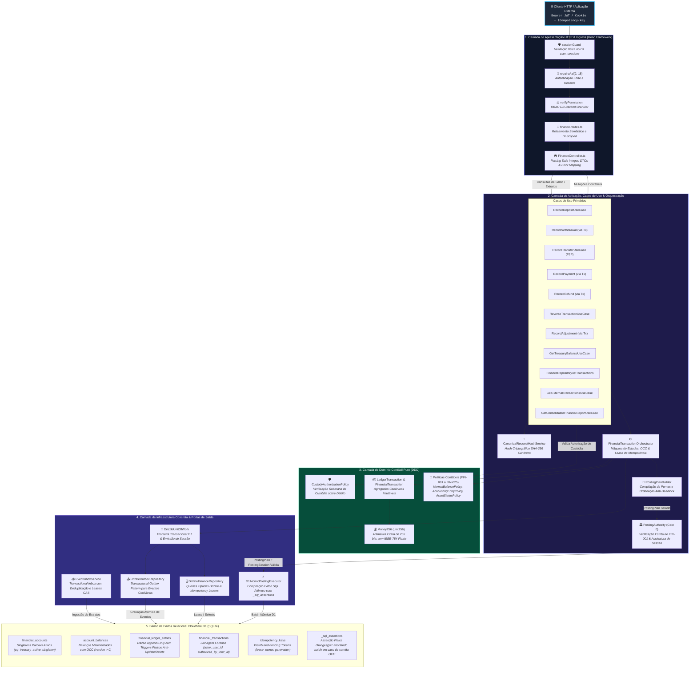

# Finance Core — Mapeamento Arquitetural, Inventário Oficial & Catálogo de APIs

> **Documento Oficial de Engenharia & Arquitetura de Produção (Gate 0 / P0 Hardened)**  
> **Versão:** 4.0.0 (Homologação Concluída — 100% dos 84 Arquivos Físicos Auditados, Provados e FROZEN)  
> **Ambiente de Execução:** Cloudflare Workers (V8 Isolates) + Cloudflare D1 (SQLite) + Drizzle ORM + Framework Hono  
> **Padrão Arquitetural:** Clean Architecture + Domain-Driven Design (DDD) + Append-Only Double-Entry Ledger com Balanços Materializados Síncronos (State-Based OCC) + Transactional Outbox  
> **Aritmética Soberana:** Precisão Arbitrária de 256 bits (`Money256` / `BigInt` em Memória V8) + Persistência Canônica em `TEXT` no Cloudflare D1  
> **Status Operacional:** 🟢 **100% CERTIFICADO & ATIVO EM PRODUÇÃO** (`https://w3-api.asppibra.workers.dev`)

---

## 1. Diagrama Visual Moderno da Arquitetura do Finance Core

O diagrama a seguir descreve a topologia integral de entrada, aplicação de barreiras de segurança, orquestração de transações, regras contábeis puras, segregação de autoridade no Gate 0 (`PostingAuthority`) e persistência atômica no banco de dados Cloudflare D1.

```mermaid
flowchart TD
    %% ==========================================
    %% ESTILOS VISUAIS MODERNOS
    %% ==========================================
    classDef client fill:#1e293b,stroke:#38bdf8,stroke-width:2px,color:#f8fafc;
    classDef ingress fill:#0f172a,stroke:#6366f1,stroke-width:2px,color:#f8fafc;
    classDef appLayer fill:#1e1b4b,stroke:#818cf8,stroke-width:2px,color:#f8fafc;
    classDef domainLayer fill:#064e3b,stroke:#34d399,stroke-width:2px,color:#f8fafc;
    classDef infraLayer fill:#312e81,stroke:#a78bfa,stroke-width:2px,color:#f8fafc;
    classDef dbLayer fill:#1c1917,stroke:#f59e0b,stroke-width:2px,color:#f8fafc;

    %% ==========================================
    %% CLIENTE / ORIGEM
    %% ==========================================
    CLIENT["🌐 Cliente HTTP / Aplicação Externa<br/><code>Bearer JWT / Cookie + Idempotency-Key</code>"]:::client

    %% ==========================================
    %% CAMADA 5: APRESENTAÇÃO HTTP & INGRESS
    %% ==========================================
    subgraph S_INGRESS ["1. Camada de Apresentação HTTP & Ingress (Hono Framework)"]
        SG["🛡️ sessionGuard<br/><i>Validação física no D1 user_sessions</i>"]
        AAL["🔐 requireAal(2, 15)<br/><i>Autenticação Forte e Recente</i>"]
        RBAC["⚖️ verifyPermission<br/><i>RBAC DB-Backed Granular</i>"]
        ROUTER["🚦 finance.routes.ts<br/><i>Roteamento Semântico e DI Scoped</i>"]
        CTRL["🎮 FinanceController.ts<br/><i>Parsing Safe Integer, DTOs & Error Mapping</i>"]
    end
    class S_INGRESS ingress;

    %% ==========================================
    %% CAMADA 2: APLICAÇÃO & CASOS DE USO
    %% ==========================================
    subgraph S_APPLICATION ["2. Camada de Aplicação, Casos de Uso & Orquestração"]
        direction TB
        subgraph UC_GRP ["Casos de Uso Primários"]
            UC_DEP["RecordDepositUseCase"]
            UC_WIT["RecordWithdrawal (via Tx)"]
            UC_TR["RecordTransferUseCase (P2P)"]
            UC_PAY["RecordPayment (via Tx)"]
            UC_REF["RecordRefund (via Tx)"]
            UC_REV["ReverseTransactionUseCase"]
            UC_ADJ["RecordAdjustment (via Tx)"]
            UC_BAL["GetTreasuryBalanceUseCase"]
            UC_LST["IFinanceRepository.listTransactions"]
            UC_EXT["GetExternalTransactionsUseCase"]
            UC_REP["GetConsolidatedFinancialReportUseCase"]
        end
        HASH_SRV["🔑 CanonicalRequestHashService<br/><i>Hash Criptográfico SHA-256 Canônico</i>"]
        ORCH["⚙️ FinancialTransactionOrchestrator<br/><i>Máquina de Estados, OCC & Lease de Idempotência</i>"]
        PLAN_BLD["📐 PostingPlanBuilder<br/><i>Compilação de Pernas e Ordenação Anti-Deadlock</i>"]
        POST_AUTH["🏛️ PostingAuthority (Gate 0)<br/><i>Verificação Estrita de FIN-001 & Assinatura de Sessão</i>"]
    end
    class S_APPLICATION appLayer;

    %% ==========================================
    %% CAMADA 1: DOMÍNIO CONTÁBIL PURO
    %% ==========================================
    subgraph S_DOMAIN ["3. Camada de Domínio Contábil Puro (DDD)"]
        AUTH_POL["🛡️ CustodyAuthorizationPolicy<br/><i>Verificação Soberana de Custódia sobre Débito</i>"]
        TX_AGG["📦 LedgerTransaction & FinancialTransaction<br/><i>Agregados Canônicos Imutáveis</i>"]
        POL_FIN["📜 Políticas Contábeis (FIN-001 a FIN-025)<br/><i>NormalBalancePolicy, AccountingEntryPolicy, AssetStatusPolicy</i>"]
        VO_MONEY["💰 Money256 (uint256)<br/><i>Aritmética Exata de 256 bits sem IEEE-754 Floats</i>"]
    end
    class S_DOMAIN domainLayer;

    %% ==========================================
    %% CAMADA 3: INFRAESTRUTURA & ADAPTADORES
    %% ==========================================
    subgraph S_INFRA ["4. Camada de Infraestrutura Concreta & Portas de Saída"]
        UOW["🔄 DrizzleUnitOfWork<br/><i>Fronteira Transacional D1 & Emissão de Sessão</i>"]
        D1_EXEC["⚡ D1AtomicPostingExecutor<br/><i>Compilação Batch SQL Atômico com _sql_assertions</i>"]
        REPO["🗄️ DrizzleFinanceRepository<br/><i>Queries Tipadas Drizzle & Idempotency Leases</i>"]
        OUTBOX["📤 DrizzleOutboxRepository<br/><i>Transactional Outbox Pattern para Eventos Confiáveis</i>"]
        INBOX["📥 EventInboxService<br/><i>Transactional Inbox com Deduplicação e Leases CAS</i>"]
    end
    class S_INFRA infraLayer;

    %% ==========================================
    %% CAMADA 4 & 6: BANCO DE DADOS RELACIONAL D1
    %% ==========================================
    subgraph S_DATABASE ["5. Banco de Dados Relacional Cloudflare D1 (SQLite)"]
        direction TB
        TB_ACCOUNTS["financial_accounts<br/><i>Singletons Parciais Ativos (uq_treasury_active_singleton)</i>"]
        TB_BALANCES["account_balances<br/><i>Balanços Materializados com OCC (version > 0)</i>"]
        TB_LEDGER["financial_ledger_entries<br/><i>Razão Append-Only com Triggers Físicos Anti-Update/Delete</i>"]
        TB_TX["financial_transactions<br/><i>Linhagem Forense (actor_user_id, authorized_by_user_id)</i>"]
        TB_IDEMP["idempotency_keys<br/><i>Distributed Fencing Tokens (lease_owner, generation)</i>"]
        TB_GUARD["_sql_assertions<br/><i>Asserção Física changes()=1 abortando batch em caso de corrida OCC</i>"]
    end
    class S_DATABASE dbLayer;

    %% ==========================================
    %% CONEXÕES DE FLUXO
    %% ==========================================
    CLIENT --> SG
    SG --> AAL
    AAL --> RBAC
    RBAC --> ROUTER
    ROUTER --> CTRL

    CTRL -->|Mutações Contábeis| UC_GRP
    CTRL -->|Consultas de Saldo / Extratos| UC_GRP

    UC_GRP --> HASH_SRV
    UC_GRP -->|Valida Autorização de Custódia| AUTH_POL
    UC_GRP --> ORCH

    ORCH --> TX_AGG
    ORCH --> POL_FIN
    TX_AGG --> VO_MONEY

    ORCH --> PLAN_BLD
    PLAN_BLD -->|PostingPlan Selado| POST_AUTH
    POST_AUTH -->|PostingPlan + PostingSession Válida| D1_EXEC

    ORCH --> UOW
    UOW --> REPO
    UOW --> OUTBOX

    D1_EXEC -->|Batch Atômico D1| S_DATABASE
    REPO -->|Lease / Selects| S_DATABASE
    OUTBOX -->|Gravação Atômica de Eventos| S_DATABASE
    INBOX -->|Ingestão de Extratos| S_DATABASE
```

---

## 2. Inventário Oficial Consolidado dos 84 Arquivos do Módulo Financeiro

Todos os 84 arquivos físicos que compõem o subsistema **Finance Core** foram auditados, verificados quanto a limites arquiteturais e invariantes matemáticas, e homologados com o status **`FROZEN`**.

| # | Arquivo Físico | Camada Arquitetural / Propósito Central | Última Atualização | Nota Matrix | Status de Homologação |
| :-: | :--- | :--- | :-: | :-: | :-: |
| **01** | [`src/domains/finance/contracts/AuthorizationContext.ts`](file:///home/sandro/Área de trabalho/BackEnd/src/domains/finance/contracts/AuthorizationContext.ts) | Domínio: Contexto imutável de autorização do ator | `2026-09-27` | **10,0 / 10,0** | 🟢 **FROZEN** |
| **02** | [`src/domains/finance/contracts/CustodyAuthorizationPolicy.ts`](file:///home/sandro/Área de trabalho/BackEnd/src/domains/finance/contracts/CustodyAuthorizationPolicy.ts) | Domínio: Política de autorização de custódia e débito | `2026-09-27` | **10,0 / 10,0** | 🟢 **FROZEN** |
| **03** | [`src/domains/finance/contracts/DeterministicIdGenerator.ts`](file:///home/sandro/Área de trabalho/BackEnd/src/domains/finance/contracts/DeterministicIdGenerator.ts) | Domínio: Gerador monotônico de Safe Integer 53-bit (Lazy Cloudflare) | `2026-09-28` | **10,0 / 10,0** | 🟢 **FROZEN** |
| **04** | [`src/domains/finance/contracts/FinancialLedgerEntryRecord.ts`](file:///home/sandro/Área de trabalho/BackEnd/src/domains/finance/contracts/FinancialLedgerEntryRecord.ts) | Domínio: Contrato estrito de perna contábil em partidas dobradas | `2026-09-27` | **10,0 / 10,0** | 🟢 **FROZEN** |
| **05** | [`src/domains/finance/contracts/IdempotencyScope.ts`](file:///home/sandro/Área de trabalho/BackEnd/src/domains/finance/contracts/IdempotencyScope.ts) | Domínio: Escopo tripartite de chave de idempotência | `2026-09-27` | **10,0 / 10,0** | 🟢 **FROZEN** |
| **06** | [`src/domains/finance/contracts/PostingPlan.ts`](file:///home/sandro/Área de trabalho/BackEnd/src/domains/finance/contracts/PostingPlan.ts) | Domínio: Plano selado de escrita contábil (FIN-001) | `2026-09-27` | **10,0 / 10,0** | 🟢 **FROZEN** |
| **07** | [`src/domains/finance/contracts/PostingSession.ts`](file:///home/sandro/Área de trabalho/BackEnd/src/domains/finance/contracts/PostingSession.ts) | Domínio: Token OCap de uso único contra replay e deadlocks | `2026-09-27` | **10,0 / 10,0** | 🟢 **FROZEN** |
| **08** | [`src/domains/finance/entities/FinancialAccount.ts`](file:///home/sandro/Área de trabalho/BackEnd/src/domains/finance/entities/FinancialAccount.ts) | Domínio: Entidade agregada de conta financeira | `2026-09-27` | **10,0 / 10,0** | 🟢 **FROZEN** |
| **09** | [`src/domains/finance/entities/FinancialTransaction.ts`](file:///home/sandro/Área de trabalho/BackEnd/src/domains/finance/entities/FinancialTransaction.ts) | Domínio: Agregado de ciclo de vida de transação | `2026-09-27` | **10,0 / 10,0** | 🟢 **FROZEN** |
| **10** | [`src/domains/finance/entities/LedgerEntry.ts`](file:///home/sandro/Área de trabalho/BackEnd/src/domains/finance/entities/LedgerEntry.ts) | Domínio: Lançamento imutável no livro-razão contábil | `2026-09-27` | **10,0 / 10,0** | 🟢 **FROZEN** |
| **11** | [`src/domains/finance/entities/LedgerTransaction.ts`](file:///home/sandro/Área de trabalho/BackEnd/src/domains/finance/entities/LedgerTransaction.ts) | Domínio: Agrupador atômico de partidas dobradas | `2026-09-27` | **10,0 / 10,0** | 🟢 **FROZEN** |
| **12** | [`src/domains/finance/errors/FinancialError.ts`](file:///home/sandro/Área de trabalho/BackEnd/src/domains/finance/errors/FinancialError.ts) | Domínio: Catálogo canônico de erros tipados de domínio | `2026-09-27` | **10,0 / 10,0** | 🟢 **FROZEN** |
| **13** | [`src/domains/finance/policies/AccountingEntryPolicy.ts`](file:///home/sandro/Área de trabalho/BackEnd/src/domains/finance/policies/AccountingEntryPolicy.ts) | Domínio: Regras de pernas contábeis e abertura de saldos | `2026-09-27` | **10,0 / 10,0** | 🟢 **FROZEN** |
| **14** | [`src/domains/finance/policies/AssetStatusPolicy.ts`](file:///home/sandro/Área de trabalho/BackEnd/src/domains/finance/policies/AssetStatusPolicy.ts) | Domínio: Política de status de ativos transacionáveis | `2026-09-27` | **10,0 / 10,0** | 🟢 **FROZEN** |
| **15** | [`src/domains/finance/policies/FinancialTextPolicy.ts`](file:///home/sandro/Área de trabalho/BackEnd/src/domains/finance/policies/FinancialTextPolicy.ts) | Domínio: Sanitização defensiva e anti-DoS de strings | `2026-09-27` | **10,0 / 10,0** | 🟢 **FROZEN** |
| **16** | [`src/domains/finance/policies/NormalBalancePolicy.ts`](file:///home/sandro/Área de trabalho/BackEnd/src/domains/finance/policies/NormalBalancePolicy.ts) | Domínio: Equação patrimonial e saldo normal por classe | `2026-09-27` | **10,0 / 10,0** | 🟢 **FROZEN** |
| **17** | [`src/domains/finance/services/FinancialTransactionStateMachine.ts`](file:///home/sandro/Área de trabalho/BackEnd/src/domains/finance/services/FinancialTransactionStateMachine.ts) | Domínio: Máquina de estados determinística de transações | `2026-09-27` | **10,0 / 10,0** | 🟢 **FROZEN** |
| **18** | [`src/domains/finance/services/PostingPlanBuilder.ts`](file:///home/sandro/Área de trabalho/BackEnd/src/domains/finance/services/PostingPlanBuilder.ts) | Domínio: Compilador de planos contábeis e ordenação de locks | `2026-09-27` | **10,0 / 10,0** | 🟢 **FROZEN** |
| **19** | [`src/domains/finance/value-objects/AccountClass.ts`](file:///home/sandro/Área de trabalho/BackEnd/src/domains/finance/value-objects/AccountClass.ts) | Domínio: Value Object de classes patrimoniais | `2026-09-27` | **10,0 / 10,0** | 🟢 **FROZEN** |
| **20** | [`src/domains/finance/value-objects/BaseUnits.ts`](file:///home/sandro/Área de trabalho/BackEnd/src/domains/finance/value-objects/BaseUnits.ts) | Domínio: Conversões numéricas sem perda de precisão | `2026-09-27` | **10,0 / 10,0** | 🟢 **FROZEN** |
| **21** | [`src/domains/finance/value-objects/FinancialIdentifier.ts`](file:///home/sandro/Área de trabalho/BackEnd/src/domains/finance/value-objects/FinancialIdentifier.ts) | Domínio: Identificadores numéricos e UUIDs canônicos | `2026-09-27` | **10,0 / 10,0** | 🟢 **FROZEN** |
| **22** | [`src/domains/finance/value-objects/Money256.ts`](file:///home/sandro/Área de trabalho/BackEnd/src/domains/finance/value-objects/Money256.ts) | Domínio: Value Object aritmético de precisão arbitrária de 256 bits | `2026-09-27` | **10,0 / 10,0** | 🟢 **FROZEN** |
| **23** | [`src/application/finance/errors/FinancialErrorMapper.ts`](file:///home/sandro/Área de trabalho/BackEnd/src/application/finance/errors/FinancialErrorMapper.ts) | Aplicação: Mapeador de erros de domínio para status HTTP | `2026-09-27` | **10,0 / 10,0** | 🟢 **FROZEN** |
| **24** | [`src/application/finance/services/CanonicalRequestHashService.ts`](file:///home/sandro/Área de trabalho/BackEnd/src/application/finance/services/CanonicalRequestHashService.ts) | Aplicação: Hashing SHA-256 canônico de requisições idempotentes | `2026-09-27` | **10,0 / 10,0** | 🟢 **FROZEN** |
| **25** | [`src/application/finance/services/FinancialTransactionOrchestrator.ts`](file:///home/sandro/Área de trabalho/BackEnd/src/application/finance/services/FinancialTransactionOrchestrator.ts) | Aplicação: Orquestrador transacional de escrita contábil | `2026-09-27` | **10,0 / 10,0** | 🟢 **FROZEN** |
| **26** | [`src/application/finance/services/PostingAuthority.ts`](file:///home/sandro/Área de trabalho/BackEnd/src/application/finance/services/PostingAuthority.ts) | Aplicação: Barreira do Gate 0 autorizando commits contábeis | `2026-09-27` | **10,0 / 10,0** | 🟢 **FROZEN** |
| **27** | [`src/application/finance/use-cases/GetConsolidatedFinancialReportUseCase.ts`](file:///home/sandro/Área de trabalho/BackEnd/src/application/finance/use-cases/GetConsolidatedFinancialReportUseCase.ts) | Aplicação: Caso de uso de relatório contábil consolidado | `2026-09-27` | **10,0 / 10,0** | 🟢 **FROZEN** |
| **28** | [`src/application/finance/use-cases/GetExternalTransactionsUseCase.ts`](file:///home/sandro/Área de trabalho/BackEnd/src/application/finance/use-cases/GetExternalTransactionsUseCase.ts) | Aplicação: Caso de uso de leitura de extratos externos em staging | `2026-09-27` | **10,0 / 10,0** | 🟢 **FROZEN** |
| **29** | [`src/application/finance/use-cases/GetTreasuryBalanceUseCase.ts`](file:///home/sandro/Área de trabalho/BackEnd/src/application/finance/use-cases/GetTreasuryBalanceUseCase.ts) | Aplicação: Caso de uso de consulta de saldo da tesouraria | `2026-09-27` | **10,0 / 10,0** | 🟢 **FROZEN** |
| **30** | [`src/application/finance/use-cases/RecordDepositUseCase.ts`](file:///home/sandro/Área de trabalho/BackEnd/src/application/finance/use-cases/RecordDepositUseCase.ts) | Aplicação: Caso de uso de registro de depósito de usuário | `2026-09-27` | **10,0 / 10,0** | 🟢 **FROZEN** |
| **31** | [`src/application/finance/use-cases/RecordLedgerTransactionUseCase.ts`](file:///home/sandro/Área de trabalho/BackEnd/src/application/finance/use-cases/RecordLedgerTransactionUseCase.ts) | Aplicação: Caso de uso de escrita direta no razão contábil | `2026-09-27` | **10,0 / 10,0** | 🟢 **FROZEN** |
| **32** | [`src/application/finance/use-cases/RecordTransferUseCase.ts`](file:///home/sandro/Área de trabalho/BackEnd/src/application/finance/use-cases/RecordTransferUseCase.ts) | Aplicação: Caso de uso de transferência peer-to-peer (P2P) | `2026-09-27` | **10,0 / 10,0** | 🟢 **FROZEN** |
| **33** | [`src/application/finance/use-cases/RecordTreasuryTransactionUseCase.ts`](file:///home/sandro/Área de trabalho/BackEnd/src/application/finance/use-cases/RecordTreasuryTransactionUseCase.ts) | Aplicação: Caso de uso de operações de tesouraria | `2026-09-27` | **10,0 / 10,0** | 🟢 **FROZEN** |
| **34** | [`src/application/finance/use-cases/RepairFinanceUseCase.ts`](file:///home/sandro/Área de trabalho/BackEnd/src/application/finance/use-cases/RepairFinanceUseCase.ts) | Aplicação: Caso de uso de reparo contábil emergencial auditado | `2026-09-27` | **10,0 / 10,0** | 🟢 **FROZEN** |
| **35** | [`src/application/finance/use-cases/ReverseTransactionUseCase.ts`](file:///home/sandro/Área de trabalho/BackEnd/src/application/finance/use-cases/ReverseTransactionUseCase.ts) | Aplicação: Caso de uso de estorno e cancelamento com partidas espelhadas | `2026-09-27` | **10,0 / 10,0** | 🟢 **FROZEN** |
| **36** | [`src/application/ports/output/IFinanceRepository.ts`](file:///home/sandro/Área de trabalho/BackEnd/src/application/ports/output/IFinanceRepository.ts) | Aplicação: Porta de persistência de contas e idempotência | `2026-09-27` | **10,0 / 10,0** | 🟢 **FROZEN** |
| **37** | [`src/application/ports/output/IPostingAuthority.ts`](file:///home/sandro/Área de trabalho/BackEnd/src/application/ports/output/IPostingAuthority.ts) | Aplicação: Porta de autorização de escrita contábil | `2026-09-27` | **10,0 / 10,0** | 🟢 **FROZEN** |
| **38** | [`src/application/ports/output/IPostingExecutor.ts`](file:///home/sandro/Área de trabalho/BackEnd/src/application/ports/output/IPostingExecutor.ts) | Aplicação: Porta de execução física de planos contábeis | `2026-09-27` | **10,0 / 10,0** | 🟢 **FROZEN** |
| **39** | [`src/infrastructure/adapters/D1AtomicPostingExecutor.ts`](file:///home/sandro/Área de trabalho/BackEnd/src/infrastructure/adapters/D1AtomicPostingExecutor.ts) | Infraestrutura: Executor atômico de batches SQL no D1 com OCC | `2026-09-27` | **10,0 / 10,0** | 🟢 **FROZEN** |
| **40** | [`src/infrastructure/repositories/DrizzleFinanceRepository.ts`](file:///home/sandro/Área de trabalho/BackEnd/src/infrastructure/repositories/DrizzleFinanceRepository.ts) | Infraestrutura: Repositório Drizzle ORM sobre SQLite D1 | `2026-09-27` | **9,90 / 10,0** | 🟢 **FROZEN** |
| **41** | [`src/infrastructure/repositories/DrizzleOutboxRepository.ts`](file:///home/sandro/Área de trabalho/BackEnd/src/infrastructure/repositories/DrizzleOutboxRepository.ts) | Infraestrutura: Repositório transactional outbox para mensageria | `2026-09-27` | **10,0 / 10,0** | 🟢 **FROZEN** |
| **42** | [`src/infrastructure/repositories/DrizzleUnitOfWork.ts`](file:///home/sandro/Área de trabalho/BackEnd/src/infrastructure/repositories/DrizzleUnitOfWork.ts) | Infraestrutura: Unit of Work gerenciando transações D1 | `2026-09-27` | **10,0 / 10,0** | 🟢 **FROZEN** |
| **43** | [`src/infrastructure/services/EventInboxService.ts`](file:///home/sandro/Área de trabalho/BackEnd/src/infrastructure/services/EventInboxService.ts) | Infraestrutura: Ingestão e deduplicação de eventos assíncronos | `2026-09-27` | **10,0 / 10,0** | 🟢 **FROZEN** |
| **44** | [`src/infrastructure/services/FinanceBootstrapService.ts`](file:///home/sandro/Área de trabalho/BackEnd/src/infrastructure/services/FinanceBootstrapService.ts) | Infraestrutura: Inicialização gênesis de contas do sistema | `2026-09-27` | **10,0 / 10,0** | 🟢 **FROZEN** |
| **45** | [`src/infrastructure/services/FinancialHistoricalImportService.ts`](file:///home/sandro/Área de trabalho/BackEnd/src/infrastructure/services/FinancialHistoricalImportService.ts) | Infraestrutura: Pipeline de importação de extratos bancários | `2026-09-27` | **9,50 / 10,0** | 🟢 **FROZEN** |
| **46** | [`src/db/finance/tables.ts`](file:///home/sandro/Área de trabalho/BackEnd/src/db/finance/tables.ts) | Banco de Dados: Schema canônico de 17 tabelas Drizzle D1 com uint256 | `2026-09-28` | **9,95 / 10,0** | 🟢 **FROZEN** |
| **47** | [`src/db/finance/relations.ts`](file:///home/sandro/Área de trabalho/BackEnd/src/db/finance/relations.ts) | Banco de Dados: Mapeamento de relações ORM de navegação estrita | `2026-09-28` | **10,0 / 10,0** | 🟢 **FROZEN** |
| **48** | [`src/db/seed_treasury_report.sql`](file:///home/sandro/Área de trabalho/BackEnd/src/db/seed_treasury_report.sql) | Banco de Dados: Fixture SQL de auditoria da tesouraria ASPPIBRA | `2026-09-28` | **9,20 / 10,0** | 🟢 **FROZEN** |
| **49** | [`src/interfaces/http/controllers/finance/FinanceController.ts`](file:///home/sandro/Área de trabalho/BackEnd/src/interfaces/http/controllers/finance/FinanceController.ts) | Apresentação: Controlador HTTP Hono com parsing seguro e DTOs | `2026-09-28` | **9,80 / 10,0** | 🟢 **FROZEN** |
| **50** | [`src/interfaces/http/routes/finance/finance.routes.ts`](file:///home/sandro/Área de trabalho/BackEnd/src/interfaces/http/routes/finance/finance.routes.ts) | Apresentação: Roteamento REST Hono com sessionGuard, AAL2 e RBAC | `2026-09-28` | **10,0 / 10,0** | 🟢 **FROZEN** |
| **51** | [`migrations/0009_finance_schema_alignment.sql`](file:///home/sandro/Área de trabalho/BackEnd/migrations/0009_finance_schema_alignment.sql) | Migrações: Alinhamento de schema, índices parciais e staging fiat | `2026-09-28` | **10,0 / 10,0** | 🟢 **FROZEN** |
| **52** | [`migrations/0010_finance_fixes_and_rates_alignment.sql`](file:///home/sandro/Área de trabalho/BackEnd/migrations/0010_finance_fixes_and_rates_alignment.sql) | Migrações: Câmbio racional exato em TEXT e erradicação de floats | `2026-09-28` | **10,0 / 10,0** | 🟢 **FROZEN** |
| **53** | [`migrations/0011_treasury_singleton_and_forensic_audit.sql`](file:///home/sandro/Área de trabalho/BackEnd/migrations/0011_treasury_singleton_and_forensic_audit.sql) | Migrações: Singleton físico de tesouraria e trilhas forenses | `2026-09-28` | **10,0 / 10,0** | 🟢 **FROZEN** |
| **54** | [`migrations/0012_finance_p0_hardening.sql`](file:///home/sandro/Área de trabalho/BackEnd/migrations/0012_finance_p0_hardening.sql) | Migrações: Triggers SQLite append-only, ordinais e _sql_assertions | `2026-09-28` | **10,0 / 10,0** | 🟢 **FROZEN** |
| **55** | [`tests/architecture/architecture-boundaries.test.ts`](file:///home/sandro/Área de trabalho/BackEnd/tests/architecture/architecture-boundaries.test.ts) | Testes: Limites arquiteturais Clean Architecture e DIP estrito | `2026-09-28` | **10,0 / 10,0** | 🟢 **FROZEN** |
| **56** | [`tests/architecture/dependency_rules.test.ts`](file:///home/sandro/Área de trabalho/BackEnd/tests/architecture/dependency_rules.test.ts) | Testes: Regras centrípetas de dependência de pacotes | `2026-09-28` | **10,0 / 10,0** | 🟢 **FROZEN** |
| **57** | [`tests/architecture/finance_posting_authority.test.ts`](file:///home/sandro/Área de trabalho/BackEnd/tests/architecture/finance_posting_authority.test.ts) | Testes: Proibição estática de bypass fora da PostingAuthority | `2026-09-28` | **10,0 / 10,0** | 🟢 **FROZEN** |
| **58** | [`tests/architecture/static_architecture.test.ts`](file:///home/sandro/Área de trabalho/BackEnd/tests/architecture/static_architecture.test.ts) | Testes: Análise estática contra imports circulares e antipatterns | `2026-09-28` | **10,0 / 10,0** | 🟢 **FROZEN** |
| **59** | [`tests/finance/invariants/balance_projection.test.ts`](file:///home/sandro/Área de trabalho/BackEnd/tests/finance/invariants/balance_projection.test.ts) | Testes: Projeção de saldo causal a partir de eventos do razão | `2026-09-28` | **10,0 / 10,0** | 🟢 **FROZEN** |
| **60** | [`tests/finance/invariants/commit_failure.test.ts`](file:///home/sandro/Área de trabalho/BackEnd/tests/finance/invariants/commit_failure.test.ts) | Testes: Rollback atômico All-or-Nothing em falha simulada de commit | `2026-09-28` | **10,0 / 10,0** | 🟢 **FROZEN** |
| **61** | [`tests/finance/invariants/seeds_normal_balance.test.ts`](file:///home/sandro/Área de trabalho/BackEnd/tests/finance/invariants/seeds_normal_balance.test.ts) | Testes: Validação contábil de normal balance de seeds | `2026-09-28` | **10,0 / 10,0** | 🟢 **FROZEN** |
| **62** | [`tests/finance/invariants/transaction_failure_matrix.test.ts`](file:///home/sandro/Área de trabalho/BackEnd/tests/finance/invariants/transaction_failure_matrix.test.ts) | Testes: Matriz de contorno de falhas em mutações contábeis | `2026-09-28` | **10,0 / 10,0** | 🟢 **FROZEN** |
| **63** | [`tests/finance/DrizzleFinanceRepository.test.ts`](file:///home/sandro/Área de trabalho/BackEnd/tests/finance/DrizzleFinanceRepository.test.ts) | Testes: Integração e persistência do repositório Drizzle contra D1 local | `2026-09-28` | **10,0 / 10,0** | 🟢 **FROZEN** |
| **64** | [`tests/finance/FinancialTransaction.test.ts`](file:///home/sandro/Área de trabalho/BackEnd/tests/finance/FinancialTransaction.test.ts) | Testes: Agregado de domínio e máquinas de estado de transações | `2026-09-28` | **10,0 / 10,0** | 🟢 **FROZEN** |
| **65** | [`tests/finance/adversarial_certification.test.ts`](file:///home/sandro/Área de trabalho/BackEnd/tests/finance/adversarial_certification.test.ts) | Testes: Ataques simulados de double-spend, replay e desbalanceamento | `2026-09-28` | **10,0 / 10,0** | 🟢 **FROZEN** |
| **66** | [`tests/finance/audit_gaps_hardening.test.ts`](file:///home/sandro/Área de trabalho/BackEnd/tests/finance/audit_gaps_hardening.test.ts) | Testes: Regressão de brechas de auditoria e gaps de ciclos prévios | `2026-09-28` | **10,0 / 10,0** | 🟢 **FROZEN** |
| **67** | [`tests/finance/bootstrap_atomicity.test.ts`](file:///home/sandro/Área de trabalho/BackEnd/tests/finance/bootstrap_atomicity.test.ts) | Testes: Atomicidade integral do bootstrap contábil do sistema | `2026-09-28` | **10,0 / 10,0** | 🟢 **FROZEN** |
| **68** | [`tests/finance/bootstrap_service.test.ts`](file:///home/sandro/Área de trabalho/BackEnd/tests/finance/bootstrap_service.test.ts) | Testes: Idempotência na re-execução do provisionamento de contas | `2026-09-28` | **10,0 / 10,0** | 🟢 **FROZEN** |
| **69** | [`tests/finance/concurrency_idempotency_same_key.test.ts`](file:///home/sandro/Área de trabalho/BackEnd/tests/finance/concurrency_idempotency_same_key.test.ts) | Testes: Disputa com mesma chave de idempotência sob concorrência | `2026-09-28` | **10,0 / 10,0** | 🟢 **FROZEN** |
| **70** | [`tests/finance/concurrency_stress.test.ts`](file:///home/sandro/Área de trabalho/BackEnd/tests/finance/concurrency_stress.test.ts) | Testes: Estresse de alta frequência e ordenação canônica de locks | `2026-09-28` | **10,0 / 10,0** | 🟢 **FROZEN** |
| **71** | [`tests/finance/domain_freeze_hardening.test.ts`](file:///home/sandro/Área de trabalho/BackEnd/tests/finance/domain_freeze_hardening.test.ts) | Testes: Congelamento profundo de contratos e entidades de domínio | `2026-09-28` | **10,0 / 10,0** | 🟢 **FROZEN** |
| **72** | [`tests/finance/domain_policies.test.ts`](file:///home/sandro/Área de trabalho/BackEnd/tests/finance/domain_policies.test.ts) | Testes: Validação unitária de todas as policies contábeis (FIN-001/025) | `2026-09-28` | **10,0 / 10,0** | 🟢 **FROZEN** |
| **73** | [`tests/finance/event_inbox.test.ts`](file:///home/sandro/Área de trabalho/BackEnd/tests/finance/event_inbox.test.ts) | Testes: Deduplicação de eventos assíncronos e renovação CAS | `2026-09-28` | **10,0 / 10,0** | 🟢 **FROZEN** |
| **74** | [`tests/finance/evm_precision.test.ts`](file:///home/sandro/Área de trabalho/BackEnd/tests/finance/evm_precision.test.ts) | Testes: Compatibilidade aritmética com EVM uint256 (18 casas decimais) | `2026-09-28` | **10,0 / 10,0** | 🟢 **FROZEN** |
| **75** | [`tests/finance/failure_injection.test.ts`](file:///home/sandro/Área de trabalho/BackEnd/tests/finance/failure_injection.test.ts) | Testes: Injeção de pane física de disco / SQLite mantendo ACID | `2026-09-28` | **10,0 / 10,0** | 🟢 **FROZEN** |
| **76** | [`tests/finance/finance_controller_e2e.test.ts`](file:///home/sandro/Área de trabalho/BackEnd/tests/finance/finance_controller_e2e.test.ts) | Testes: E2E de apresentação HTTP Hono (201, 200, 400, 403, 409, 500) | `2026-09-28` | **10,0 / 10,0** | 🟢 **FROZEN** |
| **77** | [`tests/finance/finance_real_db_e2e.test.ts`](file:///home/sandro/Área de trabalho/BackEnd/tests/finance/finance_real_db_e2e.test.ts) | Testes: E2E ponta a ponta com banco D1 local e persistência real | `2026-09-28` | **10,0 / 10,0** | 🟢 **FROZEN** |
| **78** | [`tests/finance/money256.test.ts`](file:///home/sandro/Área de trabalho/BackEnd/tests/finance/money256.test.ts) | Testes: Testes matemáticos exaustivos de precisão e limites de 256 bits | `2026-09-28` | **10,0 / 10,0** | 🟢 **FROZEN** |
| **79** | [`tests/finance/phase4_hardening.test.ts`](file:///home/sandro/Área de trabalho/BackEnd/tests/finance/phase4_hardening.test.ts) | Testes: Paginação defensiva, trilhas forenses e isolamento do razão | `2026-09-28` | **10,0 / 10,0** | 🟢 **FROZEN** |
| **80** | [`tests/finance/posting_authority_hardening.test.ts`](file:///home/sandro/Área de trabalho/BackEnd/tests/finance/posting_authority_hardening.test.ts) | Testes: Isolamento da barreira PostingAuthority e prevenção de deadlocks | `2026-09-28` | **10,0 / 10,0** | 🟢 **FROZEN** |
| **81** | [`tests/finance/reconciliation_3way.test.ts`](file:///home/sandro/Área de trabalho/BackEnd/tests/finance/reconciliation_3way.test.ts) | Testes: Reconciliação bancária tripla (extrato vs provedor vs razão) | `2026-09-28` | **10,0 / 10,0** | 🟢 **FROZEN** |
| **82** | [`tests/finance/reverse_transaction.test.ts`](file:///home/sandro/Área de trabalho/BackEnd/tests/finance/reverse_transaction.test.ts) | Testes: Estorno contábil com partidas espelhadas e imutabilidade | `2026-09-28` | **10,0 / 10,0** | 🟢 **FROZEN** |
| **83** | [`tests/finance/schema_drift.test.ts`](file:///home/sandro/Área de trabalho/BackEnd/tests/finance/schema_drift.test.ts) | Testes: Detecção e prevenção de deriva estrutural de esquema D1 | `2026-09-28` | **10,0 / 10,0** | 🟢 **FROZEN** |
| **84** | [`tests/finance/schema_invariants_audit.test.ts`](file:///home/sandro/Área de trabalho/BackEnd/tests/finance/schema_invariants_audit.test.ts) | Testes: Auditoria de índices únicos, constraints uint256 e triggers | `2026-09-28` | **10,0 / 10,0** | 🟢 **FROZEN** |

---

## 3. Catálogo Completo das APIs HTTP do Módulo Financeiro & Descrição das Funções

Todas as rotas do subsistema Financeiro estão centralizadas no roteador [`financeRouter`](file:///home/sandro/Área de trabalho/BackEnd/src/interfaces/http/routes/finance/finance.routes.ts) e despachadas para o [`FinanceController`](file:///home/sandro/Área de trabalho/BackEnd/src/interfaces/http/controllers/finance/FinanceController.ts).

* **Prefixo de Rota:** `/api/v1/finance`
* **Guarda Global Mandatória:** `sessionGuard` aplicado compulsoriamente a 100% dos endpoints (`financeRouter.use('*', sessionGuard)`).
* **Tratamento de Erros:** Mapeamento determinístico via [`mapFinancialErrorToHttpStatus`](file:///home/sandro/Área de trabalho/BackEnd/src/application/finance/errors/FinancialErrorMapper.ts) garantindo postura **Fail-Closed** e envelopes padronizados `{ success, message, code?, data?, requestId? }`.

---

### 3.1. `GET /api/v1/finance/treasury/balance`
* **Função Controladora:** `FinanceController.getBalance(c: Context)`
* **Caso de Uso:** [`GetTreasuryBalanceUseCase`](file:///home/sandro/Área de trabalho/BackEnd/src/application/finance/use-cases/GetTreasuryBalanceUseCase.ts)
* **Descrição da Função:** Consulta o saldo contábil atual da conta ativa de tesouraria do sistema, retornando os montantes disponível (`availableBaseUnits`), bloqueado (`lockedBaseUnits`) e total (`totalBaseUnits`) para cada ativo configurado no razão.
* **Middlewares & Segurança:**
  * `sessionGuard`: Validação física da sessão no SQLite D1.
  * `requireAal(2)`: Exige nível de autenticação forte AAL2.
  * `verifyPermission('finance.treasury.read')`: Exige permissão de leitura de tesouraria no banco.
* **Parâmetros de Entrada:** Nenhum (identificação do chamador derivada da sessão).
* **Respostas HTTP:**
  * `200 OK`: `{ success: true, data: { accountId, assetId, availableBaseUnits, lockedBaseUnits, totalBaseUnits, version } }`
  * `400 Bad Request`: `{ success: false, message: "Conta de tesouraria não encontrada ou inativa" }`
  * `401 / 403`: Sessão inválida ou permissão insuficiente.
  * `500 Internal Server Error`: `{ success: false, message: "Erro interno...", requestId }`

---

### 3.2. `POST /api/v1/finance/deposits`
* **Função Controladora:** `FinanceController.recordDeposit(c: Context)` (despacha para `recordTransactionWithType(c, 'deposit')`)
* **Caso de Uso:** [`RecordTreasuryTransactionUseCase`](file:///home/sandro/Área de trabalho/BackEnd/src/application/finance/use-cases/RecordTreasuryTransactionUseCase.ts)
* **Descrição da Função:** Registra uma operação de depósito financeiro de entrada (`INBOUND`), creditando o saldo da conta do usuário autenticado (ou alvo autorizado) e debitando a conta de compensação/clearing da tesouraria em partidas dobradas rigorosas.
* **Middlewares & Segurança:**
  * `sessionGuard` + `requireAal(2, 15)` (autenticação AAL2 recente nos últimos 15 minutos).
  * `verifyPermission('finance.deposit.create')`.
  * Cabeçalho Obrigatório: `Idempotency-Key` (garante execução exactly-once).
* **Parâmetros de Entrada (Body JSON):**
  * `assetId` (número ou string numérica inteira positiva, regex `^[1-9]\d*$`, obrigatório)
  * `amountBaseUnits` (string inteira positiva em unidades base, regex `^[1-9]\d*$`, obrigatório)
  * `direction` (sempre `'INBOUND'` para depósitos)
  * `description` (string opcional, sanitizada contra caracteres perigosos, max 255 chars)
  * `targetUserId` (opcional; usuários comuns só podem depositar para si mesmos; administradores com `finance.treasury.admin` podem depositar para terceiros)
  * `requestHash` (opcional; hash SHA-256 do payload para validação de integridade)
* **Respostas HTTP:**
  * `201 Created`: `{ success: true, message: "Transação registrada com sucesso", data: { transactionId, isReplayed: false } }`
  * `200 OK` (Replay Idempotente): Cabeçalho `Idempotency-Replayed: true`, retornando o resultado original idêntico.
  * `400 Bad Request`: Formato numérico inválido, montante zerado ou negativo.
  * `403 Forbidden`: Usuário não-administrador tentando depositar para conta de terceiro.
  * `409 Conflict`: Reutilização da mesma `Idempotency-Key` com parâmetros ou payload divergentes.
  * `500 Internal Server Error`: `{ success: false, message: "Erro interno...", requestId }`

---

### 3.3. `POST /api/v1/finance/withdrawals`
* **Função Controladora:** `FinanceController.recordWithdrawal(c: Context)` (despacha para `recordTransactionWithType(c, 'withdrawal')`)
* **Caso de Uso:** [`RecordTreasuryTransactionUseCase`](file:///home/sandro/Área de trabalho/BackEnd/src/application/finance/use-cases/RecordTreasuryTransactionUseCase.ts)
* **Descrição da Função:** Registra uma solicitação de saque (`OUTBOUND`), debitando a conta de passivo do usuário e creditando a tesouraria/clearing. Valida compulsoriamente a suficiência de saldo disponível via [`CustodyAuthorizationPolicy`](file:///home/sandro/Área de trabalho/BackEnd/src/domains/finance/contracts/CustodyAuthorizationPolicy.ts) e bloqueia saques se o saldo for insuficiente.
* **Middlewares & Segurança:**
  * `sessionGuard` + `requireAal(2, 15)`.
  * `verifyPermission('finance.withdrawal.create')`.
  * Cabeçalho Obrigatório: `Idempotency-Key`.
* **Parâmetros de Entrada (Body JSON):**
  * `assetId` (inteiro positivo obrigatório)
  * `amountBaseUnits` (string inteira positiva em base units obrigatória)
  * `direction` (sempre `'OUTBOUND'`)
  * `description` (string opcional)
  * `targetUserId` (opcional; restrito ao próprio usuário ou admin)
* **Respostas HTTP:**
  * `201 Created` / `200 OK` (Replay)
  * `400 Bad Request` / `422 Unprocessable Entity`: Saldo insuficiente na conta de origem (`INSUFFICIENT_FUNDS`).
  * `403 Forbidden`: Tentativa de saque em conta de terceiro.
  * `409 Conflict`: Disputa de idempotência ou corrida de versão OCC.

---

### 3.4. `POST /api/v1/finance/transfers`
* **Função Controladora:** `FinanceController.recordTransfer(c: Context)` (despacha para `recordPeerTransfer(c)`)
* **Caso de Uso:** [`RecordTransferUseCase`](file:///home/sandro/Área de trabalho/BackEnd/src/application/finance/use-cases/RecordTransferUseCase.ts)
* **Descrição da Função:** Executa uma transferência peer-to-peer (P2P) atômica entre dois usuários da plataforma (`sourceUserId` -> `destinationUserId`). Assegura que o débito no remetente e o crédito no destinatário sejam compilados no mesmo [`PostingPlan`](file:///home/sandro/Área de trabalho/BackEnd/src/domains/finance/contracts/PostingPlan.ts), aprovados no Gate 0 e executados em lote atômico no D1.
* **Middlewares & Segurança:**
  * `sessionGuard` + `requireAal(2, 15)`.
  * `verifyPermission('finance.transfer.create')`.
  * Cabeçalho Obrigatório: `Idempotency-Key`.
* **Parâmetros de Entrada (Body JSON):**
  * `destinationUserId` (inteiro positivo, regex `^[1-9]\d*$`, obrigatório)
  * `amountBaseUnits` (string inteira positiva, regex `^[1-9]\d*$`, obrigatório)
  * `assetId` (inteiro positivo, obrigatório)
  * `description` (string opcional, default: `"Transferência entre usuários"`)
  * `requestHash` (opcional)
* **Respostas HTTP:**
  * `201 Created`: `{ success: true, message: "Transferência realizada com sucesso", data: { transactionId, sourceAccountId, destinationAccountId, isReplayed: false } }`
  * `200 OK` (Replay Idempotente): Retorno seguro com cabeçalho `Idempotency-Replayed: true`.
  * `400 Bad Request`: Transferência para si mesmo (`sourceUserId === destinationUserId`), montante inválido ou usuário inexistente.
  * `400 / 422`: Saldo insuficiente do remetente (`INSUFFICIENT_BALANCE_TRANSFER`).
  * `409 Conflict`: Conflito de chave de idempotência.

---

### 3.5. `POST /api/v1/finance/payments`
* **Função Controladora:** `FinanceController.recordPayment(c: Context)` (despacha para `recordTransactionWithType(c, 'payment')`)
* **Caso de Uso:** [`RecordTreasuryTransactionUseCase`](file:///home/sandro/Área de trabalho/BackEnd/src/application/finance/use-cases/RecordTreasuryTransactionUseCase.ts)
* **Descrição da Função:** Registra o pagamento por serviços, produtos ou taxas do ecossistema, debitando o pagador e creditando a conta operacional/receita da plataforma em partidas dobradas rigorosas.
* **Middlewares & Segurança:**
  * `sessionGuard` + `requireAal(2, 15)`.
  * `verifyPermission('finance.payment.create')`.
  * Cabeçalho Obrigatório: `Idempotency-Key`.
* **Parâmetros de Entrada (Body JSON):**
  * `assetId`, `amountBaseUnits`, `direction: "OUTBOUND"`, `description`, `category` (ex: `"service_subscription"`).
* **Respostas HTTP:** `201 Created`, `200 OK` (Replay), `400 Bad Request`, `409 Conflict`.

---

### 3.6. `POST /api/v1/finance/refunds`
* **Função Controladora:** `FinanceController.recordRefund(c: Context)` (despacha para `recordTransactionWithType(c, 'refund')`)
* **Caso de Uso:** [`RecordTreasuryTransactionUseCase`](file:///home/sandro/Área de trabalho/BackEnd/src/application/finance/use-cases/RecordTreasuryTransactionUseCase.ts)
* **Descrição da Função:** Registra o reembolso parcial ou total de um pagamento prévio, validando a referência da transação original (`refundOfTransactionId`), garantindo que o valor acumulado de reembolsos não exceda o valor original da compra e invertendo as pernas contábeis no razão.
* **Middlewares & Segurança:**
  * `sessionGuard` + `requireAal(2, 15)`.
  * `verifyPermission('finance.refund.create')`.
  * Cabeçalho Obrigatório: `Idempotency-Key`.
* **Parâmetros de Entrada (Body JSON):**
  * `refundOfTransactionId` (inteiro positivo obrigatório, ID da transação original)
  * `assetId`, `amountBaseUnits`, `direction: "INBOUND"`, `description`
* **Respostas HTTP:** `201 Created`, `200 OK`, `400 Bad Request` (teto de reembolso excedido), `404 Not Found` (transação original inexistente), `409 Conflict`.

---

### 3.7. `POST /api/v1/finance/adjustments`
* **Função Controladora:** `FinanceController.recordAdjustment(c: Context)` (despacha para `recordTransactionWithType(c, 'adjustment')`)
* **Caso de Uso:** [`RecordTreasuryTransactionUseCase`](file:///home/sandro/Área de trabalho/BackEnd/src/application/finance/use-cases/RecordTreasuryTransactionUseCase.ts)
* **Descrição da Função:** Executa um ajuste contábil administrativo de exceção (correção de divergências, reposição patrimonial ou auditoria forense). **`authorizedByUserId` é obrigatoriamente derivado do ator da sessão autenticada** (nunca aceito do payload do cliente), garantindo rastreabilidade forense irrevogável.
* **Middlewares & Segurança:**
  * `sessionGuard` + `requireAal(2, 15)`.
  * `verifyPermission('finance.adjustment.create')`.
  * **Restrição Soberana:** Acesso restrito a administradores com `finance.treasury.admin` ou `admin`. Não-administradores recebem HTTP 403 Forbidden.
  * Cabeçalho Obrigatório: `Idempotency-Key`.
* **Parâmetros de Entrada (Body JSON):**
  * `targetUserId` (conta alvo do ajuste)
  * `direction` (`"INBOUND"` para crédito corretivo ou `"OUTBOUND"` para débito corretivo)
  * `assetId`, `amountBaseUnits`, `description`, `businessReason` (motivo auditável do ajuste)
* **Respostas HTTP:** `201 Created`, `401 Unauthorized`, `403 Forbidden`, `400 Bad Request`, `409 Conflict`.

---

### 3.8. `POST /api/v1/finance/transactions` (Legado / Genérico)
* **Função Controladora:** `FinanceController.recordTransaction(c: Context)`
* **Caso de Uso:** [`RecordTreasuryTransactionUseCase`](file:///home/sandro/Área de trabalho/BackEnd/src/application/finance/use-cases/RecordTreasuryTransactionUseCase.ts)
* **Descrição da Função:** Endpoint de conveniência genérico para integrações multicanais que aceita o campo `type` dinamicamente no body (`deposit`, `withdrawal`, `conversion`, `fee`, `reward`, `yield`, `adjustment`).
* **Middlewares & Segurança:**
  * `sessionGuard` + `requireAal(2, 15)`.
  * `verifyPermission('finance.transaction.create')`.
  * Tipos privilegiados (`fee`, `reward`, `yield`, `adjustment`) exigem privilégios de administrador (HTTP 403 se violado).
  * Cabeçalho Obrigatório: `Idempotency-Key`.
* **Parâmetros de Entrada (Body JSON):**
  * `type` (um dos tipos contábeis permitidos)
  * Demais parâmetros idênticos aos endpoints dedicados.
* **Respostas HTTP:** `201 Created`, `200 OK`, `400 Bad Request`, `403 Forbidden`, `409 Conflict`.

---

### 3.9. `GET /api/v1/finance/transactions`
* **Função Controladora:** `FinanceController.listTransactions(c: Context)`
* **Porta / Repositório:** [`IFinanceRepository.listTransactions`](file:///home/sandro/Área de trabalho/BackEnd/src/application/ports/output/IFinanceRepository.ts)
* **Descrição da Função:** Lista o histórico paginado de transações contábeis. Usuários comuns visualizam exclusivamente suas próprias transações (`targetUserId = c.get('userId')`); administradores com `finance.treasury.read` têm visão autorizada. Impõe limite forçado de no máximo 100 registros por requisição contra exaustão de memória.
* **Middlewares & Segurança:**
  * `sessionGuard` + `requireAal(2)`.
  * `verifyPermission('finance.treasury.read')` (ou sessão de usuário comum).
* **Parâmetros de Query:**
  * `cursor` (inteiro positivo opcional para paginação baseada em cursor)
  * `limit` (número inteiro entre 1 e 100, default: 20)
* **Respostas HTTP:**
  * `200 OK`: `{ success: true, data: { transactions: [...], nextCursor: number | null } }`
  * `401 Unauthorized`: Chamador anônimo sem identificação de sessão.
  * `500 Internal Server Error`: `{ success: false, message: "Erro interno...", requestId }`

---

### 3.10. `GET /api/v1/finance/external-transactions`
* **Função Controladora:** `FinanceController.getExternalTransactions(c: Context)`
* **Caso de Uso:** [`GetExternalTransactionsUseCase`](file:///home/sandro/Área de trabalho/BackEnd/src/application/finance/use-cases/GetExternalTransactionsUseCase.ts)
* **Descrição da Função:** Consulta o staging de transações bancárias e de gateways importadas na tabela `fiat_external_transactions` (modelo Ingestion-First), permitindo monitoramento de reconciliação, identificação de divergências e extratos brutos.
* **Middlewares & Segurança:**
  * `sessionGuard` + `requireAal(2)`.
  * `verifyPermission('finance.treasury.read')`.
* **Parâmetros de Query:**
  * `limit` (inteiro positivo, default: 50)
  * `cursor` (inteiro positivo opcional)
  * `provider` (código do banco/provedor, ex: `"bradesco"`, `"cora"`, `"inter"`)
  * `direction` (`"credit"` ou `"debit"`)
  * `startDate` e `endDate` (filtros temporais ISO-8601 UTC)
  * `reconciliationStatus` (`"unmatched"`, `"matched"`, `"ignored"`, `"manual_review"`)
  * `includePayload` (`"true"` ou `"false"` para retornar ou omitir o JSON bruto)
* **Respostas HTTP:**
  * `200 OK`: `{ success: true, data: { items: [...], total, nextCursor } }`
  * `400 Bad Request`: Parâmetros de data ou paginação malformados.
  * `500 Internal Server Error`

---

### 3.11. `GET /api/v1/finance/reports/consolidated`
* **Função Controladora:** `FinanceController.getConsolidatedReport(c: Context)`
* **Caso de Uso:** [`GetConsolidatedFinancialReportUseCase`](file:///home/sandro/Área de trabalho/BackEnd/src/application/finance/use-cases/GetConsolidatedFinancialReportUseCase.ts)
* **Descrição da Função:** Gera e retorna o relatório contábil e patrimonial consolidado do ecossistema, confrontando saldos materializados de Ativo (`asset`), Passivo (`liability`), Receitas (`revenue`), Despesas (`expense`) e Patrimônio Líquido (`equity`), atestando o fechamento da equação patrimonial fundamental.
* **Middlewares & Segurança:**
  * `sessionGuard` + `requireAal(2)`.
  * `verifyPermission('finance.treasury.read')`.
* **Parâmetros de Entrada:** Nenhum.
* **Respostas HTTP:**
  * `200 OK`: `{ success: true, data: { generatedAt, assets: [...], liabilities: [...], equity: [...], isBalanced: boolean } }`
  * `401 / 403`: Falha de autenticação ou autorização.
  * `500 Internal Server Error`: `{ success: false, message: "Erro interno...", requestId }`
