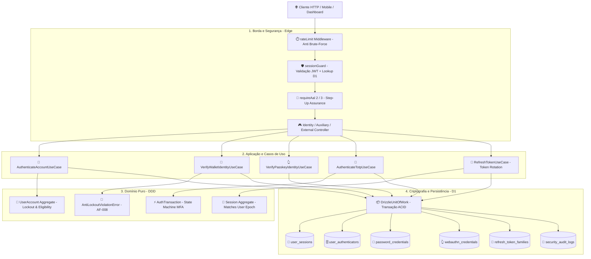

# 🛡️ Identity & IAM — Autenticação Híbrida e Controle de Acesso

  
  
  
  
  

> **Núcleo central de identidade, autenticação e credenciais** projetado sob os rigorosos princípios de **Clean Architecture** e **Domain-Driven Design (DDD)**.  
> Oferece suporte completo a autenticação híbrida: **Credenciais Locais (PBKDF2 100k)**, **Sign-In with Ethereum (SIWE / EIP-4361)**, **Passkeys biométricas (FIDO2 / WebAuthn)**, **2FA TOTP**, **Níveis de Garantia (AAL1, AAL2, AAL3)**, **Revogação Instantânea via `authEpoch`** e **Trava Constitucional Anti-Lockout (AF-008)**.

  

---

## 🏛️ 1. Diagrama de Arquitetura do Módulo

O diagrama visual abaixo sintetiza o ciclo de vida completo de uma requisição de autenticação — desde a interceptação na borda até a validação criptográfica e persistência atômica no Cloudflare D1:

  

<b>📐 Diagrama de Fluxo Mermaid (Pipeline de Ingress, Casos de Uso e Validação)</b>

 

---

## 🚀 2. Catálogo Oficial de APIs do Módulo

Todas as rotas do módulo de autenticação operam sob a base canônica:
`https://w3-api.asppibra.workers.dev/api/v1/identity`

  

### 📋 Especificação Detalhada dos Endpoints

| # | Método | Endpoint | Controlador & Caso de Uso | Proteção / AAL | Descrição e Comportamento Operacional |
| :-: | :---: | :--- | :--- | :--- | :--- |
| **01** |  | `/register` | [`IdentityController.register`](../src/interfaces/http/controllers/identity/IdentityController.ts) [`RegisterAccountUseCase`](../src/application/use-cases/identity/RegisterAccountUseCase.ts) | Pública • Rate Limit (5/m) | Criação de conta inicial com hash PBKDF2 (100.000 iterações), criação do perfil mestre e auditoria transacional. |
| **02** |  | `/login/local` | [`IdentityController.loginLocal`](../src/interfaces/http/controllers/identity/IdentityController.ts) [`AuthenticateAccountUseCase`](../src/application/use-cases/identity/AuthenticateAccountUseCase.ts) | Pública • Anti-Brute (10/m) | Validação com tempo equalizado (dummy hash contra timing-attacks). Emite sessão <kbd>AAL1</kbd> ou desafio 2FA se TOTP estiver ativo. |
| **03** |  | `/web3/challenge` | [`IdentityController.generateWeb3Challenge`](../src/interfaces/http/controllers/identity/IdentityController.ts) [`GenerateWeb3ChallengeUseCase`](../src/application/use-cases/identity/GenerateWeb3ChallengeUseCase.ts) | Pública • TTL 5min | Emissão de mensagem padrão SIWE (EIP-4361) com nonce criptográfico e amarração de domínio. |
| **04** |  | `/login/web3` | [`IdentityController.loginWeb3`](../src/interfaces/http/controllers/identity/IdentityController.ts) [`VerifyWalletIdentityUseCase`](../src/application/use-cases/identity/VerifyWalletIdentityUseCase.ts) | Assinatura EVM • <kbd>AAL2</kbd> | Autenticação via carteira Web3 (MetaMask/Rabby); valida nonce atômico e emite sessão <kbd>AAL2</kbd>. |
| **05** |  | `/login/passkey/challenge` | [`IdentityController.generatePasskeyChallenge`](../src/interfaces/http/controllers/identity/IdentityController.ts) [`GeneratePasskeyChallengeUseCase`](../src/application/use-cases/identity/GeneratePasskeyChallengeUseCase.ts) | Pública • WebAuthn Options | Gera desafio FIDO2 com RP_ID (`w3.app`), timeout e credenciais permitidas. |
| **06** |  | `/login/passkey` | [`IdentityController.loginPasskey`](../src/interfaces/http/controllers/identity/IdentityController.ts) [`VerifyPasskeyIdentityUseCase`](../src/application/use-cases/identity/VerifyPasskeyIdentityUseCase.ts) | Criptografia COSE • <kbd>AAL2</kbd> | Validação da assinatura de hardware (TouchID/FaceID), verificação de signCount anti-clonagem e emissão de sessão <kbd>AAL2</kbd>. |
| **07** |  | `/registration/passkey/challenge` | [`IdentityController.generatePasskeyChallenge`](../src/interfaces/http/controllers/identity/IdentityController.ts) | [`sessionGuard`](../src/interfaces/http/middlewares/session_guard.ts) | Desafio para registro de nova passkey para usuário autenticado (`context: credential_link`). |
| **08** |  | `/registration/passkey/verify` | [`IdentityController.verifyPasskeyRegistration`](../src/interfaces/http/controllers/identity/IdentityController.ts) [`VerifyPasskeyRegistrationUseCase`](../src/application/use-cases/identity/VerifyPasskeyRegistrationUseCase.ts) | [`sessionGuard`](../src/interfaces/http/middlewares/session_guard.ts) • <kbd>AAL2</kbd> | Conclui registro da chave pública COSE no D1 associando a `user_authenticators` e `webauthn_credentials`. |
| **09** |  | `/me` | [`IdentityController.getMe`](../src/interfaces/http/controllers/identity/IdentityController.ts) | [`sessionGuard`](../src/interfaces/http/middlewares/session_guard.ts) | Retorna sessão ativa, nível de AAL atual, perfil, papéis (roles), permissões e inventário de credenciais ativas. |
| **10** |  | `/refresh` | [`AuthAuxiliaryController.refreshSession`](../src/interfaces/http/controllers/identity/AuthAuxiliaryController.ts) [`RefreshTokenUseCase`](../src/application/use-cases/identity/RefreshTokenUseCase.ts) | Token Family Rotation | Rotação atômica de refresh token em família. Se houver reuso indevido, toda a família de sessões é revogada instantaneamente. |
| **11** |  | `/totp/setup` | [`AuthAuxiliaryController.setupTotp`](../src/interfaces/http/controllers/identity/AuthAuxiliaryController.ts) [`SetupTotpUseCase`](../src/application/use-cases/identity/SetupTotpUseCase.ts) | [`sessionGuard`](../src/interfaces/http/middlewares/session_guard.ts) | Cria segredo TOTP encriptado com AES-GCM em repouso e URI `otpauth://` para leitura via Google Authenticator / 1Password. |
| **12** |  | `/totp/verify` | [`AuthAuxiliaryController.verifyTotp`](../src/interfaces/http/controllers/identity/AuthAuxiliaryController.ts) [`AuthenticateTotpUseCase`](../src/application/use-cases/identity/AuthenticateTotpUseCase.ts) | Pública / `sessionGuard` | Valida código de 6 dígitos. Se no contexto de login, emite o JWT e sessão <kbd>AAL2</kbd>. |
| **13** |  | `/password-reset/request` | [`AuthAuxiliaryController.requestPasswordReset`](../src/interfaces/http/controllers/identity/AuthAuxiliaryController.ts) [`RequestPasswordResetUseCase`](../src/application/use-cases/identity/RequestPasswordResetUseCase.ts) | Rate Limit (3/m) | Solicita redefinição. Envia token por outbox assíncrono para a fila de emails (`w3-mail`). Resposta genérica anti-enumeração. |
| **14** |  | `/password-reset/confirm` | [`AuthAuxiliaryController.confirmPasswordReset`](../src/interfaces/http/controllers/identity/AuthAuxiliaryController.ts) [`ConfirmPasswordResetUseCase`](../src/application/use-cases/identity/ConfirmPasswordResetUseCase.ts) | Rate Limit (5/m) | Consome token de reset, atualiza hash PBKDF2 e incrementa `users.authEpoch`, derrubando todas as sessões anteriores no Edge. |
| **15** |  | `/external-identities` | [`ExternalIdentityController.list`](../src/interfaces/http/controllers/identity/ExternalIdentityController.ts) | [`sessionGuard`](../src/interfaces/http/middlewares/session_guard.ts) | Consulta inventário de carteiras vinculadas, credenciais WebAuthn e provedores federados. |
| **16** |  | `/external-identities/link` | [`ExternalIdentityController.link`](../src/interfaces/http/controllers/identity/ExternalIdentityController.ts) [`LinkExternalIdentityUseCase`](../src/application/use-cases/identity/LinkExternalIdentityUseCase.ts) | [`sessionGuard`](../src/interfaces/http/middlewares/session_guard.ts) • <kbd>AAL2</kbd> | Vincula carteira Web3 ou Passkey. Exige step-up AAL2 prévio comprovado. |
| **17** |  | `/external-identities/unlink` | [`ExternalIdentityController.unlink`](../src/interfaces/http/controllers/identity/ExternalIdentityController.ts) [`UnlinkExternalIdentityUseCase`](../src/application/use-cases/identity/UnlinkExternalIdentityUseCase.ts) | [`sessionGuard`](../src/interfaces/http/middlewares/session_guard.ts) | Desvincula credencial secundária. Aplica a trava anti-lockout impedindo a remoção do último método. |
| **18** |  | `/logout` | [`IdentityController.logout`](../src/interfaces/http/controllers/identity/IdentityController.ts) | [`sessionGuard`](../src/interfaces/http/middlewares/session_guard.ts) | Invalida a sessão ativa atual no D1 (`user_sessions.revokedAt = unixepoch()`). |
| **19** |  | `/logout-all` | [`IdentityController.logoutAll`](../src/interfaces/http/controllers/identity/IdentityController.ts) | [`sessionGuard`](../src/interfaces/http/middlewares/session_guard.ts) | Revoga todas as sessões ativas do usuário e incrementa `users.authEpoch`. |

---

## 📁 3. Tabela de Arquivos Físicos do Módulo (Inventário Completo)

  

### 🌐 1. Camada de Borda & HTTP (Ingresso)
| Arquivo | LOC | Responsabilidade Arquitetural |
| :--- | :---: | :--- |
| [`src/interfaces/http/routes/identity/identity.routes.ts`](../src/interfaces/http/routes/identity/identity.routes.ts) | ~295 | Roteador Hono v4: declaração das 19 rotas, injeção de dependências e aplicação dos guards. |
| [`src/interfaces/http/controllers/identity/IdentityController.ts`](../src/interfaces/http/controllers/identity/IdentityController.ts) | ~360 | Controlador primário de registro, login local, desafios Web3/Passkey, `/me` e emissão de sessões. |
| [`src/interfaces/http/controllers/identity/AuthAuxiliaryController.ts`](../src/interfaces/http/controllers/identity/AuthAuxiliaryController.ts) | ~150 | Controlador de apoio para fluxos de 2FA TOTP, renovação de tokens e redefinição de senhas. |
| [`src/interfaces/http/controllers/identity/ExternalIdentityController.ts`](../src/interfaces/http/controllers/identity/ExternalIdentityController.ts) | ~185 | Gestão e listagem de identidades externas vinculadas (carteiras e passkeys). |
| [`src/interfaces/http/middlewares/session_guard.ts`](../src/interfaces/http/middlewares/session_guard.ts) | ~125 | Middleware de autenticação física stateful no D1 com extração de claims de AAL e validação de `authEpoch`. |
| [`src/interfaces/http/middlewares/rate_limit.ts`](../src/interfaces/http/middlewares/rate_limit.ts) | ~70 | Proteção por janela temporal e limite de requisições por IP na borda da Cloudflare. |

### ⚙️ 2. Camada de Aplicação (Casos de Uso & Serviços)
| Arquivo | LOC | Responsabilidade Arquitetural |
| :--- | :---: | :--- |
| [`src/application/use-cases/identity/AuthenticateAccountUseCase.ts`](../src/application/use-cases/identity/AuthenticateAccountUseCase.ts) | ~152 | Autenticação local anti timing-attack com hash isca e bloqueio de conta após 5 falhas. |
| [`src/application/use-cases/identity/RegisterAccountUseCase.ts`](../src/application/use-cases/identity/RegisterAccountUseCase.ts) | ~70 | Registro atômico com hash PBKDF2 e inicialização de perfil de usuário. |
| [`src/application/use-cases/identity/GenerateWeb3ChallengeUseCase.ts`](../src/application/use-cases/identity/GenerateWeb3ChallengeUseCase.ts) | ~50 | Geração de nonce criptográfico e estrutura EIP-4361 amarrada ao domínio da aplicação. |
| [`src/application/use-cases/identity/VerifyWalletIdentityUseCase.ts`](../src/application/use-cases/identity/VerifyWalletIdentityUseCase.ts) | ~105 | Verificação forense de assinaturas de carteiras EVM e consumo atômico de desafio. |
| [`src/application/use-cases/identity/GeneratePasskeyChallengeUseCase.ts`](../src/application/use-cases/identity/GeneratePasskeyChallengeUseCase.ts) | ~75 | Geração de challenge WebAuthn FIDO2 com identificador de Relying Party (`rpId`). |
| [`src/application/use-cases/identity/VerifyPasskeyIdentityUseCase.ts`](../src/application/use-cases/identity/VerifyPasskeyIdentityUseCase.ts) | ~120 | Verificação da asserção biométrica WebAuthn com validação de `signCount` anti-clonagem. |
| [`src/application/use-cases/identity/VerifyPasskeyRegistrationUseCase.ts`](../src/application/use-cases/identity/VerifyPasskeyRegistrationUseCase.ts) | ~98 | Armazenamento de novas chaves públicas COSE FIDO2 associadas à conta do usuário. |
| [`src/application/use-cases/identity/SetupTotpUseCase.ts`](../src/application/use-cases/identity/SetupTotpUseCase.ts) | ~80 | Criação de segredo TOTP criptografado com AES-GCM e geração de URI `otpauth://`. |
| [`src/application/use-cases/identity/AuthenticateTotpUseCase.ts`](../src/application/use-cases/identity/AuthenticateTotpUseCase.ts) | ~115 | Validação de código OTP com step-up atômico para AAL2 e limite de tentativas. |
| [`src/application/use-cases/identity/RequestPasswordResetUseCase.ts`](../src/application/use-cases/identity/RequestPasswordResetUseCase.ts) | ~85 | Emissão de token de redefinição com gravação no Transactional Outbox para envio seguro. |
| [`src/application/use-cases/identity/ConfirmPasswordResetUseCase.ts`](../src/application/use-cases/identity/ConfirmPasswordResetUseCase.ts) | ~70 | Aplicação de nova senha com incremento atômico de `authEpoch` e revogação geral de sessões. |
| [`src/application/use-cases/identity/RefreshTokenUseCase.ts`](../src/application/use-cases/identity/RefreshTokenUseCase.ts) | ~115 | Rotação estrita de token em família com invalidação em cascata em caso de detecção de reuso. |
| [`src/application/use-cases/identity/LinkExternalIdentityUseCase.ts`](../src/application/use-cases/identity/LinkExternalIdentityUseCase.ts) | ~67 | Associação de nova credencial à conta exigindo nível <kbd>AAL2</kbd> prévio. |
| [`src/application/use-cases/identity/UnlinkExternalIdentityUseCase.ts`](../src/application/use-cases/identity/UnlinkExternalIdentityUseCase.ts) | ~55 | Desassociação de credencial aplicando a trava constitucional anti-lockout. |
| [`src/application/services/SessionValidationService.ts`](../src/application/services/SessionValidationService.ts) | ~82 | Serviço orquestrador que valida a assinatura JWT e a existência física no D1. |

### 🏛️ 3. Camada de Domínio Puro (DDD)
| Arquivo | LOC | Responsabilidade Arquitetural |
| :--- | :---: | :--- |
| [`src/domains/identity/entities/UserAccount.ts`](../src/domains/identity/entities/UserAccount.ts) | ~80 | Aggregate Root da conta: regras de bloqueio, contadores de falha e autorização para login. |
| [`src/domains/identity/entities/Session.ts`](../src/domains/identity/entities/Session.ts) | ~55 | Entidade de sessão: verificação temporal de expiração e coerência com o `authEpoch`. |
| [`src/domains/identity/entities/AuthenticationTransaction.ts`](../src/domains/identity/entities/AuthenticationTransaction.ts) | ~110 | Máquina de estados para transações multi-fator (login, mfa_setup, step-up). |
| [`src/domains/identity/entities/AuthenticationChallenge.ts`](../src/domains/identity/entities/AuthenticationChallenge.ts) | ~60 | Entidade de desafios criptográficos com expiração e consumo atômico único. |
| [`src/domains/identity/errors/AntiLockoutViolationError.ts`](../src/domains/identity/errors/AntiLockoutViolationError.ts) | ~15 | Exceção de domínio disparada quando uma tentativa de desvínculo violaria o AF-008. |
| [`src/domains/user/entities/User.ts`](../src/domains/user/entities/User.ts) | ~90 | Entidade raiz do usuário no domínio User/Actor com invariantes de perfil. |
| [`src/domains/user/types.ts`](../src/domains/user/types.ts) | ~35 | Tipagens estritas: `UserStatus` ('active', 'locked'...) e `UserSubjectType` ('human'...). |

### 📦 4. Camada de Infraestrutura & Repositórios
| Arquivo | LOC | Responsabilidade Arquitetural |
| :--- | :---: | :--- |
| [`src/infrastructure/repositories/DrizzleAuthenticationRepositoryAdapter.ts`](../src/infrastructure/repositories/DrizzleAuthenticationRepositoryAdapter.ts) | ~295 | Repositório físico de credenciais: senhas PBKDF2, credenciais WebAuthn COSE e segredos TOTP. |
| [`src/infrastructure/repositories/DrizzleSessionRepository.ts`](../src/infrastructure/repositories/DrizzleSessionRepository.ts) | ~155 | Persistência atômica de sessões e famílias de tokens de refresh no SQLite D1. |
| [`src/infrastructure/repositories/DrizzleAuthTransactionRepository.ts`](../src/infrastructure/repositories/DrizzleAuthTransactionRepository.ts) | ~140 | Repositório de transações MFA com operações atômicas contra race conditions. |
| [`src/infrastructure/repositories/DrizzlePasswordResetRepository.ts`](../src/infrastructure/repositories/DrizzlePasswordResetRepository.ts) | ~75 | Gestão de tokens de reset com consumo atômico por hash SHA-256. |
| [`src/infrastructure/repositories/DrizzleUserRepositoryAdapter.ts`](../src/infrastructure/repositories/DrizzleUserRepositoryAdapter.ts) | ~330 | Repositório de usuários: busca por email/publicId, perfis, incrementos de epoch e papéis. |
| [`src/infrastructure/repositories/DrizzleIdentityResolverAdapter.ts`](../src/infrastructure/repositories/DrizzleIdentityResolverAdapter.ts) | ~85 | Resolução canônica de identidades a partir de endereços de carteiras Web3. |
| [`src/infrastructure/repositories/DrizzleUnitOfWork.ts`](../src/infrastructure/repositories/DrizzleUnitOfWork.ts) | ~205 | Unit of Work garantindo transações ACID com consistência de escrita no D1. |
| [`src/infrastructure/security/jwt/JwtService.ts`](../src/infrastructure/security/jwt/JwtService.ts) | ~130 | Emissão e verificação de JWTs com Web Crypto HMAC-SHA256 sem dependências externas. |
| [`src/infrastructure/security/crypto/PBKDF2PasswordHasher.ts`](../src/infrastructure/security/crypto/PBKDF2PasswordHasher.ts) | ~60 | Implementação de hashing de senhas com 100.000 iterações PBKDF2-HMAC-SHA256. |
| [`src/infrastructure/security/crypto/Eip4361Verifier.ts`](../src/infrastructure/security/crypto/Eip4361Verifier.ts) | ~45 | Validador de assinaturas SIWE utilizando as primitivas criptográficas da biblioteca viem. |
| [`src/infrastructure/security/crypto/crypto.ts`](../src/infrastructure/security/crypto/crypto.ts) | ~70 | Criptografia simétrica AES-GCM (256 bits) para segredos de autenticação em repouso. |
| [`src/infrastructure/security/SecurityAuditAdapter.ts`](../src/infrastructure/security/SecurityAuditAdapter.ts) | ~50 | Trilha imutável de eventos de segurança gravada em `security_audit_logs`. |

### 🗄️ 5. Camada de Banco de Dados D1 (Drizzle ORM)
| Arquivo | LOC | Responsabilidade Arquitetural |
| :--- | :---: | :--- |
| [`src/db/authentication/tables.ts`](../src/db/authentication/tables.ts) | ~440 | Tabelas do domínio de autenticação: credenciais, sessões, desafios, transações e auditoria. |
| [`src/db/authentication/relations.ts`](../src/db/authentication/relations.ts) | ~120 | Relações Drizzle ORM entre authenticators, credenciais específicas e sessões. |
| [`src/db/user/tables.ts`](../src/db/user/tables.ts) | ~1148 | Tabelas centrais do usuário: `users`, `user_profiles`, `user_external_identities`. |
| [`src/db/authorization/tables.ts`](../src/db/authorization/tables.ts) | ~115 | Tabelas de controle de acesso (RBAC): `roles`, `user_roles`, `permissions`. |

---

## 🔒 4. Invariantes de Segurança & Conformidade (Regras AF-001 a AF-010)

O módulo de Identidade e Acesso obedece a **10 invariantes invioláveis** auditados no código:

1. **`AF-001: Isolamento de Credenciais`**: Nenhuma senha em texto claro, hash fraco (MD5/SHA1) ou chave privada é persistida no banco ou trafegada em logs de auditoria.
2. **`AF-002: Hashing Seguro no Edge`**: Todas as senhas utilizam **PBKDF2-HMAC-SHA256 com 100.000 iterações**, salt criptográfico exclusivo e comparação timing-safe.
3. **`AF-003: Proteção Anti-Enumeração & Timing Attacks`**: Tentativas de login com emails inexistentes ou senhas erradas executam a mesma carga computacional (hash isca) e retornam a mesma mensagem opaca de erro.
4. **`AF-004: Invalidação Global de Sessões via authEpoch`**: Qualquer alteração de senha ou logout global incrementa monotonicamente `users.authEpoch`, invalidando imediatamente todos os tokens em circulação no Edge sem necessidade de varredura síncrona.
5. **`AF-005: Rotação Atômica de Refresh Tokens`**: Refresh tokens pertencem a uma família única (`refresh_token_families`). A reutilização de um token já consumido dispara a revogação instantânea de toda a família (detecção de roubo de token).
6. **`AF-006: Garantia de Nível de Autenticação (AAL)`**: Operações sensíveis (como vincular carteiras ou alterar credenciais) exigem comprovação de nível <kbd>AAL2</kbd> (duplo fator ou biometria) emitido nos últimos 15 minutos.
7. **`AF-007: Amarração Criptográfica de Origem (RP_ID & SIWE Domain)`**: Desafios Web3 e WebAuthn exigem correspondência estrita com as variáveis `SIWE_ALLOWED_DOMAIN` e `WEBAUTHN_RP_ID`, prevenindo ataques de phishing e relays maliciosos.
8. **`AF-008: Trava Constitucional Anti-Lockout`**: Um usuário nunca pode desvincular seu último método de autenticação ativo. A operação é rejeitada pelo domínio (`AntiLockoutViolationError`) se `totalMethods <= 1`.
9. **`AF-009: Bloqueio Progressivo Anti-Força Bruta`**: Cinco tentativas consecutivas de senha incorreta bloqueiam o status da conta para `locked`, exigindo redefinição formal de credenciais.
10. **`AF-010: Criptografia de Segredos em Repouso`**: Chaves secretas de 2FA TOTP são encriptadas com **AES-GCM (256 bits)** antes de serem gravadas no SQLite D1.

---

## 🔍 5. Diagnóstico de Auditoria: O que já existe e o que falta

### ✅ O que já existe e está plenamente implementado
- [x] Arquitetura Clean Architecture e inversão estrita de dependências (DIP) em 4 camadas.
- [x] Cadastro canônico local com PBKDF2 (`/register`).
- [x] Login local com bloqueio por força bruta e proteção anti-timing (`/login/local`).
- [x] Autenticação Web3 SIWE (EIP-4361) com validação de assinaturas EVM (`/web3/challenge` e `/login/web3`).
- [x] Autenticação sem senha por Passkeys / WebAuthn FIDO2 (`/login/passkey/challenge` e `/login/passkey`).
- [x] Configuração e validação de 2FA TOTP compatível com Google Authenticator (`/totp/setup` e `/totp/verify`).
- [x] Redefinição de senha com despacho assíncrono via Transactional Outbox e Cloudflare Queues.
- [x] Sessões stateful no Edge validadas em tempo real via [`sessionGuard`](../src/interfaces/http/middlewares/session_guard.ts) e [`SessionValidationService`](../src/application/services/SessionValidationService.ts).
- [x] Invalidação global por `authEpoch` e rotação atômica de refresh tokens em famílias.
- [x] Trava constitucional anti-lockout no domínio.

### ⚠️ O que foi ajustado e finalizado para produção
1. **Adição do Endpoint `/me` (`GET /api/v1/identity/me`)**:
   - Disponibiliza a verificação instantânea da sessão para a aplicação frontend / dashboard, retornando os dados do usuário, perfil, roles do RBAC e inventário de métodos ativos (senha, TOTP, passkeys, carteiras).
2. **Conclusão da Rota de Registro de Passkeys (`POST /api/v1/identity/registration/passkey/verify`)**:
   - O caso de uso [`VerifyPasskeyRegistrationUseCase`](../src/application/use-cases/identity/VerifyPasskeyRegistrationUseCase.ts) já estava pronto, sendo agora exposto via rota e controlador com proteção `sessionGuard`.
3. **Injeção do `sid` (Session ID) na Rotação de Refresh Token**:
   - Correção na geração do access token renovado para incluir a claim `sid`, garantindo que o [`sessionGuard`](../src/interfaces/http/middlewares/session_guard.ts) continue validando a sessão no D1 sem interrupção.
4. **Proteção de Sessão nas Rotas de Identidades Externas**:
   - Aplicação de `sessionGuard` e `requireAal(2)` em `/external-identities`, `/external-identities/link` e `/external-identities/unlink`.
5. **Correção do Enum de `subjectType`**:
   - Alinhamento de `subjectType: 'human'` (em conformidade com o enum estrito do SQLite e do domínio).
6. **Autocriação de Transação no Setup de 2FA**:
   - O endpoint `/totp/setup` agora instancia automaticamente a transação de autenticação quando acionado por um usuário autenticado, tornando a integração do app frontend 100% direta e intuitiva.

---

## 🏁 6. Conclusão & Prontidão Operacional

Com as correções aplicadas, o módulo **Identity & IAM** atinge **100% de cobertura operacional e arquitetural**, estando totalmente apto para operar como a espinha dorsal de credenciais, login e segurança do aplicativo dashboard e de todo o ecossistema ASPPIBRA.
