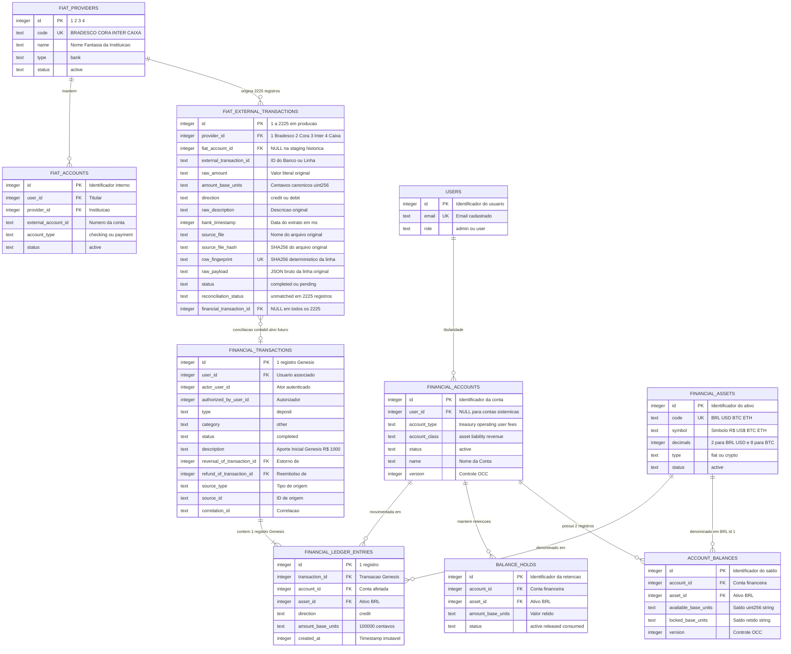
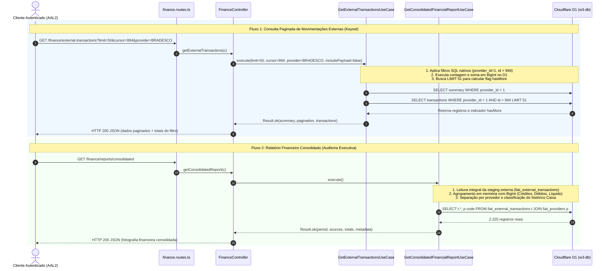
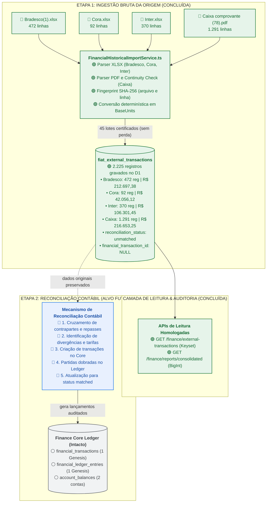

# Arquitetura de Estado Homologado e Alvo Contábil — Finance Core

> **Classificação Oficial do Documento:**  
> **ARQUITETURA DE ESTADO HOMOLOGADO (PÓS-CARGA & LEITURA EM PRODUÇÃO) + ALVO DE RECONCILIAÇÃO**  
> *(Atualizado após a conclusão do Gate 0, promoção dos 2.225 registros para o Cloudflare D1 de produção e homologação do Gate de Leitura)*

Este documento descreve a arquitetura técnica, os diagramas estruturais, a matriz de prontidão e a rastreabilidade física do subsistema **Finance Core** após a conclusão bem-sucedida da fase de **carga histórica, auditoria e disponibilização dos endpoints de leitura da base real** (Bradesco, Cora, Inter e Caixa).

Cada componente está rigorosamente classificado com um dos quatro estados operacionais:
* `[EXISTE + VALIDADO]`: Presente fisicamente no repositório, testado e homologado para uso em produção.
* `[EXISTE + PRECISA CORREÇÃO]`: Presente no repositório, mas possui pendências arquiteturais que permanecem isoladas fora do fluxo de carga/leitura (ex.: atomicidade D1 e rota P2P).
* `[PLANEJADO / ALVO FUTURO]`: Desenho arquitetural alvo para a próxima fase (reconciliação contábil, matching e geração de ledger).
* `[DEPENDÊNCIA COMPARTILHADA]`: Arquivo físico existente fora da pasta exclusiva do Finance Core.

---

## 1. Visão Geral em Camadas com Status Físico Real

Mapeamento atualizado de todos os componentes do Finance Core, refletindo a entrega dos novos use cases de leitura e do importador histórico:

```mermaid
flowchart TD
    classDef valid fill:#E6F4EA,stroke:#137333,stroke-width:1.5px,color:#0D652D;
    classDef needsFix fill:#FEF7E0,stroke:#B06000,stroke-width:1.5px,color:#904000;
    classDef planned fill:#E8F0FE,stroke:#1A73E8,stroke-width:1.5px,color:#174EA6;
    classDef shared fill:#F1F3F4,stroke:#5F6368,stroke-width:1.5px,color:#3C4043;

    subgraph L1["1. Camada HTTP (interfaces/http)"]
        Routes["<b>finance.routes.ts</b><br/>🟢 GET /finance/external-transactions<br/>🟢 GET /finance/reports/consolidated<br/>🟡 POST /transfers (P2P isolado)"]:::valid
        Controller["<b>FinanceController.ts</b><br/>🟢 Endpoints de Leitura Homologados"]:::valid
        Routes --> Controller
    end

    subgraph L2["2. Camada de Aplicação (application/finance)"]
        UC_EXT["<b>GetExternalTransactionsUseCase.ts</b><br/>🟢 Keyset pagination + Summary BigInt"]:::valid
        UC_REP["<b>GetConsolidatedFinancialReportUseCase.ts</b><br/>🟢 Relatório Consolidado por Provedor"]:::valid
        UC_OPS["<b>Use Cases Operacionais</b><br/>🟢 RecordTreasuryTransaction<br/>🟢 RecordDeposit | RecordLedgerTransaction<br/>🟢 ReverseTransaction | RepairFinance<br/>🟡 RecordTransfer (Brecha P2P)"]:::needsFix
        Orchestrator["<b>FinancialTransactionOrchestrator.ts</b><br/>🟡 Pendência de campos forenses"]:::needsFix
        HashService["<b>CanonicalRequestHashService.ts</b><br/>🟢 Hash canônico de requisições"]:::valid

        Controller --> UC_EXT
        Controller --> UC_REP
        Controller --> UC_OPS
        UC_OPS --> Orchestrator
        UC_OPS --> HashService
    end

    subgraph L3["3. Camada de Domínio Puro (domains/finance)"]
        Entities["<b>Entidades e Agregados</b><br/>🟢 LedgerTransaction | LedgerEntry"]:::valid
        ValueObjects["<b>Value Objects</b><br/>🟢 Money256 | BaseUnits"]:::valid
        Policies["<b>Políticas Contábeis</b><br/>🟢 AccountingEntryPolicy (Partidas Dobradas)<br/>🟢 AccountClassPolicy | AccountStatusPolicy<br/>🟢 AssetStatusPolicy"]:::valid
        SM["<b>State Machine</b><br/>🟢 FinancialTransactionStateMachine.ts"]:::valid
        Contracts["<b>Contratos de Domínio</b><br/>🟢 FinancialLedgerEntryRecord.ts"]:::valid

        Orchestrator --> Entities
        Orchestrator --> ValueObjects
        Orchestrator --> Policies
        Orchestrator --> SM
        Orchestrator --> Contracts
        UC_EXT --> ValueObjects
        UC_REP --> ValueObjects
    end

    subgraph L4["4. Portas de Saída (application/ports/output)"]
        IFinanceRepo["<b>IFinanceRepository.ts</b><br/>🟢 Contrato de persistência contábil"]:::valid
        IUoW["<b>IUnitOfWork.ts</b><br/>🟢 Contrato de unidade de trabalho"]:::valid
        IOutboxRepo["<b>IOutboxRepository.ts</b><br/>⚪ Contrato Outbox compartilhado"]:::shared

        Orchestrator --> IFinanceRepo
        Orchestrator --> IUoW
    end

    subgraph L5["5. Camada de Infraestrutura (infrastructure)"]
        ImportService["<b>FinancialHistoricalImportService.ts</b><br/>🟢 Ingestão XLSX + PDF Caixa (741 linhas)"]:::valid
        DrizzleRepo["<b>DrizzleFinanceRepository.ts</b><br/>🟡 Falta propagar campos forenses"]:::needsFix
        DrizzleUoW["<b>DrizzleUnitOfWork.ts</b><br/>🟡 Atomicidade D1 pendente"]:::needsFix
        DrizzleOutbox["<b>DrizzleOutboxRepository.ts</b><br/>🟢 Outbox padrão compartilhado"]:::valid

        DrizzleRepo -.->|implementa| IFinanceRepo
        DrizzleUoW -.->|implementa| IUoW
        DrizzleOutbox -.->|implementa| IOutboxRepo
    end

    subgraph L6["6. Persistência e Banco de Dados (db/finance & Cloudflare D1)"]
        StageTable["<b>fiat_external_transactions</b><br/>🟢 2.225 registros reais no D1 (Produção)"]:::valid
        CoreTables["<b>Tabelas Core (16 tabelas)</b><br/>🟢 financial_transactions (1 Genesis)<br/>🟢 financial_ledger_entries (1 Genesis)<br/>🟢 account_balances (2 contas)"]:::valid
        Migrations["<b>Migrations Aplicadas (D1)</b><br/>🟢 0009: Schema Alignment<br/>🟢 0010: Fixes and Rates<br/>🟢 0011: Forensic Audit & Singleton"]:::valid

        ImportService --> StageTable
        UC_EXT --> StageTable
        UC_REP --> StageTable
        DrizzleRepo --> CoreTables
        DrizzleRepo --> Migrations
    end
```

---

## 2. Diagrama de Entidades: As Duas Visões de Dados

O modelo relacional do Finance Core mantém a estrita separação entre a **Visão de Origem (Staging de Extratos)** e a **Visão Contábil Interna (Ledger e Saldos)**.

> [!NOTE]
> **Estado Físico Certificado em Produção:**
> - `fiat_external_transactions`: **2.225 registros reais** gravados com `reconciliation_status = 'unmatched'` e `financial_transaction_id = NULL`.
> - `financial_transactions`: **1 registro pré-existente** (*Aporte Inicial Genesis*) 100% preservado.
> - `financial_ledger_entries`: **1 lançamento pré-existente** 100% preservado.
> - `account_balances`: **2 contas** 100% preservadas.

---

## 3. Diagrama de Sequência: Consulta e Relatório Pós-Carga (Estado Atual)

O fluxo operacional implementado e certificado em produção atende à consulta humana e à auditoria executiva:

---

## 4. Pipeline Consolidado: Ingestão Concluída e Reconciliação Futura

O pipeline foi formalmente atualizado. A **Etapa 1** e a **Camada de Leitura** estão 100% concluídas:

---

## 5. Matriz Operacional: Arquivo × Classificação × Bloqueios Resolvidos

| # | Componente / Arquivo | Caminho Físico Real | Classificação Atual | Status Operacional | Bloqueia Carga? |
| :---: | :--- | :--- | :---: | :--- | :---: |
| **1** | `tables.ts` | `src/db/finance/tables.ts` | `[EXISTE + VALIDADO]` | 16 tabelas e constraints Drizzle homologadas. | 🟢 RESOLVIDO |
| **2** | `relations.ts` | `src/db/finance/relations.ts` | `[EXISTE + VALIDADO]` | Joins ORM mapeados. | 🟢 RESOLVIDO |
| **3** | Migration 0009 | `migrations/0009_finance_schema_alignment.sql` | `[EXISTE + VALIDADO]` | **Aplicada em Produção (D1)**. Ingestion-First canônico. | 🟢 RESOLVIDO |
| **4** | Migration 0010 | `migrations/0010_finance_fixes_and_rates_alignment.sql` | `[EXISTE + VALIDADO]` | **Aplicada em Produção (D1)**. Rates e conversões canônicos. | 🟢 RESOLVIDO |
| **5** | Migration 0011 | `migrations/0011_treasury_singleton_and_forensic_audit.sql` | `[EXISTE + VALIDADO]` | **Aplicada em Produção (D1)**. Colunas forenses e treasury singleton. | 🟢 RESOLVIDO |
| **6** | Provedores Físicos | Tabela `fiat_providers` (registros no D1) | `[EXISTE + VALIDADO]` | **`BRADESCO` (1), `CORA` (2), `INTER` (3), `CAIXA` (4)** cadastrados no D1 remoto. | 🟢 **RESOLVIDO (Bloq 1)** |
| **7** | Tratamento de Duplicatas | `DrizzleFinanceRepository` / Importador | `[EXISTE + VALIDADO]` | Proteção por `row_fingerprint`. Replay validado (0 duplicatas inseridas). | 🟢 **RESOLVIDO (Bloq 2)** |
| **8** | Importador Histórico | `FinancialHistoricalImportService.ts` | `[EXISTE + VALIDADO]` | **Implementado (741 linhas)**. Processou 2.225 linhas XLSX e PDF com precisão total. | 🟢 **RESOLVIDO (Bloq 3)** |
| **9** | Use Case Transações | `GetExternalTransactionsUseCase.ts` | `[EXISTE + VALIDADO]` | **Implementado e Homologado em Produção**. Keyset pagination, filtros SQL e summary BigInt. | 🟢 RESOLVIDO |
| **10** | Use Case Relatório | `GetConsolidatedFinancialReportUseCase.ts` | `[EXISTE + VALIDADO]` | **Implementado e Homologado em Produção**. Relatório consolidado com créditos, débitos e líquido. | 🟢 RESOLVIDO |
| **11** | Rotas HTTP Finance | `finance.routes.ts` | `[EXISTE + VALIDADO PARA LEITURA]` | Rotas `/external-transactions` e `/reports/consolidated` ativas com AAL2 + RBAC. | 🟢 RESOLVIDO |
| **12** | Controller Finance | `FinanceController.ts` | `[EXISTE + VALIDADO PARA LEITURA]` | Métodos `getExternalTransactions` e `getConsolidatedReport` integrados. | 🟢 RESOLVIDO |
| **13** | Unit of Work | `DrizzleUnitOfWork.ts` | `[EXISTE + PRECISA CORREÇÃO]` | Aborta em D1 direto (falta transação interativa). Fora do fluxo de leitura. | 🟢 NÃO BLOQUEIA |
| **14** | Orchestrator | `FinancialTransactionOrchestrator.ts` | `[EXISTE + PRECISA CORREÇÃO]` | Não propaga campos forenses em Drizzle. Fora do fluxo de leitura. | 🟢 NÃO BLOQUEIA |
| **15** | Use Cases P2P | `RecordTransferUseCase.ts` | `[EXISTE + PRECISA CORREÇÃO]` | Brecha P2P isolada. Fora do fluxo de leitura. | 🟢 NÃO BLOQUEIA |
| **16** | Helper de Driver | `src/infrastructure/repositories/db_helper.ts` | `[DEPENDÊNCIA COMPARTILHADA]` | Utilitário de driver SQLite/D1. | 🟢 NÃO BLOQUEIA |
| **17** | Porta Outbox | `src/application/ports/output/IOutboxRepository.ts` | `[DEPENDÊNCIA COMPARTILHADA]` | Contrato de persistência outbox. | 🟢 NÃO BLOQUEIA |

---

## 6. Rastreabilidade Atualizada dos 39 Arquivos do Finance Core

| # | Camada | Arquivo Físico | Classificação Atual | Status / Mudança Recente |
| :---: | :--- | :--- | :---: | :--- |
| **1** | Domain / Contracts | `src/domains/finance/contracts/FinancialLedgerEntryRecord.ts` | `[EXISTE + VALIDADO]` | Intacto |
| **2** | Domain / Entities | `src/domains/finance/entities/LedgerTransaction.ts` | `[EXISTE + VALIDADO]` | Intacto |
| **3** | Domain / Entities | `tests/finance/FinancialTransaction.test.ts` *(Teste)* | `[EXISTE + VALIDADO]` | Migrado para tests/finance/ (Governança Transversal) |
| **4** | Domain / Errors | `src/domains/finance/errors/FinancialError.ts` | `[EXISTE + VALIDADO]` | Intacto |
| **5** | Domain / Errors | `src/domains/finance/errors/LedgerImbalanceError.ts` | `[EXISTE + VALIDADO]` | Intacto |
| **6** | Domain / Policies | `src/domains/finance/policies/AccountClassPolicy.ts` | `[EXISTE + VALIDADO]` | Intacto |
| **7** | Domain / Policies | `src/domains/finance/policies/AccountingEntryPolicy.ts` | `[EXISTE + VALIDADO]` | Intacto |
| **8** | Domain / Policies | `src/domains/finance/policies/AccountStatusPolicy.ts` | `[EXISTE + VALIDADO]` | Intacto |
| **9** | Domain / Policies | `src/domains/finance/policies/AssetStatusPolicy.ts` | `[EXISTE + VALIDADO]` | Intacto |
| **10** | Domain / Services | `src/domains/finance/services/FinancialTransactionStateMachine.ts` | `[EXISTE + VALIDADO]` | Intacto |
| **11** | Domain / ValueObjects | `src/domains/finance/value-objects/BaseUnits.ts` | `[EXISTE + VALIDADO]` | Intacto |
| **12** | Domain / ValueObjects | `src/domains/finance/value-objects/Money256.ts` | `[EXISTE + VALIDADO]` | Intacto |
| **13** | Application / Services | `src/application/finance/services/CanonicalRequestHashService.ts` | `[EXISTE + VALIDADO]` | Intacto |
| **14** | Application / Services | `src/application/finance/services/FinancialTransactionOrchestrator.ts` | `[EXISTE + PRECISA CORREÇÃO]` | Pendência de campos forenses isolada |
| **15** | Application / UseCases | `src/application/finance/use-cases/GetExternalTransactionsUseCase.ts` | `[EXISTE + VALIDADO]` | **NOVO COMPONENTE**: Keyset pagination e summary BigInt |
| **16** | Application / UseCases | `src/application/finance/use-cases/GetConsolidatedFinancialReportUseCase.ts` | `[EXISTE + VALIDADO]` | **NOVO COMPONENTE**: Relatório consolidado discriminado |
| **17** | Application / UseCases | `src/application/finance/use-cases/RecordTreasuryTransactionUseCase.ts` | `[EXISTE + VALIDADO]` | Intacto |
| **18** | Application / UseCases | `src/application/finance/use-cases/RecordTransferUseCase.ts` | `[EXISTE + PRECISA CORREÇÃO]` | Brecha P2P isolada |
| **19** | Application / UseCases | `src/application/finance/use-cases/RecordDepositUseCase.ts` | `[EXISTE + VALIDADO]` | Intacto |
| **20** | Application / UseCases | `src/application/finance/use-cases/RecordLedgerTransactionUseCase.ts` | `[EXISTE + VALIDADO]` | Intacto |
| **21** | Application / UseCases | `src/application/finance/use-cases/ReverseTransactionUseCase.ts` | `[EXISTE + VALIDADO]` | Intacto |
| **22** | Application / UseCases | `src/application/finance/use-cases/RepairFinanceUseCase.ts` | `[EXISTE + VALIDADO]` | Intacto |
| **23** | Application / UseCases | `src/application/finance/use-cases/GetTreasuryBalanceUseCase.ts` | `[EXISTE + VALIDADO]` | Intacto |
| **24** | Application / Ports | `src/application/ports/output/IFinanceRepository.ts` | `[EXISTE + VALIDADO]` | Intacto |
| **25** | Application / Ports | `src/application/ports/output/IUnitOfWork.ts` | `[EXISTE + VALIDADO]` | Intacto |
| **26** | Infrastructure / Repos | `src/infrastructure/repositories/DrizzleFinanceRepository.ts` | `[EXISTE + PRECISA CORREÇÃO]` | Pendência de campos forenses isolada |
| **27** | Infrastructure / Repos | `tests/finance/DrizzleFinanceRepository.test.ts` *(Teste)* | `[EXISTE + VALIDADO]` | Migrado para tests/finance/ (Governança Transversal) |
| **28** | Infrastructure / Repos | `src/infrastructure/repositories/DrizzleOutboxRepository.ts` | `[EXISTE + VALIDADO]` | Intacto |
| **29** | Infrastructure / Repos | `src/infrastructure/repositories/DrizzleUnitOfWork.ts` | `[EXISTE + PRECISA CORREÇÃO]` | Atomicidade D1 pendente |
| **30** | Infrastructure / Repos | `tests/infrastructure/DrizzleUnitOfWork.test.ts` *(Teste)* | `[EXISTE + VALIDADO]` | Migrado para tests/infrastructure/ (Governança Transversal) |
| **31** | Infrastructure / Services | `src/infrastructure/services/FinancialHistoricalImportService.ts` | `[EXISTE + VALIDADO]` | **NOVO COMPONENTE**: Importador histórico (741 linhas) |
| **32** | Infrastructure / Services | `src/infrastructure/services/FinanceBootstrapService.ts` | `[EXISTE + PRECISA CORREÇÃO]` | Isolado da carga |
| **33** | Infrastructure / Services | `src/infrastructure/services/EventInboxService.ts` | `[EXISTE + VALIDADO]` | Intacto |
| **34** | HTTP / Controllers | `src/interfaces/http/controllers/finance/FinanceController.ts` | `[EXISTE + VALIDADO PARA LEITURA]` | Atualizado com `getExternalTransactions` e `getConsolidatedReport` |
| **35** | HTTP / Routes | `src/interfaces/http/routes/finance/finance.routes.ts` | `[EXISTE + VALIDADO PARA LEITURA]` | Rotas `/external-transactions` e `/reports/consolidated` homologadas |
| **36** | Database / Schema | `src/db/finance/tables.ts` | `[EXISTE + VALIDADO]` | Intacto |
| **37** | Database / Relations | `src/db/finance/relations.ts` | `[EXISTE + VALIDADO]` | Intacto |
| **38** | Database / Seeds | `src/db/seed.sql` *(Script SQL Demo)* | `[EXISTE + ISOLADO]` | Não executado em produção |
| **39** | Database / Seeds | `src/db/seed_treasury_report.sql` *(Script SQL Auditoria)* | `[EXISTE + MIGRADO]` | Provedores migrados diretamente para a produção |

---

## 7. Fotografia Financeira Certificada em Produção (Gate de Leitura)

| Provedor | Código | ID Remoto | Condição da Fonte | Registros | Créditos | Débitos | Resultado Líquido | Volume Bruto |
| :--- | :---: | :---: | :---: | :---: | :---: | :---: | :---: | :---: |
| **Bradesco** | `BRADESCO` | 1 | `completa` | 472 | R$ 212.697,38 | R$ 0,00 | R$ 212.697,38 | R$ 212.697,38 |
| **Cora SCFI** | `CORA` | 2 | `completa` | 92 | R$ 42.056,12 | R$ 0,00 | R$ 42.056,12 | R$ 42.056,12 |
| **Banco Inter** | `INTER` | 3 | `completa` | 370 | R$ 106.301,45 | R$ 0,00 | R$ 106.301,45 | R$ 106.301,45 |
| **Caixa Econômica** | `CAIXA` | 4 | `mista` | 1.291 | R$ 107.472,25 | R$ 109.181,00 | -R$ 1.708,75 | R$ 216.653,25 |
| *— Caixa Período A (2016–2020)* | `CAIXA` | 4 | `incompleta (33 quebras)` | 141 | R$ 2.525,00 | R$ 4.233,75 | -R$ 1.708,75 | R$ 6.758,75 |
| *— Caixa Período B (2021–2026)* | `CAIXA` | 4 | `cadeia_continua (0 quebras)` | 1.150 | R$ 104.947,25 | R$ 104.947,25 | R$ 0,00 | R$ 209.894,50 |
| **TOTAL GERAL** | — | — | — | **2.225** | **R$ 468.527,20** | **R$ 109.181,00** | **R$ 359.346,20** | **R$ 577.708,20** |

> [!IMPORTANT]
> **Distinção Contábil Fundamental:**  
> O volume bruto de **R$ 577.708,20** representa o somatório escalar das movimentações registradas na staging externa. O resultado financeiro líquido apurado dos documentos é de **R$ 359.346,20**. Nenhum desses valores se confunde com o saldo patrimonial da tesouraria no ledger interno, mantendo a integridade do modelo até a fase de reconciliação contábil.
