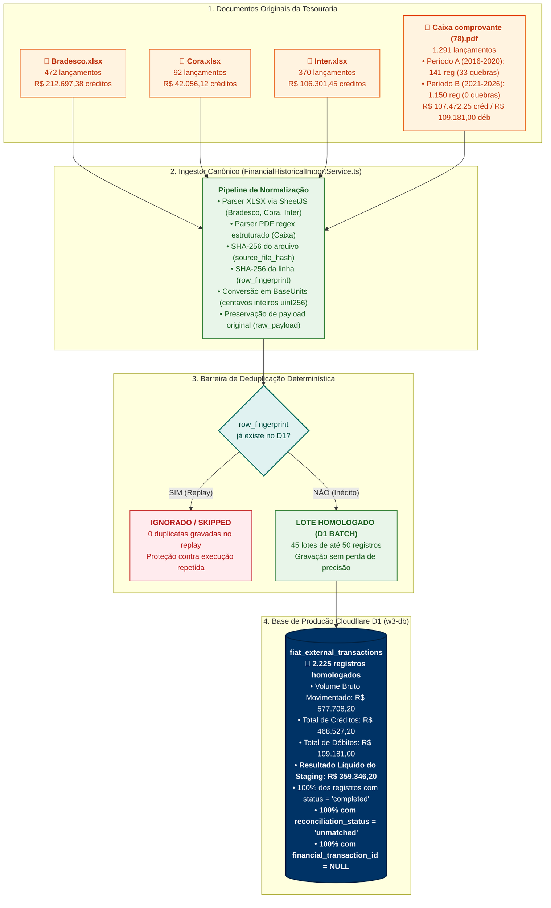
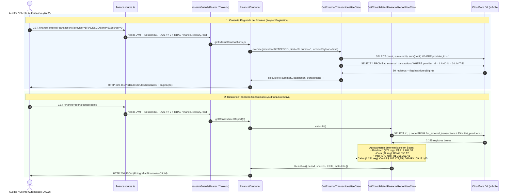
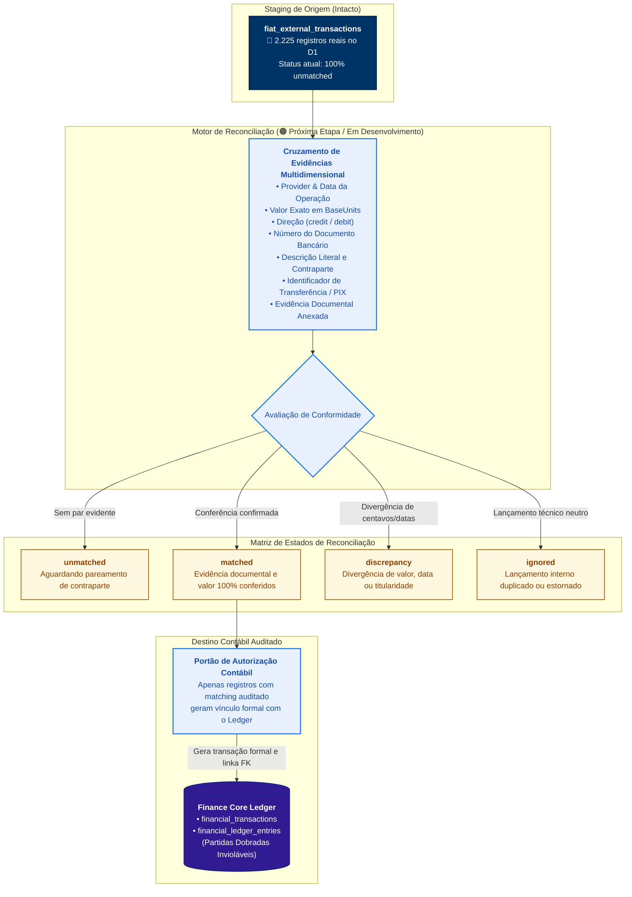
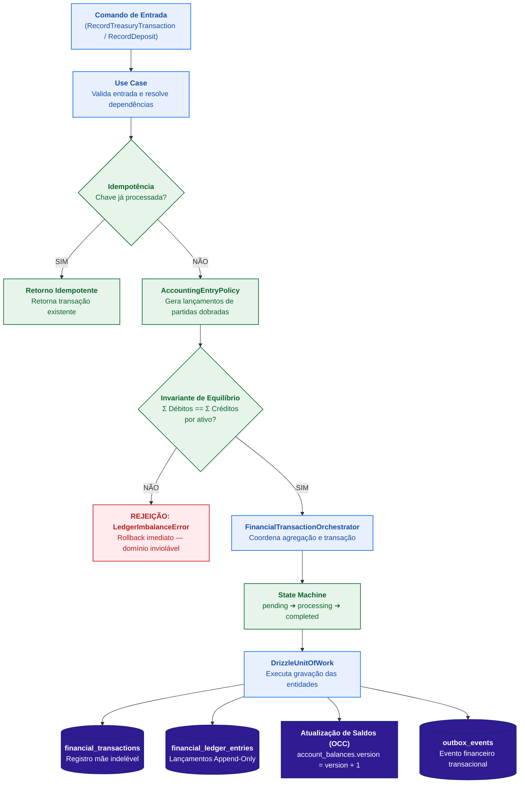

# Arquitetura Técnica, Diagrama Canônico e Checklist de Estabilização — Finance Core

> **Classificação Oficial do Documento:**  
> **ARQUITETURA DE ESTADO HOMOLOGADO (PÓS-CARGA & LEITURA EM PRODUÇÃO) + CHECKLIST AUDITÁVEL DE ESTABILIZAÇÃO + ALVO DE RECONCILIAÇÃO**  
> **Única Fonte de Verdade Técnica:** Estado físico verificado do repositório `/home/sandro/Área de trabalho/BackEnd` e do banco Cloudflare D1 `w3-db`.  
> **Data de Atualização:** 22 de Setembro de 2026.

---

## LEGENDA VISUAL DE ESTADOS OPERACIONAIS

Todos os componentes, tabelas, use cases e fluxos deste documento utilizam a seguinte classificação padronizada:

* 🔵 **`[HOMOLOGADO EM PRODUÇÃO]`**: Testado, promovido e auditado na infraestrutura Cloudflare D1 em produção.
* ✅ **`[IMPLEMENTADO + VALIDADO]`**: Código físico presente no repositório, coberto por testes automatizados locais.
* 🟡 **`[IMPLEMENTADO + PENDÊNCIA]`**: Código físico presente, mas com pendência de estabilização ou isolamento formal.
* 🟠 **`[EM ANÁLISE / PRÓXIMA ETAPA]`**: Especificação técnica definida, em desenvolvimento ou aguardando homologação da fase anterior.
* ⏳ **`[FUTURO / NÃO IMPLEMENTADO]`**: Alvo arquitetural desenhado, sem código de produção ativo.
* ⚪ **`[DEPENDÊNCIA COMPARTILHADA]`**: Arquivo físico existente fora da pasta exclusiva do Finance Core.

---

# BLOCO A — ARQUITETURA EM CAMADAS COM STATUS FÍSICO REAL

O subsistema **Finance Core** segue os princípios estritos da *Clean Architecture* e *Domain-Driven Design (DDD)*, impondo a **Regra de Dependência (DIP)**: as camadas internas nunca importam nem conhecem detalhes das camadas externas.

```mermaid
flowchart TD
    classDef prod fill:#003366,stroke:#002244,stroke-width:2px,color:#FFFFFF;
    classDef valid fill:#137333,stroke:#0D652D,stroke-width:1.5px,color:#FFFFFF;
    classDef needsFix fill:#FFB300,stroke:#B06000,stroke-width:1.5px,color:#000000;
    classDef planned fill:#4285F4,stroke:#1A73E8,stroke-width:1.5px,color:#FFFFFF;
    classDef future fill:#9AA0A6,stroke:#5F6368,stroke-width:1.5px,stroke-dasharray: 4 4,color:#FFFFFF;
    classDef shared fill:#5F6368,stroke:#3C4043,stroke-width:1.5px,color:#FFFFFF;

    subgraph L1["1. Camada de Apresentação HTTP (src/interfaces/http)"]
        direction TB
        subgraph L1_Sec["Segurança & Middlewares"]
            Guard["<b>sessionGuard</b><br/>🔵 Suporte Bearer & ?token="]:::prod
            AAL["<b>requireAal(2 / 3)</b><br/>🔵 Verificação Estrita AAL"]:::prod
            RBAC["<b>verifyPermission</b><br/>🔵 RBAC (finance.treasury.read / *.create)"]:::prod
        end
        subgraph L1_Read["Endpoints de Leitura (Homologados)"]
            R_Ext["GET /finance/external-transactions"]:::prod
            R_Rep["GET /finance/reports/consolidated"]:::prod
            R_Bal["GET /finance/treasury/balance"]:::valid
            R_Tx["GET /finance/transactions"]:::valid
        end
        subgraph L1_Write["Endpoints de Escrita (Core Ledger)"]
            W_Dep["POST /finance/deposits"]:::valid
            W_Tx["POST /finance/transactions"]:::valid
            W_Rev["POST /finance/reversals"]:::valid
            W_Rep["POST /finance/repair"]:::valid
            W_Trf["POST /finance/transfers (P2P)"]:::needsFix
        end
        Controller["<b>FinanceController.ts</b><br/>✅ Handlers HTTP isolados de ORM"]:::valid

        Guard --> AAL --> RBAC --> Controller
        Controller --> R_Ext & R_Rep & R_Bal & R_Tx
        Controller --> W_Dep & W_Tx & W_Rev & W_Rep & W_Trf
    end

    subgraph L2["2. Camada de Aplicação (src/application/finance)"]
        direction TB
        UC_Ext["<b>GetExternalTransactionsUseCase</b><br/>🔵 Keyset pagination + Somas BigInt"]:::prod
        UC_Rep["<b>GetConsolidatedFinancialReportUseCase</b><br/>🔵 Relatório Consolidado discriminado"]:::prod
        UC_Bal["<b>GetTreasuryBalanceUseCase</b><br/>✅ Saldo disponível / retido"]:::valid
        UC_Dep["<b>RecordDepositUseCase</b><br/>✅ Aporte inicial idempotente"]:::valid
        UC_Tx["<b>RecordTreasuryTransactionUseCase</b><br/>✅ Lançamento contábil corporativo"]:::valid
        UC_Ledger["<b>RecordLedgerTransactionUseCase</b><br/>✅ Transação genérica de ledger"]:::valid
        UC_Rev["<b>ReverseTransactionUseCase</b><br/>✅ Estorno contábil auditado"]:::valid
        UC_Repair["<b>RepairFinanceUseCase</b><br/>✅ Correção formal de assimetrias"]:::valid
        UC_Trf["<b>RecordTransferUseCase</b><br/>🟡 Brecha de custódia P2P"]:::needsFix

        Orchestrator["<b>FinancialTransactionOrchestrator</b><br/>🟡 Pendência de propagação forense Drizzle"]:::needsFix
        HashService["<b>CanonicalRequestHashService</b><br/>✅ Hash determinístico SHA-256"]:::valid

        Controller --> UC_Ext & UC_Rep & UC_Bal
        Controller --> UC_Dep & UC_Tx & UC_Ledger & UC_Rev & UC_Repair & UC_Trf
        UC_Dep & UC_Tx & UC_Ledger & UC_Rev & UC_Repair & UC_Trf --> Orchestrator
        Orchestrator --> HashService
    end

    subgraph L3["3. Camada de Domínio Puro (src/domains/finance)"]
        direction TB
        Entities["<b>Entidades e Agregados</b><br/>✅ LedgerTransaction<br/>✅ FinancialLedgerEntry"]:::valid
        VO["<b>Value Objects</b><br/>✅ Money256 (uint256 sem float)<br/>✅ BaseUnits (Centavos canônicos)"]:::valid
        Policies["<b>Políticas Contábeis Invariantes</b><br/>✅ AccountingEntryPolicy (Partidas Dobradas: ΣD = ΣC)<br/>✅ AccountClassPolicy | AccountStatusPolicy<br/>✅ AssetStatusPolicy"]:::valid
        SM["<b>State Machine</b><br/>✅ FinancialTransactionStateMachine<br/>(pending ➔ processing ➔ completed / failed / reversed)"]:::valid
        Errors["<b>Erros de Domínio</b><br/>✅ FinancialError<br/>✅ LedgerImbalanceError"]:::valid

        Orchestrator --> Entities
        Orchestrator --> VO
        Orchestrator --> Policies
        Orchestrator --> SM
        Orchestrator --> Errors
        UC_Ext & UC_Rep --> VO
    end

    subgraph L4["4. Portas de Saída (src/application/ports/output)"]
        direction TB
        IFinanceRepo["<b>IFinanceRepository</b><br/>✅ Contrato de persistência financeira"]:::valid
        IUoW["<b>IUnitOfWork</b><br/>✅ Contrato de transação atômica"]:::valid
        IOutboxRepo["<b>IOutboxRepository</b><br/>⚪ Contrato outbox compartilhado"]:::shared

        Orchestrator --> IFinanceRepo
        Orchestrator --> IUoW
        Orchestrator --> IOutboxRepo
    end

    subgraph L5["5. Camada de Infraestrutura (src/infrastructure)"]
        direction TB
        ImportService["<b>FinancialHistoricalImportService</b><br/>🔵 Ingestão XLSX/PDF (2.225 reg / 741 linhas)"]:::prod
        DrizzleRepo["<b>DrizzleFinanceRepository</b><br/>🟡 Falta propagar colunas forenses"]:::needsFix
        DrizzleUoW["<b>DrizzleUnitOfWork</b><br/>🟡 Executa direto no D1 (rollback total requer DO)"]:::needsFix
        OutboxRepo["<b>DrizzleOutboxRepository</b><br/>✅ Publicação transacional outbox"]:::valid
        InboxService["<b>EventInboxService</b><br/>✅ Ingestão idempotente de eventos"]:::valid
        BootstrapService["<b>FinanceBootstrapService</b><br/>🟡 Isolado da carga de produção"]:::needsFix

        DrizzleRepo -.->|implementa| IFinanceRepo
        DrizzleUoW -.->|implementa| IUoW
        OutboxRepo -.->|implementa| IOutboxRepo
    end

    subgraph L6["6. Persistência e Banco de Dados (src/db/finance & Cloudflare D1)"]
        direction TB
        subgraph DB_Staging["Visão 1: Staging de Extratos Bancários"]
            StageTable[("<b>fiat_external_transactions</b><br/>🔵 2.225 registros homologados no D1<br/>• 100% unmatched (financial_transaction_id = NULL)<br/>• Volume bruto: R$ 577.708,20")]:::prod
            Providers[("<b>fiat_providers</b><br/>🔵 1:BRADESCO, 2:CORA, 3:INTER, 4:CAIXA")]:::prod
            FiatAcc[("<b>fiat_accounts</b><br/>✅ Contas bancárias externas")]:::valid
        end
        subgraph DB_Core["Visão 2: Core Ledger & Contabilidade"]
            TxTable[("<b>financial_transactions</b><br/>✅ 1 Genesis Aporte Inicial R$ 1.000,00")]:::valid
            LedgerTable[("<b>financial_ledger_entries</b><br/>✅ 1 lançamento Genesis R$ 1.000,00")]:::valid
            AccountsTable[("<b>financial_accounts</b><br/>✅ Contas corporativas e tesouraria")]:::valid
            BalancesTable[("<b>account_balances</b><br/>✅ Saldos materializados OCC")]:::valid
            HoldsTable[("<b>balance_holds</b><br/>✅ Retenções de saldo")]:::valid
            AssetsTable[("<b>financial_assets</b><br/>✅ BRL (id: 1), USD, BTC, ETH")]:::valid
            FeesTable[("<b>financial_fees</b><br/>✅ Tarifas financeiras")]:::valid
            RatesTable[("<b>exchange_rates</b><br/>✅ Cotações canônicas")]:::valid
            ConversionsTable[("<b>asset_conversions</b><br/>✅ Conversões multi-moeda")]:::valid
            IdempotencyTable[("<b>idempotency_keys</b><br/>✅ Chaves de idempotência")]:::valid
            ReconTable[("<b>reconciliation_records</b><br/>⏳ Alvo da reconciliação contábil")]:::future
        end
        subgraph DB_Mig["Migrações Canônicas (Cloudflare D1)"]
            M09["0009_finance_schema_alignment.sql 🔵"]:::prod
            M10["0010_fixes_and_rates.sql 🔵"]:::prod
            M11["0011_forensic_audit_and_singleton.sql 🔵"]:::prod
        end

        ImportService --> StageTable
        UC_Ext & UC_Rep --> StageTable & Providers
        DrizzleRepo --> DB_Core
    end
```



---

# BLOCO B — ORIGEM EXTERNA / STAGING HISTÓRICO (HOMOLOGADO)

Área dedicada aos extratos bancários brutos, pipeline de ingestão e garantias forenses contra duplicidade:



> [!IMPORTANT]
> **Distinção Contábil Obrigatória:**  
> O resultado líquido apurado no staging (**R$ 359.346,20**) e o volume bruto movimentado (**R$ 577.708,20**) representam **estatísticas dos extratos de origem**, e **NÃO** devem ser confundidos com saldo patrimonial, saldo bancário da entidade ou resultado contábil do ledger corporativo.

---

# BLOCO C — LEITURA E RELATÓRIO FINANCEIRO (HOMOLOGADO EM PRODUÇÃO)

Os endpoints de auditoria e leitura da base real foram construídos, auditados e homologados diretamente no Cloudflare Workers e D1:



---

# BLOCO D — RECONCILIAÇÃO CONTÁBIL (PRÓXIMA ETAPA)

> [!WARNING]
> **RECONCILIAÇÃO $\neq$ LANÇAMENTO AUTOMÁTICO**  
> A reconciliação bancária é um processo analítico de matching e auditoria de contrapartes. Ela **NÃO** deve gerar lançamentos arbitrários no ledger sem evidência documental comprovada.



---

# BLOCO E — POSTING CONTÁBIL & INVARIANTES DE DOMÍNIO

Fluxo contábil formal executado quando uma transação legítima é gravada no livro-razão (*Core Ledger*):



### Invariantes Contábeis do Finance Core
1. **Partidas Dobradas Obrigatórias (Double-Entry):** Para qualquer transação contábil, o somatório dos valores a débito deve ser rigorosamente idêntico ao somatório dos valores a crédito ($\sum \text{Débitos} = \sum \text{Créditos}$) para cada ativo envolvido.
2. **Livro-Razão Imutável (Append-Only):** A tabela `financial_ledger_entries` não admite operações de `UPDATE` ou `DELETE`. Correções contábeis exigem novos lançamentos compensatórios de estorno (*reversal*).
3. **Saldos como Projeções Materializadas:** A tabela `account_balances` é uma projeção otimizada para consulta e concorrência, derivável a qualquer momento pelo somatório integral dos lançamentos do ledger.
4. **Idempotência Canônica Obrigatória:** Nenhuma mutação de saldo pode ser executada sem chave de idempotência ou hash de requisição canônico verificado.
5. **Controle de Concorrência Otimista (OCC):** Modificações de saldos exigem incremento monótono de `version` na tabela `account_balances`, abortando transações concorrentes incompatíveis.

---

# BLOCO F — RESSALVAS DE PRODUÇÃO & PENDÊNCIAS DE ESTABILIZAÇÃO

Mapeamento transparente de todas as limitações técnicas e pendências físicas verificadas no código atual:

| # | Componente Afetado | Arquivo Físico | Classificação | Detalhamento Técnico da Pendência | Impacto Operacional |
| :---: | :--- | :--- | :---: | :--- | :--- |
| **P1** | **Atomicidade D1** | `src/infrastructure/repositories/DrizzleUnitOfWork.ts` | 🟡 `PENDÊNCIA` | Cloudflare D1 em modo HTTP não suporta `BEGIN IMMEDIATE`. O UoW atual executa queries diretamente sem transação SQL interativa. Rollback multiquery completo em falha de rede requer Durable Object SQLite (`transactionSync`). | Isolado fora das leituras. Afeta apenas mutações de escrita se houver falha de rede intermediária. |
| **P2** | **Custódia P2P** | `src/application/finance/use-cases/RecordTransferUseCase.ts` | 🟡 `PENDÊNCIA` | Falta validação explícita de custódia e isolamento formal de limites em transferências diretas entre usuários normais (rota `POST /transfers`). | Rota de escrita P2P deve permanecer desativada para usuários finais até o hardening. |
| **P3** | **Linhagem Forense** | `src/infrastructure/repositories/DrizzleFinanceRepository.ts` | 🟡 `PENDÊNCIA` | As mutações do repositório Drizzle ainda não propagam todas as colunas de auditoria forense criadas na migration `0011` (`actor_user_id`, `authorized_by_user_id`, `source_type`, `correlation_id`). | Metadados forenses são preenchidos parcialmente no ledger principal. |
| **P4** | **Lease Expiry Inbox** | `src/infrastructure/services/EventInboxService.ts` | 🟡 `PENDÊNCIA` | Em cenários extremos de queda prolongada do worker durante processamento, o lease expiry requer chave de trava distribuída no KV/D1 para garantia absoluta de *exactly-once*. | Eventos concorrentes podem ser reprocessados caso o nó colapse no meio do commit. |
| **P5** | **Bootstrap Service** | `src/infrastructure/services/FinanceBootstrapService.ts` | 🟡 `PENDÊNCIA` | O bootstrap padrão foi isolado da carga real para não conflitar com os dados de produção do D1. Deve ser parametrizado para execução condicional apenas em ambientes de teste. | Não impede operação, mas requer atenção em deploy de novos ambientes virgens. |

---

# BLOCO G — CHECKLIST EXAUSTIVO DE ESTABILIZAÇÃO

Checklist de controle de qualidade para validação e auditoria contínua do módulo:

### 1. Arquitetura
- [x] Domínio isolado sem dependências externas (`src/domains/finance`)
- [x] Aplicação isolada sem importação de adaptadores de infraestrutura (`src/application/finance`)
- [x] Portas de saída abstratas e contratos tipados (`src/application/ports/output/`)
- [x] Infraestrutura implementando rigorosamente os contratos das portas
- [x] Controladores HTTP e rotas isolados de consultas ORM diretas
- [x] Banco de dados e esquemas estruturados separadamente (`src/db/finance`)

### 2. Domínio
- [x] `Money256` implementado com precisão arbitrária BigInt (sem float/number em valores monetários)
- [x] `BaseUnits` implementado para conversão determinística em centavos canônicos
- [x] `AccountingEntryPolicy` validando invariante de partidas dobradas ($\sum D = \sum C$)
- [x] `AccountClassPolicy` impondo matriz estrita de tipos e classes de contas
- [x] `AccountStatusPolicy` e `AssetStatusPolicy` bloqueando entidades inativas
- [x] `FinancialTransactionStateMachine` restringindo transições ilegais
- [x] Erros de domínio tipados e sem vazamento de detalhes de infraestrutura (`FinancialError`, `LedgerImbalanceError`)

### 3. Persistência
- [x] Schemas Drizzle revisados e tipados (`src/db/finance/tables.ts`)
- [x] Restrições de integridade, checks e chaves estrangeiras validadas
- [x] Migrações canônicas aplicadas no D1 (`0009`, `0010`, `0011`)
- [x] Índices de performance para busca por provider, id e correlation_id
- [x] Controle de Concorrência Otimista (OCC) via coluna `version` em saldos
- [x] Chaves de idempotência persistidas em banco (`idempotency_keys`)
- [x] Padrão Outbox implementado com persistência transacional (`outbox_events`)
- [x] Event Inbox implementado com controle de status e retry (`event_inbox`)

### 4. Histórico Bancário (Staging)
- [x] Extrato Bradesco ingerido (472 registros, R$ 212.697,38)
- [x] Extrato Cora SCFI ingerido (92 registros, R$ 42.056,12)
- [x] Extrato Banco Inter ingerido (370 registros, R$ 106.301,45)
- [x] Extrato Caixa Econômica ingerido (1.291 registros, R$ 216.653,25)
- [x] Fingerprints determinísticos SHA-256 gerados por arquivo e por linha
- [x] Mecanismo de deduplicação certificado (0 duplicatas inseridas no replay)
- [x] Payload original preservado em JSON bruto (`raw_payload`)
- [x] Rastreabilidade completa da proveniência (`source_file` e `source_file_hash`)
- [x] 2.225 registros certificados no Cloudflare D1 em produção

### 5. Camada de Leitura & Auditoria
- [x] `GET /finance/external-transactions` ativo com paginação keyset
- [x] Filtros por provider, status e direção homologados
- [x] Totalização de somatórios executada em BigInt sem perda de centavos
- [x] `GET /finance/reports/consolidated` gerando relatório discriminado oficial
- [x] Operação estritamente somente-leitura (Read-Only)
- [x] Smoke tests em produção certificados via Cloudflare Workers

### 6. Reconciliação Contábil
- [ ] Regras e heurísticas de cruzamento de contrapartes implementadas
- [ ] Mecanismo de anexação de evidências documentais concluído
- [x] Estado inicial `unmatched` atribuído a 100% dos 2.225 registros de staging
- [ ] Estado `matched` atribuído após conferência auditada
- [ ] Estado `discrepancy` implementado para inconsistências de centavos/datas
- [ ] Estado `ignored` implementado para lançamentos técnicos duplicados
- [ ] Interface de revisão manual de divergências implementada
- [ ] Vínculo controlado gerando lançamentos no Finance Core Ledger

### 7. Core Ledger & Saldos
- [x] Tabela `financial_transactions` protegida com 1 registro Genesis preservado
- [x] Tabela `financial_ledger_entries` protegida com 1 registro Genesis preservado
- [x] Partidas dobradas obrigatórias validadas no domínio
- [x] Natureza Append-only inviolável garantida no ledger
- [x] Tabela `account_balances` refletindo saldos das 2 contas existentes
- [x] Mecanismo de estorno contábil auditado (`ReverseTransactionUseCase`)
- [x] Proteção contra assimetrias de saldo via `RepairFinanceUseCase`
- [ ] Propagação total dos metadados forenses da migration 0011 em todas as mutations

### 8. Suíte de Testes Automatizados
- [x] Testes de Domínio executados e passando (`tests/finance/domain_policies.test.ts` — 35 testes)
- [x] Testes de Arquitetura e Governança passando (`tests/architecture/architecture-boundaries.test.ts` — 7 testes)
- [x] Testes de Invariantes Contábeis passando (`tests/finance/invariants/`)
- [x] Testes de Concorrência e Idempotência passando (`tests/finance/concurrency_idempotency_same_key.test.ts`)
- [x] Testes de Stress de Concorrência passando (`tests/finance/concurrency_stress.test.ts`)
- [x] Testes de Repositório e Driver passando (`tests/finance/DrizzleFinanceRepository.test.ts`)
- [x] Testes E2E de Controller passando (`tests/finance/finance_controller_e2e.test.ts`)
- [x] Todos os 46 arquivos de teste organizados fora de `src/` (em `tests/`)

### 9. Operação em Produção (Cloudflare)
- [x] Migrações aplicadas no banco remoto D1 `w3-db`
- [x] Backup e snapshots de segurança realizados antes da promoção
- [x] Staging de 2.225 registros preservado intacto
- [x] Ledger e contas Genesis preservados intactos
- [x] Endpoints de leitura homologados com autenticação AAL2
- [x] Suporte a consulta direta no navegador via parâmetro `?token=`
- [x] Observabilidade e correlação ponta a ponta (`correlation_id`)
- [ ] Implementação de transações interativas com rollback total via Durable Object

---

# BLOCO H — QUADRO DE STATUS GLOBAL DE ESTABILIZAÇÃO

```text
========================================================================================
                      FINANCE CORE — STATUS DE ESTABILIZAÇÃO
========================================================================================

 [ ZONA 1: CONCLUÍDO & HOMOLOGADO ] 🔵 / ✅
 --------------------------------------------------------------------------------------
 • Ingestão dos 2.225 registros bancários históricos (Bradesco, Cora, Inter, Caixa)
 • Volume bruto de R$ 577.708,20 registrado em staging sem perda de centavos
 • Zero duplicatas inseridas via garantia de fingerprint SHA-256
 • Schemas de banco e migrações 0009, 0010 e 0011 aplicadas no Cloudflare D1
 • Endpoints GET /finance/external-transactions e /reports/consolidated homologados
 • Autenticação com sessão AAL2 de 24h e suporte a ?token= para navegador
 • Domínio puro com Money256 (BigInt uint256), BaseUnits e Partidas Dobradas
 • Máquina de estados FinancialTransactionStateMachine (DOD-12)
 • 100% dos testes de arquitetura e domínio aprovados (testes fora de src/)

 [ ZONA 2: EM REVISÃO & HARDENING ] 🟡 / 🟠
 --------------------------------------------------------------------------------------
 • P1: Atomicidade transacional no Cloudflare D1 (DrizzleUnitOfWork via DO SQLite)
 • P2: Hardening e isolamento de custódia na rota P2P RecordTransferUseCase
 • P3: Propagação integral das colunas forenses da migration 0011 no DrizzleFinanceRepo
 • P4: Trava distribuída de lease expiry no EventInboxService
 • Motor Canônico de Reconciliação Contábil (matching dos 2.225 registros unmatched)

 [ ZONA 3: ALVO FUTURO (FORA DO ESCOPO ATUAL) ] ⏳
 --------------------------------------------------------------------------------------
 • Integração direta via APIs bancárias (Open Finance / BaaS)
 • Sincronização automática de extratos em tempo real
 • Webhooks bancários automatizados para liquidação instantânea
 • Credenciamento de novas instituições financeiras
 • Funcionalidades de investimento e tesouraria multi-institucional avançada
========================================================================================
```

---

# CRITÉRIO PARA FREEZE DO FINANCE CORE

O subsistema **Finance Core** só poderá ser formalmente considerado **CONGELADO (ESTABILIZADO)** para liberação de novos módulos após o cumprimento integral de todos os seguintes gates:

```text
┌────────────────────────────────────────────────────────────────────────┐
│               GATES OBRIGATÓRIOS PARA FREEZE DO FINANCE                │
├──────────────────────────────────┬─────────────────────────────────────┤
│ 1. Arquitetura em Camadas        │ ✅ 100% Auditada e em conformidade  │
│ 2. Domínio Contábil Puro         │ ✅ 100% Conforme (Money256 BigInt)  │
│ 3. Persistência e Schemas D1     │ ✅ 100% Aplicada em Produção        │
│ 4. Staging Histórico Certificado │ 🔵 100% Homologado (2.225 registros)│
│ 5. Endpoints de Leitura          │ 🔵 100% Homologados em Produção     │
│ 6. Suíte de Testes Automatizados │ ✅ 100% Aprovados (fora de src/)    │
│ 7. Atomicidade Interativa D1     │ 🟡 PENDENTE (Requer DO SQLite)      │
│ 8. Hardening do Fluxo P2P        │ 🟡 PENDENTE (Isolar rota transfers) │
│ 9. Linhagem Forense Completa     │ 🟡 PENDENTE (Propagar cols 0011)    │
│ 10. Motor de Reconciliação       │ 🟠 EM ANDAMENTO (Próxima etapa)     │
└──────────────────────────────────┴─────────────────────────────────────┘
```

> [!CAUTION]
> **DIRETRIZ DE ENGENHARIA:**  
> **Não iniciar novos módulos nem adicionar dependências externas no sistema enquanto houver pendência crítica aberta no Finance Core.**
